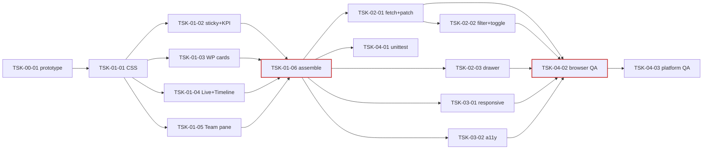

# WBS - dev-plugin 웹 모니터링 도구 v2

> version: 1.0
> description: v1 대시보드의 렌더 레이어를 교체하여 KPI 카드·WP 도넛·Live Activity·Phase Timeline·실행 출력 드로어를 도입. v1 데이터 수집·엔드포인트·스킬 커맨드는 그대로 재사용, 인라인 CSS + 바닐라 JS + No external CDN 원칙 유지.
> depth: 3
> start-date: 2026-04-21
> target-date: 2026-05-01
> updated: 2026-04-21

---

## Dev Config

### Domains
| domain | description | unit-test | e2e-test | e2e-server | e2e-url |
|--------|-------------|-----------|----------|------------|---------|
| backend | monitor-server.py 렌더·라우팅 (Python stdlib) | `python3 -m unittest discover scripts/ -v` | - | - | - |
| frontend | 인라인 CSS/JS 대시보드 UI | - | - | `python3 scripts/monitor-launcher.py --port 7321 --docs docs` | `http://localhost:7321` |
| fullstack | 렌더 레이어(Python → HTML/CSS/JS) | `python3 -m unittest discover scripts/ -v` | - | `python3 scripts/monitor-launcher.py --port 7321 --docs docs` | `http://localhost:7321` |
| test | 테스트 스위트 (unittest) | `python3 -m unittest discover scripts/ -v` | - | - | - |

### Design Guidance
| domain | architecture |
|--------|-------------|
| backend | monitor-server.py 단일 파일 안의 _section_* 렌더 함수 + _build_state_snapshot. BaseHTTPRequestHandler 경로 라우팅. stdlib만 사용, 외부 의존 금지. |
| frontend | 인라인 CSS (DASHBOARD_CSS 문자열) + 인라인 JS (DASHBOARD_JS). 외부 CDN/폰트/스크립트 금지. `<section data-section="...">` 단위로 DOM 부분 교체. 라우팅과 메뉴 연결: 신규 페이지는 즉시 라우터에 등록하고 메뉴/사이드바의 진입점을 같은 Task에서 추가한다. 라우터·메뉴 배선을 분리된 후속 Task로 미루면 orphan page가 발생한다. |

### Quality Commands
| name | command |
|------|---------|
| lint | `python3 -m py_compile scripts/monitor-server.py` |
| typecheck | - |
| coverage | - |

### Cleanup Processes
python3

---

## WP-00: 프로젝트 초기화 + 프로토타입
- schedule: 2026-04-21 ~ 2026-04-21
- description: 정적 HTML 프로토타입으로 레이아웃·색·애니메이션을 서버 통합 전에 검증 (P1)

### TSK-00-01: 정적 HTML 프로토타입 작성
- category: development
- domain: frontend
- model: sonnet
- status: [xx]
- priority: medium
- assignee: -
- schedule: 2026-04-21 ~ 2026-04-21
- tags: prototype, design, html
- depends: -
- blocked-by: -
- entry-point: library
- note: 목업 데이터 하드코딩. 서버 통합 전 레이아웃·색·애니메이션 확인용 정적 산출물. `docs/monitor-v2/prototype.html`로 저장.

#### PRD 요구사항
- prd-ref: docs/monitor-v2/prd.md §8 구현 단계 P1
- requirements:
  - 단일 HTML 파일, 인라인 CSS + 인라인 JS, 외부 CDN/폰트/JS 0건
  - 목업 데이터(태스크 10건·WP 3개·phase history 20건·tmux pane 3개)로 상단 sticky 헤더 + KPI 5장 + 필터 칩 + WP 카드(도넛+progress) + Live Activity + Phase Timeline + Team pane inline preview + 드로어 골격 렌더
  - PRD §4.4 와이어프레임과 동일한 2단 레이아웃 재현 (좌 60% / 우 40%)
- acceptance:
  - 브라우저에서 열면 스크롤 없이 KPI 5장 + WP 3개 카드가 뷰포트에 표시됨
  - `[expand ↗]` 클릭 시 드로어가 우측에서 슬라이드 인, `ESC`로 닫힘
  - 데스크톱(1440px) 뷰포트에서 레이아웃이 깨지지 않음
- constraints:
  - 외부 자원 로드 금지 (script/link/font 태그의 src/href는 허용 안 함)
  - conic-gradient / CSS 변수 / 인라인 SVG만 사용

#### 기술 스펙 (TRD)
- tech-spec:
  - 단일 HTML5 문서
  - CSS: flex / grid / conic-gradient / custom properties
  - SVG: inline polyline(sparkline) + rect(timeline)
  - JS: 드로어 open/close + ESC 키 바인딩 (최소)
- api-spec: -
- data-model:
  - 목업 state.json 구조 (TRD §4.2.3 스키마 참고)
- ui-spec:
  - 헤더 sticky · KPI 카드 5장 · 필터 칩 4개 · WP 카드(도넛 + progress) · Live Activity 피드 · Phase Timeline SVG · Team pane inline preview + expand 버튼 · 드로어 골격

---

## WP-01: 렌더 레이어 재작성 (P2)
- schedule: 2026-04-22 ~ 2026-04-25
- description: DASHBOARD_CSS 확장 + 섹션별 렌더 함수 재작성 + render_dashboard 조립

### TSK-01-01: DASHBOARD_CSS 확장
- category: development
- domain: frontend
- model: sonnet
- status: [xx]
- priority: critical
- assignee: -
- schedule: 2026-04-22 ~ 2026-04-22
- tags: css, layout, design-system
- depends: TSK-00-01
- blocked-by: -
- entry-point: /
- note: v1 CSS 63줄 → 확장 ~343줄. 400줄 상한 준수.

#### PRD 요구사항
- prd-ref: docs/monitor-v2/prd.md §4.4, §4.7
- requirements:
  - Sticky 헤더 스타일 · KPI 카드 팔레트(running/failed/bypass/done/pending 좌측 4px 컬러 바) · 필터 칩 (`aria-pressed` 상태 스타일)
  - 2단 grid 레이아웃(`.page`, 좌 3fr / 우 2fr)
  - WP 카드 도넛(conic-gradient) + progress bar
  - task-row 좌측 상태 컬러 바 + Running row 애니메이션 라인
  - Live activity fade-in · Phase timeline SVG 클래스(tl-dd/im/ts/xx/fail) · pane preview · 드로어(backdrop + slide-in 640px)
  - 반응형 브레이크포인트 1280px / 768px 및 `prefers-reduced-motion: reduce` 대응
- acceptance:
  - `python3 -m py_compile scripts/monitor-server.py` 통과
  - CSS 문자열 라인 수 ≤ 400
  - `@supports not (background: conic-gradient(...))` fallback 포함 (구형 Safari 대응)
- constraints:
  - 외부 폰트/CDN 금지, 시스템 폰트만 사용
  - v1 CSS 변수(`--bg`, `--fg`, `--muted` 등) 네이밍 유지

#### 기술 스펙 (TRD)
- tech-spec:
  - CSS Grid · Flexbox · conic-gradient · CSS custom properties · keyframes
  - `@media (max-width: 1279px)` / `(max-width: 767px)` / `(prefers-reduced-motion: reduce)`
- api-spec: -
- data-model: -
- ui-spec:
  - 색 팔레트: v1 팔레트 유지 (orange/red/yellow/green/light-gray)
  - 도넛: 80×80px, conic-gradient 2세그먼트(green·orange), pct 텍스트 중앙 배치
  - 드로어: 640px / 모바일은 100vw

---

### TSK-01-02: `_section_sticky_header` + `_section_kpi` 렌더 함수 신규
- category: development
- domain: fullstack
- model: sonnet
- status: [xx]
- priority: critical
- assignee: -
- schedule: 2026-04-23 ~ 2026-04-23
- tags: render, kpi, header, sparkline
- depends: TSK-01-01
- blocked-by: -
- entry-point: /
- note: 헤더의 auto-refresh 토글은 JS 연결 전 스타일만 렌더 (JS는 WP-02에서 연결).

#### PRD 요구사항
- prd-ref: docs/monitor-v2/prd.md §4.5.1, §4.5.2
- requirements:
  - 로고 dot + 제목 + project_root(말줄임) + refresh 주기 라벨 + auto-refresh 토글 버튼 렌더
  - KPI 카드 5장: Running / Failed / Bypass / Done / Pending (팔레트 색 매칭)
  - 각 KPI 카드에 스파크라인 SVG(`<polyline>`) — `phase_history`를 1분 버킷 × 10버킷으로 집계
  - 필터 칩 4개 (All / Running / Failed / Bypass)와 `[data-filter]` 속성
- acceptance:
  - `_kpi_counts(tasks, features, signals)` 반환값 합 == 전체 Task 수
  - 우선순위 처리: bypass > failed > running > done > pending (중복 카운트 방지)
  - unittest에서 렌더 결과에 `data-kpi="running|failed|bypass|done|pending"` 5개 존재 확인
- constraints:
  - HTML escape 필수 (v1 `_esc` 재사용)
  - SVG에 `<title>` 추가 (스크린리더용)
- test-criteria:
  - KPI 카운트 경계값: 태스크 0건, 중복 시그널, bypass+failed 동시

#### 기술 스펙 (TRD)
- tech-spec:
  - `_section_sticky_header(model) -> str`
  - `_section_kpi(model) -> str`
  - 헬퍼: `_kpi_counts(tasks, features, signals)`, `_spark_buckets(items, kind, now, span_min=10)`, `_kpi_spark_svg(buckets, color)`
- api-spec:
  - `/api/state` 응답 (v1 스키마) 사용
- data-model:
  - `phase_history_tail[].event` ∈ {dd.ok, im.ok, ts.ok, xx.ok, ts.fail, im.fail, dd.fail, bypass}
- ui-spec:
  - Sticky 헤더 42px · KPI 카드 1줄 5등분 · 칩 그룹 헤더 우측

---

### TSK-01-03: `_section_wp_cards` 렌더 함수 신규
- category: development
- domain: fullstack
- model: sonnet
- status: [xx]
- priority: critical
- assignee: -
- schedule: 2026-04-23 ~ 2026-04-23
- tags: render, wp-card, donut
- depends: TSK-01-01
- blocked-by: -
- entry-point: /
- note: 기존 `_section_wbs`는 카드 내 `
` 펼침 영역으로 흡수.

#### PRD 요구사항
- prd-ref: docs/monitor-v2/prd.md §4.5.3, §4.5.4
- requirements:
  - WP별 카드 렌더: 제목(WP-ID + 이름) + 도넛(conic-gradient) + progress bar + 카운트(● done / ○ running / ◐ pending / × failed / 🟡 bypass)
  - 카드 하단 `
` 안에 v1 6-컬럼 task-row를 상태별 CSS 클래스(`done|running|failed|bypass|pending`)와 함께 렌더
  - Feature 카드(WP 그룹 없음, 단일 평면 리스트)도 동일 row 구조로 `_section_features`에서 렌더
- acceptance:
  - `_wp_donut_style(counts)` 반환 문자열에 `--pct-done-end` / `--pct-run-end` CSS 변수 포함
  - WP 카운트 합 = 해당 WP의 Task 수
  - 빈 WP("no tasks") 빈 카드 empty-state
- constraints:
  - Task ID 순서 보존 (v1 `_group_preserving_order` 사용)
- test-criteria:
  - 0건 · 1건 · 혼합 상태 WP 각각 렌더 결과 스냅샷 비교

#### 기술 스펙 (TRD)
- tech-spec:
  - `_section_wp_cards(tasks, running_ids, failed_ids) -> str`
  - `_wp_donut_style(counts) -> str`
- api-spec: -
- data-model:
  - WorkItem.wp_id / status / bypassed / error
- ui-spec:
  - 도넛 80×80px · progress bar 6px · 카드 그리드 2fr 1fr

---

### TSK-01-04: `_section_live_activity` + `_section_phase_timeline` 렌더 함수 신규
- category: development
- domain: fullstack
- model: opus
- status: [xx]
- priority: critical
- assignee: -
- schedule: 2026-04-24 ~ 2026-04-24
- tags: render, timeline, activity, svg
- depends: TSK-01-01
- blocked-by: -
- entry-point: /
- note: Phase timeline의 종료 시각 추론 로직(다음 이벤트 `at` 또는 `generated_at`)과 SVG 해칭 패턴 정의가 핵심 복잡도.

#### PRD 요구사항
- prd-ref: docs/monitor-v2/prd.md §4.5.5, §4.5.6
- requirements:
  - Live Activity: 모든 태스크+피처의 `phase_history_tail`을 평탄화 → 최신 20건 내림차순 → `HH:MM:SS · TSK-ID · event · elapsed` 포맷
  - Phase Timeline: 각 Task row에 phase별 `<rect>` (dd/im/ts/xx 색), 실패 구간은 해칭 패턴(`<pattern id="hatch">`), bypass row 우측에 🟡 마커
  - 시간축: 현재 - 60분 = x=0, 현재 = x=W, 5분 간격 tick
  - Task 수 50 초과 시 상위 50만 렌더 후 "+N more" 링크
- acceptance:
  - phase_history 없는 Task는 timeline에서 skip (empty row 안 생성)
  - fail 이벤트 구간에 `class="tl-fail"` 적용
  - `_timeline_svg([], 60)` → empty state 반환 (크래시 없음)
- constraints:
  - SVG는 인라인, 외부 자원 참조 금지
  - 시간 파싱 실패 시 해당 이벤트 skip (예외 미발생)
- test-criteria:
  - phase_history 0건 · 1건 · 50건 · 100건에서 렌더 성공 + 시간축 범위 일관성

#### 기술 스펙 (TRD)
- tech-spec:
  - `_section_live_activity(model) -> str`
  - `_section_phase_timeline(tasks, features) -> str`
  - `_timeline_svg(rows, span_minutes) -> str`
  - 종료 시각 추론: `next_event.at` 있으면 사용, 없으면 `generated_at`
- api-spec: -
- data-model:
  - PhaseEntry.at (ISO 8601, tz-aware)
- ui-spec:
  - Timeline viewBox `0 0 600 {row_count*20}`, row 높이 16px, tick 5분 간격
  - Live activity auto-scroll + fade-in

---

### TSK-01-05: `_section_team` 수정 — inline preview + expand 버튼
- category: development
- domain: fullstack
- model: sonnet
- status: [xx]
- priority: high
- assignee: -
- schedule: 2026-04-24 ~ 2026-04-24
- tags: render, team, pane-preview
- depends: TSK-01-01
- blocked-by: -
- entry-point: /
- note: pane 수 ≥ 20일 때 preview 생략 (비용 제어). `capture_pane()`은 v1 그대로 호출.

#### PRD 요구사항
- prd-ref: docs/monitor-v2/prd.md §4.5.7, §4.5.8
- requirements:
  - 각 pane row에 마지막 3줄 preview (`<pre class="pane-preview">`) 렌더
  - `[expand ↗]` 버튼에 `data-pane-expand="{pane_id}"` 속성
  - pane 수 ≥ 20이면 preview 생략하고 `<pre class="pane-preview empty">no preview (too many panes)</pre>` 렌더
  - agent-pool 섹션은 v1 그대로 (preview 없음, 드로어 대상 아님 — PRD §4.5.7 명시)
- acceptance:
  - tmux 미설치 시 "tmux not available" empty-state (v1과 동일)
  - `data-pane-expand` 버튼이 각 pane row에 정확히 1개
  - preview `<pre>` max-height 4.5em 적용 (CSS 검증 위임)
- constraints:
  - pane_id HTML escape (`%2` → `%2` 그대로, URL-encoded는 별도)

#### 기술 스펙 (TRD)
- tech-spec:
  - `_section_team(panes) -> str` 수정
  - `_pane_last_n_lines(pane_id, n=3) -> str` — `capture_pane`의 tail n줄
- api-spec: -
- data-model:
  - PaneInfo.pane_id / window_name / pane_current_command / pane_pid
- ui-spec:
  - pane row: 메타라인 + expand 버튼 + preview 3줄

---

### TSK-01-06: `render_dashboard` 재조립 + sticky header + 드로어 골격
- category: development
- domain: fullstack
- model: opus
- status: [xx]
- priority: critical
- assignee: -
- schedule: 2026-04-25 ~ 2026-04-25
- tags: render, assembly, drawer-skeleton
- depends: TSK-01-02, TSK-01-03, TSK-01-04, TSK-01-05
- blocked-by: -
- entry-point: /
- note: 이 Task가 v2 최소 동작 가능 상태 (UI 보이기만). JS 없이도 서버 사이드 렌더로 전 레이아웃 검증 가능. `<meta http-equiv="refresh">` 제거.

#### PRD 요구사항
- prd-ref: docs/monitor-v2/prd.md §4.4, §4.5.8, docs/monitor-v2/trd.md §4.2.5
- requirements:
  - 섹션 조립 순서: sticky_header → kpi → [page col-left: wp_cards → features] + [col-right: live_activity → phase_timeline → team → subagents]
  - 드로어 골격 주입: `
` + `<aside class="drawer" role="dialog" aria-modal="true">`
  - v1의 `<meta http-equiv="refresh">` 제거 (JS 폴링으로 대체 예정)
  - 각 `<section>`에 `data-section="{key}"` 속성 (JS 부분 교체용 식별자)
- acceptance:
  - `render_dashboard({})` — 빈 모델에서 크래시 없이 full HTML 반환
  - `render_dashboard(valid_model)` 출력 바이트 길이 200KB 이하 (태스크 30건 기준)
  - `<aside class="drawer">` 정확히 1개 (중복 방지)
- constraints:
  - 기존 `_section_header`·`_section_wbs`·`_section_subagents`·`_section_phase_history`는 신규 섹션으로 **대체**되되 기존 링크(`#wbs`, `#features`, `#team`, `#subagents`, `#phases`)는 유지

#### 기술 스펙 (TRD)
- tech-spec:
  - `render_dashboard(model) -> str` 재작성
  - `_drawer_skeleton() -> str` 신규
  - `<script>` 태그 삽입 위치: `</body>` 직전
- api-spec: -
- data-model: -
- ui-spec:
  - `.page` grid 2단 (데스크톱) / 1단 (태블릿/모바일)

---

## WP-02: 클라이언트 JS (P3)
- schedule: 2026-04-26 ~ 2026-04-27
- description: 부분 fetch + 필터 + 드로어 제어를 바닐라 JS로 구현

### TSK-02-01: 부분 fetch + DOM 교체 엔진
- category: development
- domain: frontend
- model: opus
- status: [xx]
- priority: critical
- assignee: -
- schedule: 2026-04-26 ~ 2026-04-26
- tags: js, polling, dom-patch, fetch
- depends: TSK-01-06
- blocked-by: -
- entry-point: /
- note: DOM diff 대신 `data-section` 단위 innerHTML 교체 전략 (TRD §13 첫 열린 질문 결정 반영 — 단순 교체).

#### PRD 요구사항
- prd-ref: docs/monitor-v2/prd.md §4.8
- requirements:
  - `setInterval`로 5초마다 `/api/state` 호출, 응답 JSON으로 각 섹션 재렌더
  - `
` 펼침 상태 / 스크롤 위치 / 필터 선택 유지
  - `AbortController`로 중복 요청 취소
  - auto-refresh 토글 OFF 시 polling 중지
- acceptance:
  - 5초 주기에서 스크롤이 튀지 않음 (브라우저 QA에서 검증)
  - 폴링 실패(404/500/네트워크) 시 silent catch, 다음 틱에서 재시도
  - 탭이 비활성(hidden)일 때 폴링 계속 (`visibilitychange` 미구현 — MVP 범위 외)
- constraints:
  - 바닐라 JS만 사용, 프레임워크 금지
  - JS 총 라인 ≤ 200 (인라인)
- test-criteria:
  - DOM 교체 후 `data-pane-expand` 버튼 클릭 리스너 정상 동작 (이벤트 위임 확인)

#### 기술 스펙 (TRD)
- tech-spec:
  - `_DASHBOARD_JS` 문자열에 IIFE로 감싼 controller 추가
  - `fetchStateAndPatch()`, `patchSection(name, html)`
  - 전략: MVP는 서버가 `/`를 재렌더하여 클라이언트가 `<section data-section=...>` 단위로 비교·교체 (단순 구현, 서버 부담 약간 ↑)
- api-spec:
  - `/api/state` (v1) 사용
- data-model: -
- ui-spec: -

---

### TSK-02-02: 필터 칩 + auto-refresh 토글 동작
- category: development
- domain: frontend
- model: sonnet
- status: [xx]
- priority: high
- assignee: -
- schedule: 2026-04-26 ~ 2026-04-26
- tags: js, filter, toggle
- depends: TSK-02-01
- blocked-by: -
- entry-point: /
- note: 필터는 순수 CSS class 토글 (서버 호출 없음).

#### PRD 요구사항
- prd-ref: docs/monitor-v2/prd.md §4.5.2, §4.8
- requirements:
  - 칩 클릭 시 해당 칩만 `aria-pressed=true`, 나머지는 `false`
  - 필터 값이 `all`이 아니면 `.task-row:not(.{filter})`를 `display: none`
  - auto-refresh 토글 클릭 시 `state.autoRefresh` 플립 + 라벨 텍스트 교체 ("◐ auto" ↔ "○ paused")
- acceptance:
  - 5가지 필터(`all`/`running`/`failed`/`bypass` + 기본값)를 수동 테스트 시 의도한 Row만 표시
  - 필터 상태는 DOM 교체 후에도 유지 (TSK-02-01과 연계)
- constraints:
  - 새 네트워크 호출 없음

#### 기술 스펙 (TRD)
- tech-spec:
  - `applyFilter()`, `document.querySelectorAll('.chip')` 이벤트 바인딩
  - toggle handler
- api-spec: -
- data-model: -
- ui-spec: -

---

### TSK-02-03: 드로어 열기/닫기 + `/api/pane/{id}` 2초 폴링
- category: development
- domain: frontend
- model: sonnet
- status: [xx]
- priority: critical
- assignee: -
- schedule: 2026-04-27 ~ 2026-04-27
- tags: js, drawer, pane-poll
- depends: TSK-01-06
- blocked-by: -
- entry-point: /
- note: 드로어 폴링은 대시보드 폴링과 독립 (다른 setInterval).

#### PRD 요구사항
- prd-ref: docs/monitor-v2/prd.md §4.5.8
- requirements:
  - `[data-pane-expand]` 클릭 → 드로어 오픈 + 2초 폴링 시작
  - `[✕]` / backdrop / `ESC` 키 → 드로어 닫힘 + 폴링 중지
  - 단일 드로어 — 다른 pane 클릭 시 현재 드로어의 pane_id 교체
  - 드로어 본문 `<pre>` 에는 `textContent`만 적용 (XSS 방지)
- acceptance:
  - 드로어 열림 ↔ 닫힘 3회 반복 시 메모리 누수 없음 (이벤트 리스너 중복 등록 없음)
  - 폴링 실패 시 silent catch, 다음 틱 재시도
  - 트리거 버튼이 DOM 교체로 재생성돼도 동작 (이벤트 위임)
- constraints:
  - `innerHTML` 사용 금지 (드로어 본문 한정)
- test-criteria:
  - 드로어 열린 상태에서 대시보드 폴링 → pane row 재생성 → 드로어 유지 확인

#### 기술 스펙 (TRD)
- tech-spec:
  - `openDrawer(paneId)`, `closeDrawer()`, `startDrawerPoll()`, `stopDrawerPoll()`, `tickDrawer()`
  - `document.addEventListener('keydown', ...)` — ESC 바인딩
- api-spec:
  - `/api/pane/{pane_id}` (v1)
- data-model:
  - `{pane_id, lines: string[], captured_at: iso8601}`
- ui-spec:
  - 드로어 헤더에 [⏸ pause] / [⟳] 버튼 (MVP에서 pause/refresh 기능은 선택, 라벨만 렌더)

---

## WP-03: 반응형 + 접근성 (P4)
- schedule: 2026-04-28 ~ 2026-04-28
- description: 미디어 쿼리 · 접근성 속성 · prefers-reduced-motion

### TSK-03-01: 반응형 미디어 쿼리 (1280px / 768px)
- category: development
- domain: frontend
- model: sonnet
- status: [xx]
- priority: medium
- assignee: -
- schedule: 2026-04-28 ~ 2026-04-28
- tags: css, responsive, media-query
- depends: TSK-01-06
- blocked-by: -
- entry-point: /
- note: CSS 추가 ≤ 50줄.

#### PRD 요구사항
- prd-ref: docs/monitor-v2/prd.md §4.7
- requirements:
  - ≥1280px: 2단 grid (좌 3fr / 우 2fr)
  - 768~1279px: 1단 (순서 KPI → WP → Features → Activity → Timeline → Team → Subagent)
  - <768px: KPI 카드 가로 스크롤, Phase Timeline 기본 접힘(토글), 도넛 숨김·숫자만
- acceptance:
  - Chrome DevTools에서 1440/1024/390 세 뷰포트 레이아웃 검증
  - 가로 스크롤 의도된 곳 외에 발생 안 함
- constraints:
  - 기존 CSS 변수/클래스 네이밍 유지

#### 기술 스펙 (TRD)
- tech-spec:
  - `@media (max-width: 1279px)` / `@media (max-width: 767px)`
- api-spec: -
- data-model: -
- ui-spec:
  - 모바일 KPI: overflow-x: auto, scroll-snap
  - 모바일 timeline: `
`로 감싸 접힘

---

### TSK-03-02: 접근성 속성 + prefers-reduced-motion
- category: development
- domain: frontend
- model: sonnet
- status: [xx]
- priority: medium
- assignee: -
- schedule: 2026-04-28 ~ 2026-04-28
- tags: a11y, aria, reduced-motion
- depends: TSK-01-06
- blocked-by: -
- entry-point: /
- note: WCAG 2.2 AA 수준 목표.

#### PRD 요구사항
- prd-ref: docs/monitor-v2/prd.md §5.3, docs/monitor-v2/trd.md §8
- requirements:
  - KPI 카드 숫자에 `aria-label="Running: 3"` 형태
  - 필터 칩·auto-refresh 토글·expand 버튼은 `<button>`으로 렌더 (키보드 focusable)
  - SVG에 `<title>` + `<desc>` 주입 (스파크라인·타임라인)
  - 드로어: `role="dialog"` `aria-modal="true"`, 열릴 때 `.drawer-close`로 focus 이동, 닫힐 때 트리거 요소로 복귀
  - `@media (prefers-reduced-motion: reduce)` — pulse·fade·slide·transition 무효화
- acceptance:
  - axe-core 또는 Lighthouse a11y 점수 ≥ 90 (Chrome DevTools)
  - 탭키만으로 헤더·칩·WP 카드 펼침·드로어 열기/닫기 가능
- constraints:
  - 색만으로 상태 구분하지 않음 (border-left 4px 병행)

#### 기술 스펙 (TRD)
- tech-spec:
  - 기존 렌더 함수에 `aria-*` 속성 추가 (최소 침습)
  - 포커스 관리: `drawer-open` 시 `document.activeElement` 저장 후 복원
- api-spec: -
- data-model: -
- ui-spec: -

---

## WP-04: QA (P5)
- schedule: 2026-04-29 ~ 2026-05-01
- description: 단위 테스트 + 브라우저 수동 QA + 4개 플랫폼 Smoke

### TSK-04-01: 단위 테스트 추가 (unittest)
- category: infrastructure
- domain: test
- model: sonnet
- status: [xx]
- priority: high
- assignee: -
- schedule: 2026-04-29 ~ 2026-04-29
- tags: test, unittest, regression
- depends: TSK-01-06
- blocked-by: -
- entry-point: -
- note: Python stdlib `unittest`만 사용 (pip 의존 금지).

#### PRD 요구사항
- prd-ref: docs/monitor-v2/trd.md §7.1
- requirements:
  - `_kpi_counts`: 5개 카테고리 합 == 전체, 우선순위 충돌 해소
  - `_spark_buckets`: 10분 범위 외 이벤트 제외, kind 매칭
  - `_wp_donut_style`: 분모 0 방어, 각도 합 ≤ 360
  - `_section_kpi`: 5 `.kpi-card` 포함, `data-kpi` 속성
  - `_section_wp_cards`: WP 순서 보존, CSS 변수 포함
  - `_timeline_svg`: 0건 empty state, fail 구간 `class="tl-fail"`
  - `_section_team`: `data-pane-expand` 버튼 존재, preview `<pre>` 존재
  - `/api/state` 스키마 회귀 테스트 (키 집합 1:1 일치)
- acceptance:
  - 모든 테스트 `python3 -m unittest discover scripts/` 통과
  - 테스트 케이스 ≥ 12건
- constraints:
  - pip 패키지 금지 (`unittest.mock`만 허용)
- test-criteria:
  - 회귀 방지: v1 `/api/state` 응답 구조 스냅샷과 비교

#### 기술 스펙 (TRD)
- tech-spec:
  - `scripts/test_monitor_render.py` 신규
  - `unittest.TestCase` + `unittest.mock`
- api-spec: -
- data-model: -
- ui-spec: -

---

### TSK-04-02: 브라우저 수동 QA (Chrome / Safari / Firefox × 3 뷰포트)
- category: infrastructure
- domain: test
- model: sonnet
- status: [xx]
- priority: high
- assignee: -
- schedule: 2026-04-30 ~ 2026-04-30
- tags: test, browser, manual-qa, responsive
- depends: TSK-02-01, TSK-02-02, TSK-02-03, TSK-03-01, TSK-03-02
- blocked-by: -
- entry-point: -
- note: 체크리스트 기반 수동 QA. 결과는 `docs/monitor-v2/qa-report.md`로 저장.

#### PRD 요구사항
- prd-ref: docs/monitor-v2/trd.md §7.3
- requirements:
  - Chrome / Safari / Firefox 3개 브라우저
  - 1440px / 1024px / 390px 3개 뷰포트
  - 체크 항목: 레이아웃 · 애니메이션 · 드로어 ESC 닫힘 · 필터 칩 · auto-refresh 토글 · `prefers-reduced-motion` 활성화 시 애니메이션 중단
  - 장시간(5분+) 폴링 시 메모리 증가 관찰 (Chrome DevTools Performance)
- acceptance:
  - 3×3 매트릭스 전체 통과 or 실패 항목 qa-report.md에 기록
  - `qa-report.md` v1 형식 따라 작성
- constraints: -
- test-criteria:
  - 골든 경로: `/dev-team` 실행 중 대시보드 열기 → WP 펼치기 → pane expand → ESC 닫기

#### 기술 스펙 (TRD)
- tech-spec:
  - 서버 기동: `python3 scripts/monitor-launcher.py --port 7321 --docs docs`
  - 브라우저 DevTools: Responsive, Lighthouse, Performance
- api-spec: -
- data-model: -
- ui-spec: -

---

### TSK-04-03: 4-플랫폼 Smoke 테스트 (macOS / Linux / WSL2 / Windows psmux)
- category: infrastructure
- domain: test
- model: sonnet
- status: [xx]
- priority: medium
- assignee: -
- schedule: 2026-05-01 ~ 2026-05-01
- tags: test, platform, smoke
- depends: TSK-04-02
- blocked-by: -
- entry-point: -
- note: Windows는 psmux 필요, WSL2는 접근 가능 환경에서만 진행 (최소 macOS + Linux + Windows psmux 3개 필수).

#### PRD 요구사항
- prd-ref: docs/monitor-v2/trd.md §7.4
- requirements:
  - 각 플랫폼에서 기동 → 대시보드 로드 → 드로어 열기 → pane 출력 2초 폴링 확인
  - tmux 미설치 환경(Linux 최소 설치본)에서 "tmux not available" 안내 정상 표시
- acceptance:
  - 3+ 플랫폼 Smoke 통과 (WSL2 누락 허용)
  - 플랫폼별 결함 발견 시 qa-report.md에 기록
- constraints: -
- test-criteria:
  - Windows psmux에서 `sys.executable` 사용하여 rc=9009 없음 확인

#### 기술 스펙 (TRD)
- tech-spec:
  - 각 플랫폼에서 `/dev-monitor` 실행
  - `scripts/_platform.py` 경로 처리 검증
- api-spec: -
- data-model: -
- ui-spec: -

---

## 의존 그래프

> 9단계 검증 결과를 이 섹션에 기록한다. `dep-analysis.py --graph-stats` 실행 후 아래 수치와 리뷰 후보 표를 자동 계산 결과로 갱신한다.

### 그래프 (Mermaid)

### 통계

> `dep-analysis.py --graph-stats` 실행 결과 (2026-04-21).

| 항목 | 값 | 임계값 |
|------|-----|--------|
| 최장 체인 깊이 | **8** (00-01 → 01-01 → 01-02 → 01-06 → 02-01 → 02-02 → 04-02 → 04-03) | 3 초과 시 검토 → **초과** |
| 전체 Task 수 | **15** | — |
| Fan-in ≥ 3 Task 수 | **2** (TSK-01-06 fan-in 5, TSK-01-01 fan-in 4) | 계약 추출 후보 |
| Diamond 패턴 수 | **12 pairs** (apex TSK-01-01 → merge TSK-01-06: 6쌍 / apex TSK-01-06 → merge TSK-04-02: 6쌍) | 자주 발생 시 apex 계약 추출 |

**Fan-in Top 5**:

| Task | Fan-in | 의존하는 Task | 계약 추출 가능? |
|------|--------|---------------|----------------|
| TSK-01-06 | 5 | 02-01, 02-03, 03-01, 03-02, 04-01 | 불가 — `render_dashboard` 조립은 섹션 렌더 함수의 실제 구현 있어야 호출 가능 (진짜 구현 의존) |
| TSK-01-01 | 4 | 01-02, 01-03, 01-04, 01-05 | 불가 — CSS 클래스 emit 검증에 실체 CSS가 필요 (진짜 구현 의존) |
| TSK-02-01 | 2 | 02-02, 04-02 | 임계값 미만 |
| TSK-00-01 | 1 | 01-01 | 임계값 미만 |
| TSK-01-02 | 1 | 01-06 | 임계값 미만 |

> 참고: TSK-04-02는 `depends_count=5`(의존하는 Task 5개)로 리뷰 후보에 올라있지만 `fan_in=1`(해당 Task를 depends로 지목하는 Task는 TSK-04-03 하나뿐)이므로 fan-in top에는 들지 않음. "depends≥4"와 "fan_in≥3"는 각각 별개 신호.

### 리뷰 후보 판정

| 후보 | reason | signal | 판정 |
|------|--------|--------|------|
| TSK-01-01 | fan_in>=3 | fan_in=4 | **유지** — 아래 근거 참조 |
| TSK-01-06 | depends>=4, fan_in>=3 | depends_count=4, fan_in=5 | **유지** — 조립 지점, 진짜 구현 의존 |
| TSK-04-02 | depends>=4 | depends_count=5 | **유지** — QA 수렴 지점, 통합 검증 성격 |
| max_chain_depth=8 | (상한 3 초과) | — | **유지** — 공유 계약 없음으로 단축 불가 |

### 계약 분리 불가 근거 (0단계 스캔 결과)

본 프로젝트는 **0단계 공유 계약 사전 분석 결과 신규 공유 계약이 없다**.

| 스캔 대상 | 스캔 결과 |
|-----------|-----------|
| data-model (DB 엔티티) | 변경 없음 — v1 `state.json` 구조 그대로 재사용 |
| API 설계 | 4개 엔드포인트(`/`, `/api/state`, `/pane/{id}`, `/api/pane/{id}`) v1 그대로, 신규 0건 |
| 타입·DTO·스키마 | `/api/state` JSON 스키마는 v1 계승, `WorkItem`/`PaneInfo`/`SignalEntry`/`PhaseEntry` 재사용 |
| 이벤트·메시지 | 해당 없음 |

따라서 depth/fan-in 초과를 **계약 추출로 해소할 수 없다**. 각 depends는 다음과 같이 진짜 구현 의존이다:

- **TSK-01-01 → TSK-01-02/03/04/05 (CSS → 섹션 렌더)**: 섹션 렌더 함수는 CSS 클래스 이름(`.kpi-card`, `.wp-donut`, `.task-row.running` 등)을 emit한다. CSS가 존재하지 않으면 스타일 검증 불가. shape만 먼저 확정할 수는 있으나 단일 파일 내 문자열 상수라 비용이 이득을 상회.
- **TSK-01-06 (조립)**: `render_dashboard`는 섹션 렌더 함수들을 실제로 호출한다. 함수 signature만 있는 mock으로 조립하면 실 출력과 차이가 커지고 레이아웃·escape 이슈가 감춰짐.
- **TSK-02-01 (fetch+DOM patch)**: DOM patching의 대상인 `<section data-section=...>` 구조가 TSK-01-06에서 확정돼야 JS가 의미 있는 selector를 쓸 수 있음.
- **TSK-04-02 (browser QA)**: 통합 동작 검증 성격상 수렴 지점이 불가피.

→ max_chain_depth=8, fan-in=4/5는 **허용**. 병렬성은 TSK-01-02/03/04/05 4개 및 TSK-02-* / TSK-03-* 5개가 각각 동시 착수 가능하여 단일 개발자 환경에서 충분.

### 다음 단계 수행 항목

- [x] `dep-analysis.py --graph-stats` 실행 → 통계·리뷰 후보 갱신 (2026-04-21 완료)
- [x] 리뷰 후보 3건(TSK-01-01, TSK-01-06, TSK-04-02) 및 max_chain_depth=8 허용 — **사용자 승인 2026-04-21** (근거: 0단계 스캔 결과 신규 공유 계약 없음, 단축 불가)
