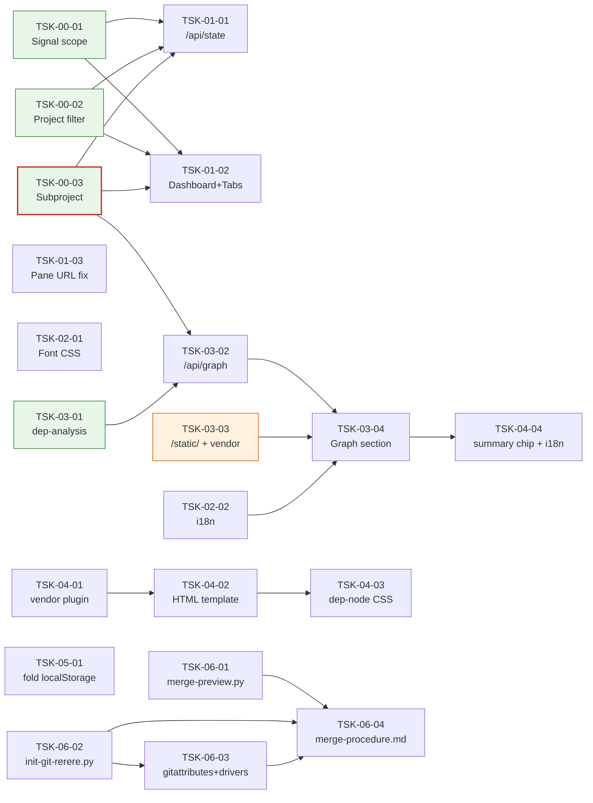

# WBS - dev-monitor v3

> version: 1.2
> description: dev-monitor 대시보드 v3 — 프로젝트/서브프로젝트 격리 + 실시간 의존성 그래프 + pane URL 버그 수정 + i18n/폰트 UX 개선 + (v1.1) Dep-graph 노드 카드 디자인 / WP 카드 fold 영속성 / 워크트리 머지 충돌 저감 MVP + (v1.2) Dep-Graph 요약 카드 범례화 + 상태별 색상
> depth: 3
> start-date: 2026-04-22
> target-date: 2026-05-06
> updated: 2026-04-23

---

## Dev Config

### Domains
| domain | description | unit-test | e2e-test | e2e-server | e2e-url |
|--------|-------------|-----------|----------|------------|---------|
| backend | Python scripts (monitor-server.py HTTP handler, dep-analysis.py, signal scanners, filter helpers) | `pytest -q scripts/` | - | - | - |
| frontend | SSR HTML/CSS + 벤더 JS(`skills/dev-monitor/vendor/*.js`). monitor-server.py 내부 `render_dashboard`/`_section_*` 함수가 SSR. 클라이언트 graph-client.js가 `/api/graph` 2초 폴링. | `pytest -q scripts/` | - | - | - |
| fullstack | backend + frontend 통합 (대시보드 라우트, 탭 바, i18n, 그래프 섹션) | `pytest -q scripts/` | `python3 scripts/test_monitor_e2e.py` | `python3 scripts/monitor-server.py --port 7321 --docs docs/monitor-v3` | `http://localhost:7321` |
| infra | `/static/` 라우팅, 벤더 JS 바인딩, 플러그인 캐시 동기화 | - | - | - | - |

### Design Guidance
| domain | architecture |
|--------|-------------|
| backend | Python 3 stdlib only (no pip). `http.server.BaseHTTPRequestHandler` + do_GET 디스패치. 모든 헬퍼는 pure 함수(테스트 용이). 테스트는 `scripts/test_monitor_*.py`/`scripts/test_dep_analysis*.py` — pytest + stdlib만. 서버 기동은 `monitor-launcher.py`가 서브프로세스로 detach. signal 원자성은 create+rename, 절대 NFS 마운트 금지. |
| frontend | SSR HTML은 monitor-server.py 내부 문자열 템플릿(별도 템플릿 엔진 없음). CSS는 `:root` 변수 기반(`--font-body`, `--font-mono`, `--font-h2`). i18n은 쿼리 파라미터(`?lang=ko|en`) 기반 stateless — 쿠키/localStorage 비사용. 클라이언트 JS는 `skills/dev-monitor/vendor/`에 벤더링, `/static/` 라우트 화이트리스트로 서빙. 라우팅과 메뉴 연결: 신규 섹션/탭/토글은 모두 동일 Task에서 SSR 렌더에 포함하여 orphan 섹션 방지. |

### Quality Commands
| name | command |
|------|---------|
| lint | - |
| typecheck | `python3 -m py_compile scripts/monitor-server.py scripts/dep-analysis.py` |
| coverage | - |

### Cleanup Processes
monitor-server, monitor-launcher

---

## WP-00: 공유 계약 & 필터 헬퍼
- schedule: 2026-04-22 ~ 2026-04-23
- description: 여러 feature(API·대시보드·그래프)가 공유하는 signal scope 구조 변경, 프로젝트/서브프로젝트 필터 헬퍼를 계약 전용으로 선행 분리. 이 WP 완료 후 WP-01~WP-03 feature Task들이 병렬 진행 가능.

### TSK-00-01: Signal scope 구조 subdir-per-scope 변경
- category: infrastructure
- domain: backend
- model: opus
- status: [xx]
- priority: critical
- assignee: -
- schedule: 2026-04-22 ~ 2026-04-22
- tags: signal, scope, contract, breaking
- depends: -
- blocked-by: -
- entry-point: -
- note: breaking contract — 모든 signal 소비자에 영향. `_classify_signal_scopes`는 `agent-pool:*` prefix 특수 처리 로직을 유지하여 표시 측면은 불변.

#### PRD 요구사항
- prd-ref: PRD §2 목표 P0-1 (프로젝트 단위 필터), §4 S1
- requirements:
  - `/tmp/claude-signals/` 하위를 subdir 단위로 스캔하고 각 signal의 `scope`를 `"shared"` 평탄화 대신 subdir 이름으로 기록한다.
  - `agent-pool:{timestamp}` scope는 기존대로 별도 버킷으로 유지.
  - `_classify_signal_scopes`가 agent-pool prefix만 특별 처리하고 나머지를 shared 버킷에 담는 현재 표시 로직은 변경하지 않는다.
- acceptance:
  - `/tmp/claude-signals/proj-a/X.done` → scope="proj-a"로 기록됨.
  - 기존 대시보드 렌더가 regression 없이 동일한 카운트를 표시.
- constraints:
  - Python 3 stdlib만. 테스트는 pytest + tempfile 기반 격리.
- test-criteria:
  - `test_scan_signals_scope_is_subdir`가 통과한다.

#### 기술 스펙 (TRD)
- tech-spec:
  - scripts/monitor-server.py의 `scan_signals()` 수정 (TRD §3.3).
- api-spec:
  - 내부 SignalEntry 구조: `scope` 필드 값 변경, 타입 동일.
- data-model:
  - SignalEntry(scope: str, ...) — scope 값 의미 변경(subdir 이름).
- ui-spec: -

---

### TSK-00-02: 프로젝트 레벨 pane/signal 필터 헬퍼
- category: infrastructure
- domain: backend
- model: sonnet
- status: [xx]
- priority: critical
- assignee: -
- schedule: 2026-04-23 ~ 2026-04-23
- tags: filter, project-scope, helper, contract
- depends: -
- blocked-by: -
- entry-point: -
- note: TSK-00-01과 독립적으로 구현 가능 (scope 값 의존 없음 — `project_name` prefix 매칭만).

#### PRD 요구사항
- prd-ref: PRD §2 P0-1, §5 AC-1, AC-2
- requirements:
  - `_filter_panes_by_project(panes, project_root, project_name)` — `pane_current_path`가 project_root 하위이거나 `window_name`이 `WP-*-{project_name}` 패턴이면 통과.
  - `_filter_signals_by_project(signals, project_name)` — `scope`가 `project_name` 또는 `project_name-*` prefix인 signal만 통과.
- acceptance:
  - 다른 프로젝트의 pane/signal이 대시보드 모델에서 제외됨.
  - 동일 project_name 하의 서브프로젝트 scope(`proj-a-billing`)는 통과.
- constraints:
  - Python 3 stdlib. `os.sep` 기반 경로 정규화로 크로스플랫폼 호환.
- test-criteria:
  - `test_filter_panes_by_project_root_startswith`, `test_filter_panes_by_project_window_name_match`, `test_filter_signals_by_project` 통과.

#### 기술 스펙 (TRD)
- tech-spec:
  - scripts/monitor-server.py에 pure 헬퍼 함수 추가 (TRD §3.2).
- api-spec: -
- data-model: -
- ui-spec: -

---

### TSK-00-03: 서브프로젝트 탐지 & 필터 헬퍼
- category: infrastructure
- domain: backend
- model: sonnet
- status: [xx]
- priority: critical
- assignee: -
- schedule: 2026-04-23 ~ 2026-04-23
- tags: subproject, discovery, filter, helper, contract
- depends: -
- blocked-by: -
- entry-point: -
- note: `args-parse.py:82-92`의 기존 서브프로젝트 규약과 동일 규칙 — child 디렉터리에 `wbs.md`가 있으면 subproject로 판정.

#### PRD 요구사항
- prd-ref: PRD §2 P0-2, §4 S2, §5 AC-3, AC-4, AC-5
- requirements:
  - `discover_subprojects(docs_dir: Path) -> List[str]` — `{docs_dir}/*/wbs.md`를 포함한 child 디렉터리 이름을 정렬된 리스트로 반환.
  - `_filter_by_subproject(state, sp, project_name)` — pane은 `window_name`이 `-{sp}` suffix 또는 `-{sp}-` 포함 또는 `pane_current_path`에 `/{sp}/` 포함이면 통과. signal은 scope가 `{project_name}-{sp}` 또는 `{project_name}-{sp}-*`이면 통과.
  - `wbs.md`가 없는 디렉터리(예: `docs/tasks/`, `docs/features/`)는 서브프로젝트로 인정하지 않음.
- acceptance:
  - 멀티 모드 vs 레거시 모드 판정 로직(`is_multi_mode = len(discover_subprojects(docs_dir)) > 0`)을 이 Task가 제공하는 헬퍼로 수행.
- constraints:
  - stdlib `pathlib.Path`만 사용.
- test-criteria:
  - `test_discover_subprojects_multi`, `test_discover_subprojects_legacy`, `test_discover_subprojects_ignores_dirs_without_wbs`, `test_filter_by_subproject_signals`, `test_filter_by_subproject_panes_by_window` 통과.

#### 기술 스펙 (TRD)
- tech-spec:
  - scripts/monitor-server.py에 헬퍼 함수 추가 (TRD §3.1, §3.4).
- api-spec: -
- data-model: -
- ui-spec: -

---

## WP-01: API & 대시보드 필터 통합
- schedule: 2026-04-24 ~ 2026-04-26
- description: WP-00의 헬퍼를 소비하여 `/api/state`를 확장하고, 대시보드 루트 라우트에 필터 + 서브프로젝트 탭 바 + pane URL 버그 수정을 적용.

### TSK-01-01: /api/state 쿼리 파라미터 & 응답 스키마 확장
- category: development
- domain: backend
- model: sonnet
- status: [xx]
- priority: high
- assignee: -
- schedule: 2026-04-24 ~ 2026-04-24
- tags: api, state, subproject, include_pool
- depends: TSK-00-01, TSK-00-02, TSK-00-03
- blocked-by: -
- entry-point: -
- note: /api/state는 AJAX 전용이므로 UI 변경 없음. lang 파라미터는 파싱하되 JSON 응답에는 영향 없음(HTML 렌더 전용).

#### PRD 요구사항
- prd-ref: PRD §5 AC-5
- requirements:
  - `?subproject=<sp|all>`(기본 all), `?lang=<ko|en>`, `?include_pool=<0|1>`(기본 0) 쿼리 파라미터를 처리.
  - 응답에 `subproject`, `available_subprojects`, `is_multi_mode`, `project_name`, `generated_at`, `project_root`, `docs_dir` 필드 추가.
  - `wbs_tasks`/`features`는 effective_docs_dir에서 스캔, `shared_signals`/`tmux_panes`는 WP-00 필터 적용.
  - `agent_pool_signals`는 기본 `[]`, `include_pool=1`일 때만 채움.
- acceptance:
  - `?subproject=billing` 응답에 `"subproject":"billing"` + 필터된 리스트.
  - `?include_pool=1` 없이는 agent-pool signals 제외.
- constraints:
  - 기존 API 소비자 없음 — breaking 필드 추가 자유. 기본값은 레거시 동작 유지.
- test-criteria:
  - `test_api_state_subproject_query`, `test_api_state_include_pool_default_excluded`, `test_api_state_include_pool_flag` 통과.

#### 기술 스펙 (TRD)
- tech-spec:
  - `do_GET` → `_route_root` 및 `_handle_state_api`에서 쿼리 파싱 + effective_docs_dir 해석 + 필터 closure 구성 (TRD §3.8).
- api-spec:
  - GET /api/state?subproject=&lang=&include_pool=&refresh= — 응답 스키마는 TRD §3.8 JSON 예시 준수.
- data-model:
  - 응답 상위 객체에 새 필드 7개 추가.
- ui-spec: -

---

### TSK-01-02: 대시보드 루트 라우트 + 서브프로젝트 탭 바 (SSR + UI)
- category: development
- domain: fullstack
- model: opus
- status: [xx]
- priority: high
- assignee: -
- schedule: 2026-04-25 ~ 2026-04-26
- tags: dashboard, ssr, subproject, tabs, filter
- depends: TSK-00-01, TSK-00-02, TSK-00-03
- blocked-by: -
- entry-point: / (대시보드 최상단 탭 바 `[ all | {sp1} | {sp2} ]`. legacy 모드는 탭 바 비표시)
- note: fullstack 통합 Task — WP-00 3개 헬퍼가 루트 렌더 파이프라인 하나에서 모두 수렴(의도된 3→1 merge). `_build_render_state(root, eff, ...)` + 탭 HTML을 한 번에 추가해야 SSR 렌더와 tabs UI 사이에 drift가 생기지 않음.

#### PRD 요구사항
- prd-ref: PRD §2 P0-1·P0-2, §4 S1·S2, §5 AC-1, AC-2, AC-3, AC-4, AC-5
- requirements:
  - 루트 GET `/`에서 `subproject`/`lang` 쿼리 파싱, `discover_subprojects`로 멀티 모드 판정, `effective_docs_dir` 해석(`all` → docs_dir, `<sp>` → docs_dir/sp).
  - pane/signal 필터 closure를 구성하여 `_build_render_state`에 주입.
  - 멀티 모드에서 헤더 바로 아래에 `[ all | sp1 | sp2 ]` 탭 바 렌더. 레거시 모드(서브프로젝트 0개)에서는 탭 바 미표시.
  - 각 탭 링크는 `?subproject={sp}` (기존 `?lang=` 쿼리 보존).
- acceptance:
  - AC-1/2: 다른 프로젝트의 pane·signal이 대시보드에 나타나지 않음.
  - AC-3/4: 멀티/레거시에 따라 탭 바가 적절히 노출/숨김.
  - AC-5: 탭 클릭 시 해당 서브프로젝트의 wbs_tasks/features/panes/signals만 보임.
- constraints:
  - Python 3 stdlib만. 기존 `_section_*` 함수 시그니처는 가능한 유지하되 필터 closure를 인자로 주입.
- test-criteria:
  - `test_dashboard_shows_tabs_in_multi_mode`, `test_dashboard_hides_tabs_in_legacy` 통과 + AC-1~5 관련 기존 테스트 regression 없음.

#### 기술 스펙 (TRD)
- tech-spec:
  - scripts/monitor-server.py `do_GET`/`_route_root`/`render_dashboard` 확장 (TRD §2 데이터 흐름 다이어그램).
- api-spec:
  - GET /?subproject=&lang= — HTML 응답.
- data-model:
  - render_state 모델에 project_name, subproject, available_subprojects, is_multi_mode 추가.
- ui-spec:
  - 탭 바 HTML: `<nav class="subproject-tabs"><a href="?subproject=all">all</a> | <a href="?subproject=billing">billing</a> ...</nav>`.
  - 현재 탭은 aria-current/클래스로 하이라이트.

---

### TSK-01-03: pane 상세 페이지 URL 인코딩 버그 수정
- category: defect
- domain: backend
- model: sonnet
- status: [xx]
- priority: high
- assignee: -
- schedule: 2026-04-24 ~ 2026-04-24
- tags: bugfix, url-encoding, pane, tmux
- depends: -
- blocked-by: -
- entry-point: -
- note: 브라우저가 `%` → `%25`로 자동 재인코딩하여 `/pane/%250` 요청이 오는 문제. 렌더 측 `quote()` + 라우터 측 `unquote()` 양쪽 수정 필요. JS fetch는 이미 encodeURIComponent 사용 중.

#### PRD 요구사항
- prd-ref: PRD §2 P0-3, §4 S3, §5 AC-6
- requirements:
  - pane 링크 생성 시 `urllib.parse.quote(pane_id, safe="")`로 URL-encode (기존 HTML-escape만으로는 부족).
  - `/pane/` 라우트에서 `urllib.parse.unquote` 후 `_PANE_ID_RE` 검증.
  - 불량 입력(`%xx` non-digit 등)은 unquote 결과가 정규식 불일치 → 400.
- acceptance:
  - `GET /pane/%250` → `capture_pane`에 `%0` 전달되어 200 응답.
  - 렌더된 pane 링크 href에 `%25` 포함(브라우저 재인코딩 전 단계).
- constraints:
  - 기존 `_PANE_ID_RE` 정규식 변경하지 않음 (decode 후 검증이므로 기존 패턴 그대로 유효).
- test-criteria:
  - `test_pane_route_decodes_percent_encoded`, `test_pane_link_quotes_pane_id` 통과.

#### 기술 스펙 (TRD)
- tech-spec:
  - scripts/monitor-server.py 2개 지점 수정 (TRD §3.5): 링크 생성부(~2183) + 라우트 핸들러(~3696, 3699).
- api-spec:
  - GET /pane/{url_encoded_pane_id} — decode 후 tmux capture.
- data-model: -
- ui-spec: -

---

## WP-02: UI 폴리싱 (폰트 + i18n)
- schedule: 2026-04-24 ~ 2026-04-25
- description: CSS 변수 기반 폰트 확대 + 섹션 h2 한정 i18n(ko/en). 둘 다 WP-00 헬퍼 의존 없이 독립 진행.

### TSK-02-01: 폰트 CSS 변수 도입 & 13→14px 확대
- category: development
- domain: frontend
- model: sonnet
- status: [xx]
- priority: medium
- assignee: -
- schedule: 2026-04-24 ~ 2026-04-24
- tags: css, font, ux
- depends: -
- blocked-by: -
- entry-point: / (전역 body/mono 폰트)
- note: `grep`으로 정확히 매치되는 `font-size: 13px`, `font-size: 15px` 리터럴만 변수로 치환. 미디어 쿼리 추가 없음(반응형 미대응).

#### PRD 요구사항
- prd-ref: PRD §2 P1-4, §5 AC-8
- requirements:
  - CSS `:root`에 `--font-body: 14px`, `--font-mono: 14px`, `--font-h2: 17px` 선언.
  - 기존 리터럴 13px/15px를 해당 변수로 치환.
- acceptance:
  - 본문 글자 크기 v2 대비 확대(13→14+).
  - 브라우저 inspect로 `:root { --font-body: 14px }` 확인.
- constraints:
  - 반응형 추가 금지. 기존 레이아웃 깨지지 않도록 checkout diff로 검증.
- test-criteria:
  - `test_font_css_variables_present` 통과.

#### 기술 스펙 (TRD)
- tech-spec:
  - scripts/monitor-server.py 인라인 CSS 블록 수정 (TRD §3.6).
- api-spec: -
- data-model: -
- ui-spec:
  - :root 변수 3개 + 기존 리터럴 치환.

---

### TSK-02-02: i18n 프레임워크 + 언어 토글 UI
- category: development
- domain: fullstack
- model: sonnet
- status: [xx]
- priority: medium
- assignee: -
- schedule: 2026-04-24 ~ 2026-04-25
- tags: i18n, ko, en, lang-toggle
- depends: -
- blocked-by: -
- entry-point: / 헤더 우측 `[ 한 | EN ]` 토글
- note: 섹션 h2 heading만 번역 대상. eyebrow, 테이블 컬럼명, 코드 블록, 에러 메시지는 비대상(PRD §3 비목표). 쿠키/localStorage 없음 — `?lang=` 쿼리만.

#### PRD 요구사항
- prd-ref: PRD §2 P1-5, §3 비목표, §4 S4, §5 AC-7
- requirements:
  - `_I18N = {"ko": {...}, "en": {...}}` 테이블을 모듈 상단 상수로 선언.
  - `_t(lang, key)` 헬퍼 구현 — 미일치 키는 key 자체 반환.
  - `render_dashboard(model, lang="ko")` 서명 확장, 각 `_section_*` 함수의 heading 인자를 `_t(lang, ...)` 결과로 교체.
  - 헤더 우측 `<nav class="lang-toggle">`에 ko/en 링크 렌더 (현재 subproject 쿼리 보존).
  - 기본값 `ko`.
- acceptance:
  - AC-7: `?lang` 미지정 시 "작업 패키지" 등 한국어, `?lang=en` 시 "Work Packages" 등 영문.
- constraints:
  - 섹션 h2 이외 텍스트는 번역하지 않음(스코프 제한).
- test-criteria:
  - `test_section_titles_korean_default`, `test_section_titles_english_with_lang_en` 통과.

#### 기술 스펙 (TRD)
- tech-spec:
  - scripts/monitor-server.py 상단에 `_I18N` 상수 + `_t` 헬퍼 (TRD §3.7).
  - `render_dashboard` + `_section_*` 시그니처에 lang 전파.
- api-spec:
  - GET /?lang=ko|en — HTML 응답에서 섹션 heading 번역.
- data-model:
  - `_I18N` 키: work_packages, features, team_agents, subagents, live_activity, phase_timeline (WP-03에서 dep_graph 키 추가).
- ui-spec:
  - `<nav class="lang-toggle"><a href="?lang=ko&subproject=...">한</a> <a href="?lang=en&subproject=...">EN</a></nav>`.

---

## WP-03: 실시간 의존성 그래프
- schedule: 2026-04-24 ~ 2026-04-28
- description: dep-analysis 알고리즘 확장 → /api/graph 엔드포인트 → /static/ 벤더 서빙 → Dependency Graph 섹션(cytoscape + dagre + 2초 폴링). 서브프로젝트 필터와 연동.

### TSK-03-01: dep-analysis.py --graph-stats 확장 (critical_path, fan_out, bottleneck_ids)
- category: infrastructure
- domain: backend
- model: opus
- status: [xx]
- priority: high
- assignee: -
- schedule: 2026-04-24 ~ 2026-04-24
- tags: algorithm, topological-sort, critical-path, dep-analysis
- depends: -
- blocked-by: -
- entry-point: -
- note: longest-path DP + 결정론적 tiebreak(task_id alphabetical). 기존 max_chain_depth/fan_in_top/diamond_patterns/review_candidates 필드는 그대로 유지.

#### PRD 요구사항
- prd-ref: PRD §2 P0-6, §5 AC-10~AC-14
- requirements:
  - `--graph-stats` JSON 출력에 다음 필드 추가:
    - `fan_out`: Task별 fan-out 개수.
    - `critical_path`: `{"nodes": [...], "edges": [...]}` — 루트(fan_in==0)에서 리프까지 longest path.
    - `bottleneck_ids`: `fan_in >= 3 or fan_out >= 3`인 Task ID 목록.
  - 동점 시 task_id alphabetical 작은 쪽 우선(결정론).
  - 사이클 감지 시 명시적 에러(기존 동작 유지).
- acceptance:
  - 선형 체인 TSK-A→B→C→D → critical_path.nodes = [A,B,C,D].
  - 다이아몬드 그래프 → 긴 경로 선택 + 결정론.
  - fan_in≥3 또는 fan_out≥3만 bottleneck_ids에 포함.
- constraints:
  - Python 3 stdlib (`collections.defaultdict`, `json`).
- test-criteria:
  - `test_dep_analysis_critical_path_linear`, `test_dep_analysis_critical_path_diamond`, `test_dep_analysis_fan_out`, `test_dep_analysis_bottleneck_ids` 통과.

#### 기술 스펙 (TRD)
- tech-spec:
  - scripts/dep-analysis.py `--graph-stats` 모드 확장 (TRD §3.9.3).
- api-spec:
  - CLI 출력 JSON에 3개 필드 추가.
- data-model:
  - `{max_chain_depth, fan_in_top, diamond_patterns, review_candidates, fan_out, critical_path: {nodes, edges}, bottleneck_ids}`.
- ui-spec: -

---

### TSK-03-02: /api/graph 엔드포인트
- category: development
- domain: backend
- model: sonnet
- status: [xx]
- priority: high
- assignee: -
- schedule: 2026-04-25 ~ 2026-04-25
- tags: api, graph, polling, subproject
- depends: TSK-03-01, TSK-00-03
- blocked-by: -
- entry-point: -
- note: O(N+E) 재계산 — 수백 Task까지 단일 요청 <50ms 목표. 상태 판정은 `_derive_node_status(task, signals)` 헬퍼로 격리.

#### PRD 요구사항
- prd-ref: PRD §2 P0-6, §4 S5, §5 AC-10, AC-11, AC-15, AC-16
- requirements:
  - `GET /api/graph?subproject=<sp|all>` 핸들러 추가.
  - scan_tasks(effective_docs_dir) → dep-analysis 호출 → 응답 빌드.
  - 노드 status 매핑:
    - `done`: state.json.status == `[xx]`
    - `running`: `.running` 시그널 또는 status in {`[dd]`,`[im]`,`[ts]`}
    - `pending`: 기타
    - `failed`: `.failed` 시그널 또는 state.json.last.event == `fail`
    - `bypassed`: state.json.bypassed == true
  - 각 노드에 `is_critical`, `is_bottleneck`, `fan_in`, `fan_out`, `bypassed`, `wp_id`, `label` 포함.
  - `stats`에 total/done/running/pending/failed/bypassed/max_chain_depth/critical_path_length/bottleneck_count.
- acceptance:
  - AC-10: 응답 `nodes`/`edges`가 WBS Task와 depends를 정확히 반영.
  - AC-11: status 값 5종이 올바르게 파생.
  - AC-15: `?subproject=p1`이면 `docs/p1/`의 Task만.
  - AC-16: state.json 변경 시 다음 호출에서 즉시 반영(캐시 없음).
- constraints:
  - 매 호출 fresh 스캔 — in-memory 캐시 없음(2초 폴링이므로 지연 허용).
- test-criteria:
  - `test_api_graph_returns_nodes_and_edges`, `test_api_graph_derives_status_done_running_pending_failed_bypassed`, `test_api_graph_respects_subproject_filter` 통과.

#### 기술 스펙 (TRD)
- tech-spec:
  - scripts/monitor-server.py `_handle_graph_api` + `_derive_node_status` 추가 (TRD §3.9.2).
  - dep-analysis.py를 subprocess로 호출 또는 모듈 import (기존 관행 확인 후 결정).
- api-spec:
  - GET /api/graph?subproject= — 응답 스키마는 TRD §3.9.2 JSON 예시 준수.
- data-model:
  - 응답 최상위: subproject, docs_dir, generated_at, stats, critical_path, nodes[], edges[].
- ui-spec: -

---

### TSK-03-03: /static/ 라우팅 + 벤더 JS 바인딩
- category: infrastructure
- domain: infra
- model: sonnet
- status: [xx]
- priority: high
- assignee: -
- schedule: 2026-04-24 ~ 2026-04-24
- tags: static, routing, vendor, security
- depends: -
- blocked-by: -
- entry-point: -
- note: `skills/dev-monitor/vendor/`에 cytoscape.min.js, dagre.min.js, cytoscape-dagre.min.js 3종을 commit. 디렉터리 traversal 방지는 path에 `..` 포함 시 404.

#### PRD 요구사항
- prd-ref: PRD §5 AC-18
- requirements:
  - `_is_static_path(path)` 분기 + `_handle_static(handler, path)` 핸들러.
  - 허용 화이트리스트: `cytoscape.min.js`, `dagre.min.js`, `cytoscape-dagre.min.js`, `graph-client.js`. 기타 경로 404.
  - 파일 base: `${CLAUDE_PLUGIN_ROOT}/skills/dev-monitor/vendor/`.
  - `..` 포함 경로 또는 화이트리스트 외는 404.
  - MIME: `.js` → `application/javascript; charset=utf-8`.
  - Cache-Control: `public, max-age=3600`.
  - 벤더 JS 3종을 저장소에 추가(graph-client.js는 TSK-03-04 산출물이라 본 Task에서는 placeholder 또는 빈 파일로 선행).
- acceptance:
  - AC-18: `ls skills/dev-monitor/vendor/*.js`가 cytoscape/dagre 존재 확인.
  - `GET /static/cytoscape.min.js` → 200.
  - `GET /static/../secrets` → 404.
- constraints:
  - 오프라인 동작 보장 — CDN 링크 금지.
- test-criteria:
  - `test_static_route_whitelist_allows_vendor_js`, `test_static_route_rejects_traversal` 통과.

#### 기술 스펙 (TRD)
- tech-spec:
  - scripts/monitor-server.py에 static 라우트 + handler (TRD §3.9.6).
  - `skills/dev-monitor/vendor/` 디렉터리 신설.
- api-spec:
  - GET /static/{file} — 화이트리스트만.
- data-model: -
- ui-spec: -

---

### TSK-03-04: Dependency Graph 섹션 (graph-client.js + SSR + 통합)
- category: development
- domain: fullstack
- model: opus
- status: [xx]
- priority: high
- assignee: -
- schedule: 2026-04-26 ~ 2026-04-28
- tags: graph, cytoscape, dagre, polling, realtime, client
- depends: TSK-03-02, TSK-03-03, TSK-02-02
- blocked-by: -
- entry-point: /#dep-graph (대시보드 내 Dependency Graph 섹션)
- note: fullstack — SSR 뼈대(_section_dep_graph) + graph-client.js(≤300 LOC) + i18n 키 `dep_graph` 추가 + 대시보드 renderer 통합. 클라이언트 delta 적용은 노드 속성 갱신이 기본, 토폴로지 변경 시에만 레이아웃 재실행.

#### PRD 요구사항
- prd-ref: PRD §2 P0-6, §4 S5, §5 AC-12, AC-13, AC-14, AC-16, AC-17
- requirements:
  - `_section_dep_graph(lang, subproject)` SSR 헬퍼 — `<div id="dep-graph-canvas">` + summary 영역 + 벤더 `<script>` 태그 4개(/static/ 경로).
  - `_I18N`에 `dep_graph` 키 추가(ko: "의존성 그래프", en: "Dependency Graph").
  - `render_dashboard`에서 기존 섹션 리스트에 dep-graph 삽입.
  - `skills/dev-monitor/vendor/graph-client.js` 신규 작성:
    - 2초 간격 폴링 (`POLL_MS = 2000`).
    - cytoscape 초기화(dagre LR 레이아웃, nodeSep:40, rankSep:80).
    - 첫 로드: `cy.add()` + `cy.layout({name:'dagre'}).run()`.
    - 이후 폴링: nodes/edges diff — 기존 노드는 속성 갱신(color/borderWidth), 신규는 add, 제거는 remove.
    - 토폴로지 변경 감지 시에만 레이아웃 재실행.
    - CSS transition으로 색상 전환 애니메이션(400ms).
    - 노드 클릭 팝오버(Task 제목·상태·depends·phase_history 표시).
    - 마우스 휠 pan/zoom 기본 지원.
    - 색상 팔레트: done `#22c55e`, running `#eab308`, pending `#94a3b8`, failed `#ef4444`, bypassed `#a855f7`, 크리티컬 엣지 `#ef4444`, 기본 엣지 `#475569`.
    - 병목 노드: ⚠ 라벨 prefix + 배지 스타일.
    - 현재 `?subproject=` 쿼리 유지.
  - 진행도 요약 카드(`#dep-graph-summary`)에 `총 N · 완료 x · 진행 y · 대기 z · 실패 w · 바이패스 b`, `크리티컬 패스 깊이 D`, `병목 Task K개` — 폴링에 맞춰 갱신.
- acceptance:
  - AC-12: 크리티컬 패스 엣지가 굵은 빨강 선 + 노드 테두리 강조.
  - AC-13: fan_in≥3 또는 fan_out≥3 노드에 ⚠ 배지.
  - AC-14: 진행도 요약 카드에 카운트 + 크리티컬 패스 깊이 포함.
  - AC-16: Task 상태 변화가 리로드 없이 2~3초 이내 노드 색상에 반영.
  - AC-17: pan/zoom, 노드 클릭 팝오버 정상 동작.
- constraints:
  - graph-client.js는 순수 브라우저 JS(ES2020 범위) — 번들러 없음. SSR도 stdlib만.
  - 대용량 WBS(~100 Task)에서 프레임 끊김 없어야 함(layout 재실행 최소화).
- test-criteria:
  - `test_graph_section_embedded_in_dashboard` 통과.
  - 수동 E2E: `/dev TSK-ID` 실행 중 노드 전환 관찰, 크리티컬 패스 재계산 확인, 오프라인 로드 확인.

#### 기술 스펙 (TRD)
- tech-spec:
  - scripts/monitor-server.py `_section_dep_graph` (TRD §3.9.5).
  - `skills/dev-monitor/vendor/graph-client.js` (TRD §3.9.4, ≤300 LOC).
  - 기존 `render_dashboard` 호출 체인에 편입.
- api-spec:
  - 클라이언트는 `GET /api/graph?subproject=${SP}` 호출(TSK-03-02 제공).
- data-model:
  - cytoscape 노드 data: `{id, label, color, borderWidth, borderColor, status, is_critical, is_bottleneck, fan_in, fan_out, bypassed, wp_id}`.
  - 엣지 data: `{source, target, color, width, is_critical}`.
- ui-spec:
  - 섹션 HTML TRD §3.9.5 예시 준수.
  - 색상 팔레트 TRD §3.9.4 고정.
  - 높이 520px 캔버스 + legend + summary.

---

## WP-04: Dep-Graph 노드 카드 디자인 개편 + 요약 카드 범례화
- schedule: 2026-04-24 ~ 2026-04-27
- description: (1) 현재 단일 라인 레이블(title-only, 11px, 단색)을 HTML 기반 2줄 카드(ID monospace + 제목 sans + 상태 3중 시각 단서)로 교체, `cytoscape-node-html-label` 플러그인 벤더링. (2) 섹션 헤더 우측 요약 숫자(`4 · 2 · 1 · 1 · 0 · 0`)를 `{레이블} {숫자}` 칩으로 교체하고 상태 색상 팔레트와 1:1 일치시켜, 노드/legend/요약 세 위치의 색상 언어를 통일한다.

### TSK-04-01: cytoscape-node-html-label 벤더 추가
- category: infrastructure
- domain: infra
- model: sonnet
- status: [ ]
- priority: high
- assignee: -
- schedule: 2026-04-24 ~ 2026-04-24
- tags: vendor, whitelist, plugin, infra
- depends: -
- blocked-by: -
- entry-point: -
- note: v2.0.1 (~7 KB). GitHub release 에서 다운로드. `_STATIC_WHITELIST` 등록 + `_section_dep_graph` script 태그에 dagre 직후 주입.

#### PRD 요구사항
- prd-ref: PRD §2 P0-7, §5 AC-19
- requirements:
  - `skills/dev-monitor/vendor/cytoscape-node-html-label.min.js` 추가 (버전 v2.0.1 고정, 외부 네트워크 의존 없음)
  - `scripts/monitor-server.py` `_STATIC_WHITELIST` 에 파일명 등록
  - `_section_dep_graph` 의 `<script>` 로드 순서: `dagre → cytoscape → cytoscape-node-html-label → cytoscape-dagre → graph-client`
- acceptance:
  - `GET /static/cytoscape-node-html-label.min.js` → 200, MIME `application/javascript; charset=utf-8`
  - 기존 `/static/*.js` 요청 regression 없음
- constraints:
  - Python stdlib 만 사용 (기존 `_handle_static` 재사용)
  - 벤더 파일 서명 검증 불요 (localhost 전용)
- test-criteria:
  - `test_static_route_serves_node_html_label`
  - `test_dep_graph_script_load_order`

#### 기술 스펙 (TRD)
- tech-spec: TRD §3.10.2
- api-spec: `/static/` 화이트리스트 확장만, 기존 라우터 재사용
- data-model: -
- ui-spec: -

---

### TSK-04-02: graph-client.js 노드 HTML 템플릿
- category: development
- domain: frontend
- model: sonnet
- status: [ ]
- priority: high
- assignee: -
- schedule: 2026-04-25 ~ 2026-04-25
- tags: graph, cytoscape, html-label, template, frontend
- depends: TSK-04-01
- blocked-by: -
- entry-point: -
- note: `nodeStyle.label` 제거 및 ⚠ 이모지 prefix 제거. `cy.nodeHtmlLabel([...])` 등록 및 `escapeHtml` 헬퍼 추가. 기존 팝오버/폴링 로직은 변경 없음.

#### PRD 요구사항
- prd-ref: PRD §2 P0-7, §5 AC-19, AC-20, AC-21
- requirements:
  - `nodeHtmlTemplate(data)` — 상태 클래스(`status-{done|running|pending|failed|bypassed}`) + `critical` + `bottleneck` 플래그를 포함한 2줄 카드 HTML
  - `escapeHtml` 헬퍼 추가 (XSS 방지)
  - cytoscape node 스타일: `background-opacity: 0`, `border-width: 0`, `width: 180`, `height: 54`
  - 레이아웃: `nodeSep: 60`, `rankSep: 120`, rankDir `LR` 유지
  - `nodeStyle()` 에서 `label` 필드 제거
- acceptance:
  - WBS Task 50개 기준 pan/zoom 시 HTML 레이블이 노드 위치 추종
  - 기존 클릭 팝오버 이벤트(`cy.on("tap","node",...)`) 정상 동작
- constraints:
  - IIFE 패턴 / ES2020 / ≤350 LOC 유지 (기존 285 LOC 기준 여유)
- test-criteria:
  - `test_dep_graph_two_line_label`
  - `test_dep_graph_node_template_contains_id_and_title`
  - `test_dep_graph_bottleneck_class_renders`

#### 기술 스펙 (TRD)
- tech-spec: TRD §3.10.3
- api-spec: `/api/graph` 응답 구조 변경 없음 (기존 `label` 필드 재사용)
- data-model: 클라이언트 측 `nd.id`, `nd.label`, `nd.status`, `nd.is_critical`, `nd.is_bottleneck` 활용
- ui-spec: TRD §3.10.4 CSS 계약

---

### TSK-04-03: dep-node CSS + 캔버스 높이 조정
- category: development
- domain: frontend
- model: sonnet
- status: [ ]
- priority: high
- assignee: -
- schedule: 2026-04-26 ~ 2026-04-26
- tags: css, theme, design-tokens, frontend
- depends: TSK-04-02
- blocked-by: -
- entry-point: -
- note: monitor-server.py inline `<style>` 또는 `_section_dep_graph` 내부에 CSS 추가. `color-mix()` 사용 — 최신 브라우저 전제.

#### PRD 요구사항
- prd-ref: PRD §2 P0-7, §5 AC-19, AC-20, AC-21
- requirements:
  - `.dep-node`, `.dep-node-id`, `.dep-node-title` 기본 규칙
  - 상태 5종별 규칙: `border-left-color` + `--_tint` CSS 변수 + `.dep-node-id` 글자색 override
  - `.dep-node.critical` (붉은 글로우 + border), `.dep-node.bottleneck` (dashed border)
  - hover lift(transform + shadow)
  - canvas 인라인 스타일 `height: 520px → 640px`
- acceptance:
  - AC-19~AC-21 전부 충족
  - 기존 범례(legend) 색상과 스트립 색상 일치
  - 시각 회귀 없음
- constraints:
  - CSS 토큰(`--done`, `--run`, `--ink-3`, `--fail`, `--bg-2`, `--ink-4`, `--ink`) 재사용
  - `color-mix()` 미지원 환경은 단서 1/2만 유지(graceful degradation)
- test-criteria:
  - `test_dep_graph_css_rules_present`
  - `test_dep_graph_canvas_height_640`
  - `test_dep_graph_status_multi_cue`

#### 기술 스펙 (TRD)
- tech-spec: TRD §3.10.4, §3.10.5
- api-spec: -
- data-model: -
- ui-spec: TRD §3.10.4

---

### TSK-04-04: Dep-Graph summary 칩 SSR + i18n + CSS
- category: development
- domain: frontend
- model: sonnet
- status: [ ]
- priority: medium
- assignee: -
- schedule: 2026-04-27 ~ 2026-04-27
- tags: dep-graph, summary, legend, i18n, css, accessibility, frontend
- depends: TSK-03-04
- blocked-by: -
- entry-point: -
- note: WP-04의 노드 카드 디자인과 동일한 섹션(`_section_dep_graph`)·동일한 색상 팔레트를 다룬다. TSK-04-01/02/03(노드 카드)과 독립적이어서 병렬 가능하지만, 같은 파일 충돌을 피하려면 04-03 이후 직렬 수행 권장. `graph-client.js:updateSummary` 는 `[data-stat]` 선택자만 사용하므로 태그 변경(`<span>→<b>`)과 무관하게 동작 — JS 수정 0 목표.

#### PRD 요구사항
- prd-ref: PRD §2 P1-8, §4 S9, §5 AC-30, AC-31, AC-32
- requirements:
  - `_section_dep_graph` summary HTML 교체: 6개 `<span class="dep-stat dep-stat-{state}"><em>{label}</em> <b data-stat="{state}">-</b></span>`
  - `_t` 테이블에 i18n 키 6종 추가: `dep_stat_total`, `dep_stat_done`, `dep_stat_running`, `dep_stat_pending`, `dep_stat_failed`, `dep_stat_bypassed` (ko/en)
  - `.dep-stat` / `.dep-stat-{state}` CSS 규칙 추가 — `var(--done)`, `var(--run)`, `var(--ink-3)`, `var(--fail)`, `#a855f7`, `var(--ink)` 매핑
  - `[data-stat]` 선택자 6종 모두 유지 (graph-client.js:updateSummary 계약)
  - `.dep-graph-summary-extra`(크리티컬 깊이/병목 수) 표시 유지
- acceptance:
  - AC-30: `lang=ko` / `lang=en` 렌더에서 6개 레이블이 정확히 표시
  - AC-31: 5개 상태 칩의 글자색이 팔레트 토큰과 일치, `total` 은 기본 텍스트 색
  - AC-32: 칩 색상과 `#dep-graph-legend` 색상이 1:1 일치
  - `graph-client.js:updateSummary` 회귀 없음 (기존 `test_monitor_*` 통과)
- constraints:
  - SSR 마크업 변경 우선, JS 수정은 선택자 유지 시 0으로 목표
  - 새 CSS 토큰 도입 금지 — 기존 `--done`/`--run`/`--ink`/`--ink-3`/`--fail` 재사용
  - `#a855f7`(bypassed)는 legend·graph-client.js 기존 하드코딩값과 동일값 사용
  - 색만으로 상태 구분하지 않음 — 레이블 텍스트가 1차 단서(접근성)
- test-criteria:
  - `test_dep_graph_summary_labels_ko`
  - `test_dep_graph_summary_labels_en`
  - `test_dep_graph_summary_color_matches_palette`
  - `test_dep_graph_summary_legend_parity`
  - `test_dep_graph_summary_preserves_data_stat_selector`

#### 기술 스펙 (TRD)
- tech-spec: TRD §3.13
- api-spec: `/api/graph` 응답 스키마 변경 없음 (기존 `stats.{total,done,running,pending,failed,bypassed,critical_path_depth,bottleneck_count}` 재사용)
- data-model: -
- ui-spec: TRD §3.13.3(HTML), §3.13.4(i18n), §3.13.5(CSS), §3.13.7(legend parity)

---

## WP-05: WP 카드 Fold 상태 영속성
- schedule: 2026-04-27 ~ 2026-04-27
- description: localStorage 기반으로 WP 카드(`<details data-wp>`) 접힘 상태를 자동 refresh 및 하드 리로드 후에도 유지. 서버 계약 변경 없이 클라이언트 JS 확장으로만 해결.

### TSK-05-01: Fold 영속성 JS + patchSection 훅 확장
- category: development
- domain: fullstack
- model: sonnet
- status: [xx]
- priority: medium
- assignee: -
- schedule: 2026-04-27 ~ 2026-04-27
- tags: localstorage, ux, details, fold, frontend
- depends: -
- blocked-by: -
- entry-point: -
- note: 서버는 기본 `<details ... open>` 유지 (JS 비활성/첫 방문자 호환). 클라이언트 JS가 localStorage 로 덮어씀.

#### PRD 요구사항
- prd-ref: PRD §2 P1-6, §5 AC-22, AC-23, AC-24
- requirements:
  - 키 스키마: `dev-monitor:fold:{WP-ID}`, 값 `"open"|"closed"`
  - 헬퍼 4종: `readFold`, `writeFold`, `applyFoldStates(root)`, `bindFoldListeners(root)`
  - 초기 로드(`startMainPoll` 직전) 호출
  - `patchSection('wp-cards')` 교체 직후 `applyFoldStates(current); bindFoldListeners(current);`
  - toggle 이벤트 → `writeFold` (per-element listener, __foldBound 플래그로 중복 방지)
  - try/catch 로 quota/disabled localStorage 대응
- acceptance:
  - AC-22: toggle 시 localStorage 키 값 정상 저장
  - AC-23: 5초 auto-refresh 후 접힌 상태 유지
  - AC-24: 하드 리로드(F5) 후 접힌 상태 유지
- constraints:
  - 서버 계약 변경 없음 (`<details open>` 기본값 유지)
  - 다중 탭 `storage` 이벤트 동기화는 범위 밖
- test-criteria:
  - `test_fold_localstorage_write` (브라우저 비의존 — JS 코드 존재 검증)
  - `test_fold_restore_on_patch` (patchSection 훅 호출 여부)
  - `test_fold_bind_idempotent` (__foldBound 중복 방지)

#### 기술 스펙 (TRD)
- tech-spec: TRD §3.11
- api-spec: 서버 계약 변경 없음
- data-model: localStorage key-value (`dev-monitor:fold:{WP-ID}` → `"open"|"closed"`)
- ui-spec: `<details data-wp="WP-ID">` 토글 UX

---

## WP-06: 워크트리 머지 충돌 저감 MVP
- schedule: 2026-04-28 ~ 2026-05-02
- description: `/dev-team` 머지 단계의 충돌 빈도·해결 토큰비용 저감. Layer 2(merge-preview) + Layer 3(rerere + 머지 드라이버) + Layer 4(주기 main-sync) MVP. Layer 1/5 는 범위 밖(후속).

### TSK-06-01: merge-preview.py 작성 + dev-build 워커 프롬프트 통합
- category: infrastructure
- domain: fullstack
- model: sonnet
- status: [ ]
- priority: high
- assignee: -
- schedule: 2026-04-28 ~ 2026-04-29
- tags: git, merge, preview, worker, infrastructure
- depends: -
- blocked-by: -
- entry-point: -
- note: Python stdlib subprocess. zero-LLM 스크립트. `skills/dev-build/SKILL.md` 워커 프롬프트에 1줄 통합.

#### PRD 요구사항
- prd-ref: PRD §2 P1-7, §5 AC-25, AC-29
- requirements:
  - `scripts/merge-preview.py` — `--remote origin`, `--target main` 옵션, 기본값 동일
  - JSON stdout: `{"clean": bool, "conflicts": [{"file": str, "hunks": [...]}], "base_sha": str}`
  - `git merge --no-commit --no-ff` 시뮬레이션 후 **반드시** `--abort` (부작용 0)
  - 깨끗하지 않은 워크트리(uncommitted) 면 exit 2 + stderr 경고
  - `skills/dev-build/SKILL.md` 워커 프롬프트에 Task `[im]` 진입 전 실행 단계 추가
- acceptance:
  - AC-25: clean / 충돌 케이스 모두 정확 분류
  - AC-29: 프롬프트 문자열 grep 검증
- constraints:
  - Python 3 stdlib, subprocess 로 `git` 호출
  - exit code: 0 (clean+JSON), 1 (conflicts+JSON), 2 (워크트리 dirty)
- test-criteria:
  - `test_merge_preview_detects_conflicts`
  - `test_merge_preview_clean_merge`
  - `test_merge_preview_dirty_worktree_exits_2`
  - `test_dev_build_skill_contains_merge_preview_step`

#### 기술 스펙 (TRD)
- tech-spec: TRD §3.12.2
- api-spec: CLI JSON stdout
- data-model: `{clean, conflicts[], base_sha}`
- ui-spec: -

---

### TSK-06-02: init-git-rerere.py + dev-team 자동 호출
- category: infrastructure
- domain: infra
- model: sonnet
- status: [ ]
- priority: high
- assignee: -
- schedule: 2026-04-30 ~ 2026-04-30
- tags: git, rerere, config, infrastructure
- depends: -
- blocked-by: -
- entry-point: -
- note: Idempotent (재호출 안전). `/dev-team` 워크트리 생성 직후 1회 호출. WP-06 TSK-06-03 의 드라이버 등록까지 여기서 수행.

#### PRD 요구사항
- prd-ref: PRD §2 P1-7, §5 AC-26
- requirements:
  - `scripts/init-git-rerere.py` — `git config rerere.enabled true`, `rerere.autoupdate true`
  - 머지 드라이버 등록: `merge.state-json-smart.driver`, `merge.state-json-smart.name`, `merge.wbs-status-smart.driver`, `merge.wbs-status-smart.name`
  - `{CLAUDE_PLUGIN_ROOT}` 경로 치환을 환경변수 기반으로 자동 해결
  - Idempotent: 동일 값이면 no-op (변경 없음 로그)
  - `/dev-team` 팀리더 스폰 지점 또는 `wp-setup.py` 에서 1회 호출
- acceptance:
  - AC-26: `git config --get rerere.enabled` = `true`
  - 드라이버 4개 설정 모두 존재 (`git config --get merge.state-json-smart.driver`)
- constraints:
  - 프로젝트 로컬 `.git/config` 만 수정 (전역 사용자 설정 건드리지 않음)
- test-criteria:
  - `test_init_git_rerere_idempotent`
  - `test_init_git_rerere_sets_drivers`

#### 기술 스펙 (TRD)
- tech-spec: TRD §3.12.3
- api-spec: -
- data-model: -
- ui-spec: -

---

### TSK-06-03: .gitattributes + merge-state-json.py + merge-wbs-status.py
- category: infrastructure
- domain: infra
- model: opus
- status: [ ]
- priority: high
- assignee: -
- schedule: 2026-05-01 ~ 2026-05-02
- tags: git, merge-driver, gitattributes, state-json, wbs, infrastructure
- depends: TSK-06-02
- blocked-by: -
- entry-point: -
- note: 머지 세만틱 복잡(3-way JSON / markdown 라인 merge) — Opus 선정. 드라이버 실패 시 exit 1 로 일반 3-way 충돌 폴백.

#### PRD 요구사항
- prd-ref: PRD §2 P1-7, §5 AC-27, AC-28
- requirements:
  - `.gitattributes` (프로젝트 루트 신규):
    ```
    docs/todo.md                    merge=union
    docs/**/state.json              merge=state-json-smart
    docs/**/tasks/**/state.json     merge=state-json-smart
    docs/**/wbs.md                  merge=wbs-status-smart
    ```
  - `scripts/merge-state-json.py` — 알고리즘 TRD §3.12.5 준수(phase_history union + status 우선순위 + bypassed OR + updated max)
  - `scripts/merge-wbs-status.py` — 알고리즘 TRD §3.12.6 준수(status 라인 진행도 우선, 비-status 는 3-way)
  - 두 드라이버 모두 실패(파싱 에러/스키마 불일치) 시 exit 1 → 일반 3-way 충돌 폴백
- acceptance:
  - AC-27: phase_history 양쪽 합쳐 중복 제거, status 우선순위 `[xx]>[ts]>[im]>[dd]>[ ]`
  - AC-28: `docs/todo.md` 양쪽 라인 보존
  - 드라이버 자체 테스트 통과
- constraints:
  - Python 3 stdlib (`json`, `difflib.ndiff` 등)
  - Signed write (tmp → rename) 원자성 보장
- test-criteria:
  - `test_merge_state_json_phase_history_union`
  - `test_merge_state_json_status_priority`
  - `test_merge_state_json_bypassed_or`
  - `test_merge_state_json_fallback_on_invalid_json`
  - `test_merge_wbs_status_priority`
  - `test_merge_wbs_status_non_status_conflict_preserved`
  - `test_merge_todo_union` (git 내장 확인)

#### 기술 스펙 (TRD)
- tech-spec: TRD §3.12.4, §3.12.5, §3.12.6
- api-spec: `%O %A %B %L` 드라이버 서명
- data-model: state.json 스키마 + wbs.md status 라인 파서
- ui-spec: -

---

### TSK-06-04: merge-procedure.md 개정 + 충돌 로그 저장
- category: documentation
- domain: fullstack
- model: sonnet
- status: [ ]
- priority: medium
- assignee: -
- schedule: 2026-05-02 ~ 2026-05-02
- tags: docs, merge, procedure, fullstack
- depends: TSK-06-01, TSK-06-02, TSK-06-03
- blocked-by: -
- entry-point: -
- note: 기존 auto-abort 플로우에 rerere/드라이버 단계 삽입. 충돌 로그 저장 경로 명시로 학습 데이터 축적.

#### PRD 요구사항
- prd-ref: PRD §2 P1-7
- requirements:
  - `skills/dev-team/references/merge-procedure.md` 에 다음 명시:
    - 머지 순서: early-merge → rerere 자동 해결 → 드라이버 시도 → 잔존 충돌은 `docs/merge-log/{WT_NAME}-{UTC}.json` 기록 후 abort
    - 충돌 로그 JSON 스키마: `{wt_name, utc, conflicts[], base_sha, result: "aborted"|"resolved"}`
    - WP-06 내부 재귀 주의 (TRD §3.12.8) — WP-06 Task 진행 중 자기 구현 기능 비활성
  - 문서 변경만(코드 변경 없음) — dev-team 워커가 재현 가능한 수준으로 상세
- acceptance:
  - 문서 기준으로 실제 `/dev-team` 실행이 재현 가능
  - 기존 `test_dev_team_*` 통과 유지
- constraints:
  - 한국어 작성, 예시 명령 포함
- test-criteria:
  - 문서 lint(존재 확인)
  - 기존 `test_dev_team_*` regression 없음

#### 기술 스펙 (TRD)
- tech-spec: TRD §3.12.7, §3.12.8
- api-spec: -
- data-model: 충돌 로그 JSON 스키마
- ui-spec: -

---

## 의존 그래프

### 그래프 (Mermaid)



### 통계

> `dep-analysis.py --graph-stats` 기준 (`fan_in` = 이 Task를 `depends`로 지목한 downstream Task 수)
>
> v1.1 확장(WP-04/05/06) + v1.2 확장(WP-04/TSK-04-04) 포함 기준. WP-04 는 3-task 선형 체인(01→02→03) + TSK-04-04(TSK-03-04 직접 의존, 01~03과 병렬 가능), WP-05 는 독립, WP-06 는 01/02/03 → 04 로 수렴.

| 항목 | 값 | 임계값 |
|------|-----|--------|
| 최장 체인 깊이 | 3 (WP-00~03 경로 유지) / 2 (WP-04: 01→02→03) / 2 (WP-06) / 1 (TSK-04-04: 단일) | 3 초과 시 검토 |
| 전체 Task 수 | 21 (기존 12 + v1.1 신규 8 + v1.2 신규 1) | — |
| Fan-in ≥ 3 Task 수 | 1 (TSK-00-03) | 계약 추출 후보 |
| Diamond 패턴 수 | 0 | 자주 발생 시 apex 계약 추출 |

**Fan-in Top 5** (downstream 소비자 수):

| Task | Fan-in | 소비 downstream | 계약 추출 상태 |
|------|--------|-----------------|----------------|
| TSK-00-03 | 3 | TSK-01-01, TSK-01-02, TSK-03-02 | ✅ 이미 계약 전용으로 분리 완료 |
| TSK-06-04 | 3 | — (수렴점, WP-06 문서화) | — (WP 종결 Task) |
| TSK-00-01 | 2 | TSK-01-01, TSK-01-02 | ✅ 이미 계약 전용으로 분리 완료 |
| TSK-00-02 | 2 | TSK-01-01, TSK-01-02 | ✅ 이미 계약 전용으로 분리 완료 |
| TSK-03-04 | 1 | TSK-04-04 | — (v1.2에서 TSK-04-04 추가로 +1) |
| TSK-04-02 | 1 | TSK-04-03 | — |

**Diamond 패턴**: 없음. TSK-00-01/02/03이 TSK-01-01과 TSK-01-02로 팬아웃되지만 downstream에서 단일 apex로 재수렴하지 않아 diamond가 형성되지 않는다.

### 리뷰 후보 (review_candidates)

| Task | 신호 | 판정 | 근거 |
|------|------|------|------|
| TSK-00-03 | fan_in=3 | 유지 | TSK-00-03(discover_subprojects + _filter_by_subproject)은 WP-00 0단계 공유 계약 분석에서 선행 분리된 **계약 전용 Task**다. 세 downstream(/api/state, 대시보드 라우트, /api/graph)이 모두 서브프로젝트 해석이 필요하므로 fan_in=3은 설계 의도. 계약이 이미 분리돼 있어 추가 작업 불필요. |

**판정 요약**: `max_chain_depth=3` (임계값 내), `fan_in≥3` 1건(TSK-00-03)은 이미 계약 전용 Task로 선행 분리됨. TSK-06-04 는 WP-06 종결 Task로 fan_in=3 이지만 downstream 없어(terminal) 계약 추출 무관. WP-04 / WP-05 / WP-06 추가 후에도 그래프 건전성 양호 — 추가 재분해 불필요.

---

## v1.1 확장 요약 (WP-04/05/06)

### 변경 요약
- **WP-04** (3 tasks, 2026-04-24~26): Dep-graph 노드를 cytoscape-node-html-label 플러그인 기반 2줄 HTML 카드로 교체. 상태별 3중 시각 단서(스트립 색 / ID 글자색 / 배경 틴트).
- **WP-05** (1 task, 2026-04-27): localStorage 기반 WP 카드 fold 상태 영속화. 서버 계약 변경 없이 클라이언트 JS로만 해결.
- **WP-06** (4 tasks, 2026-04-28~05-02): merge-preview + git rerere + 커스텀 머지 드라이버 MVP. 충돌 빈도·해결 토큰비용 저감.

### 관련 문서
- PRD: §2 P0-7, P1-6, P1-7 / §3 비목표 확장 / §4 S6·S7·S8 / §5 AC-19~AC-29
- TRD: §1 변경 파일 확장 / §3.10 / §3.11 / §3.12

### 실행 경로
- `/dev:dev-team monitor-v3` — tmux 세션 안에서 호출. 각 WP 별 worktree 생성 → WP 리더 spawn → 워커가 DDTR 사이클 수행 → early-merge.
- WP-06 내부 재귀 주의: merge-preview / rerere / 드라이버 자체가 WP-06 산출물이므로 **WP-06 실행 중에는 해당 기능 없이 진행** (TRD §3.12.8).

---

## v1.2 확장 요약 (WP-04 범위 확장 — TSK-04-04)

### 배경
- v1.1 릴리스 후 실사용에서 "Dep-Graph 섹션 헤더 우측 숫자(`4 · 2 · 1 · 1 · 0 · 0`)가 각각 무엇인지 범례가 없어 식별이 어렵다"는 피드백 — 캔버스 아래 legend와 노드는 색상 구분되어 있으나, **요약 숫자만 단색 평문**이라 색상 언어가 단절된 문제.

### 변경 요약
- **TSK-04-04** (1 task, 2026-04-27): Dep-Graph summary HTML을 `{레이블} {숫자}` 칩으로 교체, 레이블/숫자 글자색을 노드·legend 색상 팔레트와 1:1 일치. i18n(ko/en) 적용. `[data-stat]` 계약 보존으로 `graph-client.js` 회귀 0. **별도 WP가 아니라 WP-04 내 TSK로 통합** — 같은 섹션(`_section_dep_graph`)·같은 색상 팔레트를 다루므로 노드 카드 디자인과 함께 처리.

### 관련 문서
- PRD: §2 P1-8 / §3 비목표 확장(요약 카드 추가 메트릭/인터랙션) / §4 S9 / §5 AC-30~AC-32
- TRD: §1 변경 파일 확장 / §3.13

### 실행 경로
- `/dev:dev TSK-04-04 --docs docs/monitor-v3` — 단일 Task로 해결 가능. 의존: TSK-03-04 완료 후 (노드 카드 TSK-04-01/02/03과는 병렬 가능하나 같은 파일 충돌 회피를 위해 TSK-04-03 이후 직렬 수행 권장).
- 수용 기준 검증 시 실제 브라우저에서 `http://localhost:7321/?lang=ko` 및 `?lang=en` 양쪽 확인.
