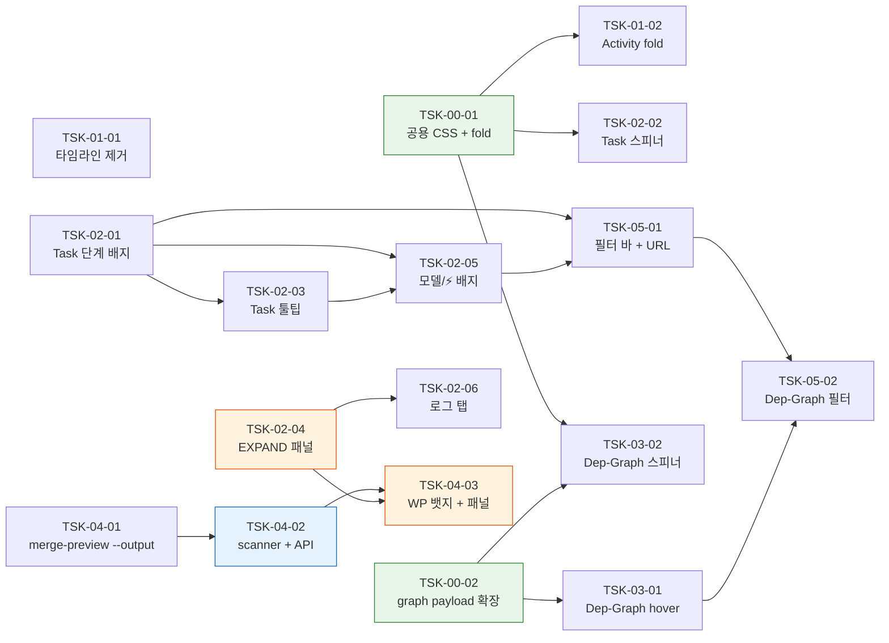

# WBS - dev-monitor v4

> version: 1.0
> description: dev-monitor 대시보드 v4 — 단계 타임라인 제거 / 실시간 활동 기본 접힘 / 작업 패키지 Task DDTR 단계 배지 + tmux 실행중 스피너 + hover 툴팁 + EXPAND 슬라이딩 패널 / 의존성 그래프 2초 hover 툴팁 + 실행중 노드 스피너
> depth: 3
> start-date: 2026-04-24
> target-date: 2026-04-27
> updated: 2026-04-23

---

## Dev Config

### Domains
| domain | description | unit-test | e2e-test | e2e-server | e2e-url |
|--------|-------------|-----------|----------|------------|---------|
| backend | Python scripts (monitor-server.py HTTP handler, dep-analysis.py, signal scanners, filter helpers, /api/task-detail 라우트) | `pytest -q scripts/` | - | - | - |
| frontend | SSR HTML/CSS + 벤더 JS(`skills/dev-monitor/vendor/*.js`). monitor-server.py 내부 `render_dashboard`/`_section_*` 함수가 SSR. 클라이언트 graph-client.js가 `/api/graph` 2초 폴링. `setupTaskTooltip`/`openTaskPanel` 같은 인라인 JS는 `<script>` 블록 내부. | `pytest -q scripts/` | `python3 scripts/test_monitor_e2e.py` | `python3 scripts/monitor-server.py --port 7321 --docs docs/monitor-v4` | `http://localhost:7321` |
| fullstack | backend + frontend 통합 (대시보드 라우트, 슬라이드 패널, EXPAND API + UI, Task 단계 배지 렌더) | `pytest -q scripts/` | `python3 scripts/test_monitor_e2e.py` | `python3 scripts/monitor-server.py --port 7321 --docs docs/monitor-v4` | `http://localhost:7321` |
| infra | `/static/` 라우팅, 벤더 JS 바인딩, 플러그인 캐시 동기화, 공용 CSS `@keyframes spin` | - | - | - | - |

### Design Guidance
| domain | architecture |
|--------|-------------|
| backend | Python 3 stdlib only (no pip). `http.server.BaseHTTPRequestHandler` + do_GET 디스패치. 모든 헬퍼는 pure 함수(테스트 용이). 테스트는 `scripts/test_monitor_*.py` — pytest + stdlib만. 서버 기동은 `monitor-launcher.py`가 서브프로세스로 detach. signal 원자성은 create+rename, 절대 NFS 마운트 금지. `/api/task-detail`은 on-demand이며 wbs.md는 mtime 기반 재로드(기존 패턴 재사용). |
| frontend | SSR HTML은 monitor-server.py 내부 문자열 템플릿(별도 템플릿 엔진 없음). CSS는 `:root` 변수 기반(`--font-body`, `--font-mono`, `--ink-3`, `--run`, `--done`, `--fail`). i18n은 쿼리 파라미터(`?lang=ko|en`) 기반 stateless — 쿠키/localStorage 비사용(단 fold 상태는 localStorage 예외). 클라이언트 JS는 `skills/dev-monitor/vendor/`에 벤더링, `/static/` 라우트 화이트리스트로 서빙. 툴팁/슬라이드 패널은 **`data-section` 바깥 body 직계**에 배치하여 5초 auto-refresh 의 innerHTML 교체로부터 격리. 이벤트 바인딩은 document-level delegation을 원칙으로 하여 섹션 재렌더 후에도 자동 생존. |

### Quality Commands
| name | command |
|------|---------|
| lint | - |
| typecheck | `python3 -m py_compile scripts/monitor-server.py scripts/dep-analysis.py` |
| coverage | - |

### Cleanup Processes
monitor-server, monitor-launcher

---

## WP-00: 공유 계약 & 헬퍼
- schedule: 2026-04-24 ~ 2026-04-24
- description: v4 전반의 프론트/백 공유 계약(스피너 CSS, 범용 fold 헬퍼, `/api/graph` payload 확장)을 선행 분리. WP-01~WP-03 Task들이 이 Task들을 `depends`로 연결한다.

### TSK-00-01: 공용 spinner CSS + 범용 fold 헬퍼
- category: infrastructure
- domain: frontend
- model: sonnet
- status: [xx]
- priority: critical
- assignee: -
- schedule: 2026-04-24 ~ 2026-04-24
- tags: shared-contract, css, fold, client-util
- depends: -
- blocked-by: -
- entry-point: library
- note: 계약 전용(contract-only) Task — 구현 로직 없이 CSS keyframe 1종 + JS 헬퍼 4종만. fan-in 3(TSK-01-02, TSK-02-02, TSK-03-02)이지만 이는 설계 의도 — 같은 공용 유틸을 3개 feature가 소비.

#### PRD 요구사항
- prd-ref: PRD §2 P0-2 (스피너), §2 P0-4 (Activity 접힘 + fold 영속), §5 AC-5, AC-6, AC-7, AC-8, AC-9
- requirements:
  - 인라인 `<style>` 블록에 `@keyframes spin { to { transform: rotate(360deg); } }` 공용 키프레임을 1회 추가.
  - `.spinner`, `.node-spinner` 공용 클래스 — 기본 `display:none`, 너비 10px, 테두리 2px, `border-top-color: var(--run)`, `animation: spin 1s linear infinite`.
  - `.trow[data-running="true"] .spinner { display:inline-block }` + `.dep-node[data-running="true"] .node-spinner { display:inline-block; position:absolute; top:4px; right:4px }` 노출 조건 CSS.
  - 범용 fold 헬퍼 4종 추가:
    - `readFold(key, defaultOpen)` — `localStorage['dev-monitor:fold:'+key]` 를 `'open'|'closed'` 로 읽고 미지정 시 `defaultOpen` 반환.
    - `writeFold(key, open)` — 위 키에 `'open'|'closed'` 저장.
    - `applyFoldStates(container)` — `container.querySelectorAll('[data-fold-key]')` 순회하여 각 `<details>`에 `open` 속성 동기화. `data-fold-default-open` 속성이 있으면 기본 열림, 없으면 기본 닫힘.
    - `bindFoldListeners(container)` — 위 요소에 `toggle` 이벤트 리스너를 1회만 바인딩(`_foldBound` 플래그).
  - 기존 wp-cards 전용 로직을 위 헬퍼로 대체 — wp-cards는 `data-fold-key="{WP-ID}"` + `data-fold-default-open` 속성으로 기본 열림 유지.
- acceptance:
  - `@keyframes spin` 이 인라인 CSS 에 정확히 1회 정의된다(중복 금지).
  - `readFold('X', true)` 가 localStorage 미지정 시 `true` 반환, `readFold('X', false)` 는 `false` 반환.
  - 기존 wp-cards fold 영속성에 회귀 없음 — 기존 `test_monitor_fold.py`(v3 WP-05) 전부 통과.
  - 임의의 `<details data-fold-key="X">` 에 `applyFoldStates(document)` 호출 시 localStorage 값이 반영된다.
- constraints:
  - 외부 라이브러리 금지. Python 3 stdlib + vanilla JS 만.
  - CSS 변수는 기존 `:root` 정의(`--run`, `--ink-3`, `--bg-2`) 재사용.
  - 기존 localStorage 키 prefix(`dev-monitor:fold:`) 유지 — 마이그레이션 불필요.
- test-criteria:
  - `test_monitor_shared_css_has_spin_keyframe` — 렌더된 HTML 에 `@keyframes spin` 정확히 1회 포함.
  - `test_monitor_fold_helper_generic_data_key` — 가상 `<details data-fold-key="X">` 에 대해 읽기/쓰기/적용 동작.
  - `test_monitor_fold.py` (v3 회귀) 통과.

#### 기술 스펙 (TRD)
- tech-spec:
  - scripts/monitor-server.py 인라인 CSS/JS 수정 (TRD §3.0).
- api-spec: -
- data-model: -
- ui-spec:
  - `.spinner`: 10×10px, 둥근 테두리(50%), 2px solid `var(--ink-3)`, border-top-color `var(--run)`, `animation: spin 1s linear infinite`.
  - `.node-spinner`: position absolute, top 4 / right 4, 같은 spin 키프레임 사용.

---

### TSK-00-02: `/api/graph` payload v4 필드 확장
- category: infrastructure
- domain: backend
- model: sonnet
- status: [xx]
- priority: critical
- assignee: -
- schedule: 2026-04-24 ~ 2026-04-24
- tags: shared-contract, api, graph, payload
- depends: -
- blocked-by: -
- entry-point: -
- note: 계약 전용(contract-only) Task — 노드 dict 생성부에 필드만 추가, 기존 필드·로직 불변. fan-in 2(TSK-03-01, TSK-03-02).

#### PRD 요구사항
- prd-ref: PRD §2 P1-7 (Dep-Graph hover tooltip), §2 P0-2 (Dep-Graph spinner), §5 AC-6, AC-15, AC-17
- requirements:
  - `/api/graph` 응답의 `nodes[*]` 딕셔너리에 다음 필드 추가:
    - `phase_history_tail: List[PhaseEntry]` — 최근 3개 (각 entry: `{event, from, to, at, elapsed_seconds}`).
    - `last_event: Optional[str]`
    - `last_event_at: Optional[str]` — ISO-8601 문자열.
    - `elapsed_seconds: Optional[int]`
    - `is_running_signal: bool` — `.running` signal 파일이 존재하는 task id 집합 포함 여부.
  - 기존 필드(`id`, `label`, `status`, `is_critical`, `is_bottleneck`, `fan_in`, `fan_out`, `bypassed`, `wp_id`, `depends`) 는 변경 없음.
  - `running_ids` 계산 로직은 기존 `/api/state` 와 동일 set 재사용(중복 스캔 금지).
- acceptance:
  - `GET /api/graph?subproject=monitor-v4` 응답의 모든 노드가 위 5개 신규 필드를 포함한다(값이 없을 경우 `null`/빈 배열).
  - `.running` signal 이 존재하는 task 의 `is_running_signal=true`, 없는 task 는 `false`.
  - 기존 `test_monitor_graph_api.py` 전부 회귀 없이 통과.
- constraints:
  - Python 3 stdlib. JSON 직렬화는 `json.dumps(..., ensure_ascii=False)` 유지.
  - 응답 크기 증가 허용 상한: 노드당 +500B (여유). 50 노드 기준 +25KB 이내.
- test-criteria:
  - `test_api_graph_payload_v4_fields_present` — 모든 노드에 5개 필드 존재.
  - `test_api_graph_is_running_signal_reflects_signal_file` — tmp signal 생성/삭제 시 토글.
  - `test_api_graph_phase_history_tail_limit_3` — 4+ 엔트리 있어도 3개만 반환.

#### 기술 스펙 (TRD)
- tech-spec:
  - scripts/monitor-server.py 의 `/api/graph` 핸들러에서 노드 dict 확장 (TRD §3.8).
- api-spec:
  - 응답 스키마 확장 — 상기 5개 필드. 기존 필드 호환.
- data-model:
  - `PhaseEntry` dict: `{event: str, from: str, to: str, at: str, elapsed_seconds: int}`.
- ui-spec: -

---

## WP-01: UI 정리 & 접힘
- schedule: 2026-04-24 ~ 2026-04-25
- description: 단계 타임라인 섹션 제거 + 실시간 활동 섹션을 `<details data-fold-key="live-activity">` 로 래핑하여 기본 접힘 + auto-refresh 에서도 fold 상태 보존.

### TSK-01-01: 단계 타임라인 섹션 제거
- category: development
- domain: frontend
- model: sonnet
- status: [xx]
- priority: high
- assignee: -
- schedule: 2026-04-24 ~ 2026-04-24
- tags: cleanup, timeline, removal
- depends: -
- blocked-by: -
- entry-point: 대시보드 메인 (`/?subproject=monitor-v4`)
- note: `_PHASE_TO_SEG` / `_timeline_rows` 가 다른 섹션에서 참조되지 않음을 grep 으로 확인 후 제거. dep-graph 색 매핑은 별도 테이블.

#### PRD 요구사항
- prd-ref: PRD §2 P0-3, §4 S5, §5 AC-1
- requirements:
  - `scripts/monitor-server.py` 에서 다음을 제거:
    - 함수 `_section_phase_timeline()` (약 L3614–L3729).
    - 헬퍼 `_timeline_rows()`.
    - 상수 `_PHASE_TO_SEG`.
    - `render_dashboard()` 내 `_section_phase_timeline(...)` 호출 및 `data-section="phase-timeline"` 래퍼.
    - CSS 블록 `.panel.timeline`, `.tl-row`, `.tl-seg*`, `.tl-scale` 등 timeline 전용.
  - 제거로 인한 빈 공간 발생 시 상하 섹션이 자연스럽게 이어지도록 margin 확인.
- acceptance:
  - 렌더된 HTML 에 `data-section="phase-timeline"` 요소와 `tl-` prefix 클래스가 존재하지 않는다.
  - `grep -n "_PHASE_TO_SEG\|_timeline_rows\|tl-row" scripts/monitor-server.py` 결과가 비어 있다.
  - 다른 섹션(wp-cards, live-activity, dep-graph, features, team, subagents)의 렌더·CSS 에 회귀 없음.
- constraints:
  - CSS 삭제 시 `.tl-` 패턴에만 한정. 다른 의미의 접두어(`.task-`, `.trow-` 등) 오삭제 금지.
  - 인라인 `<style>` 블록의 중괄호 매칭 깨지지 않도록 주의.
- test-criteria:
  - `test_dashboard_has_no_phase_timeline` — 렌더 HTML 에서 `phase-timeline` 미존재.
  - `test_css_no_tl_classes` — 인라인 `<style>` 에서 `.tl-` 패턴 부재.

#### 기술 스펙 (TRD)
- tech-spec:
  - monitor-server.py 블록 제거 (TRD §3.1). `_PHASE_TO_SEG` 는 dep-graph 색 매핑과 무관 — 사전 grep 검증.
- api-spec: -
- data-model: -
- ui-spec:
  - 제거 후 레이아웃: WP Cards → Live Activity → Dep-Graph → Features → Team → Subagents.

---

### TSK-01-02: 실시간 활동 기본 접힘 + auto-refresh 생존
- category: development
- domain: frontend
- model: sonnet
- status: [xx]
- priority: high
- assignee: -
- schedule: 2026-04-25 ~ 2026-04-25
- tags: activity, fold, auto-refresh, details
- depends: TSK-00-01
- blocked-by: -
- entry-point: 대시보드 메인 → 실시간 활동 섹션
- note: `data-fold-default-open` 속성을 **부여하지 않음** → `readFold('live-activity', false)` → 기본 닫힘. wp-cards 는 `data-fold-default-open` 유지 → 기본 열림.

#### PRD 요구사항
- prd-ref: PRD §2 P0-4, §4 S5, §5 AC-7, AC-8, AC-9
- requirements:
  - `_section_live_activity(rows, lang)` 출력을 `<details class="activity-section" data-fold-key="live-activity">` 로 래핑:
    - `<summary><h2>{_t(lang,'live_activity')}</h2></summary>`
    - `<div class="panel"><div class="activity" aria-live="polite">{기존 행들}</div></div>`
  - `patchSection('live-activity')` 에 wp-cards 와 동일한 특례 추가 — innerHTML 교체 후 `applyFoldStates` + `bindFoldListeners` 재실행.
  - 활동 섹션을 클릭해 펼치면 `localStorage['dev-monitor:fold:live-activity']='open'` 저장, 접으면 `'closed'` 저장.
- acceptance:
  - 첫 페이지 로드 시(localStorage 비어있음) 활동 섹션이 접힌 상태(`<details>` 에 `open` 속성 없음).
  - 사용자가 펼친 후 5초 이상 대기 → 펼친 상태 유지(auto-refresh 의 innerHTML 교체 이후에도 `open` 속성 복원).
  - 하드 리로드(F5) 후에도 마지막 상태 유지.
  - 섹션 안의 개별 행 렌더는 v3 와 동일 — 회귀 없음.
- constraints:
  - `<details>` 네이티브 `toggle` 이벤트 사용(클릭 핸들러 직접 바인딩 금지).
  - TSK-00-01 의 헬퍼 재사용 — 중복 함수 정의 금지.
- test-criteria:
  - `test_live_activity_wrapped_in_details` — 렌더 HTML 에 `<details` + `data-fold-key="live-activity"` 존재, `open` 속성 부재.
  - `test_patch_section_live_activity_restores_fold` — DOM 시뮬레이션: 패치 전 `open`, innerHTML 교체, `applyFoldStates` 호출 → `open` 복원.
  - `test_live_activity_default_closed` — `readFold('live-activity', false)` fallback.

#### 기술 스펙 (TRD)
- tech-spec:
  - monitor-server.py `_section_live_activity` + 인라인 JS `patchSection` 수정 (TRD §3.2).
- api-spec: -
- data-model: -
- ui-spec:
  - `<details>` 의 `summary` 는 기존 `<h2>` 와 동일 스타일 유지. 화살표 기본 `▶`/`▼` 허용.

---

## WP-02: 작업 패키지 Task UI
- schedule: 2026-04-24 ~ 2026-04-27
- description: 작업 패키지 카드의 Task 행에 DDTR 단계 배지 + 실행중 스피너 + hover 툴팁 + EXPAND 슬라이딩 패널을 추가. `_render_task_row_v2` 가 중심 변경 지점.

### TSK-02-01: Task DDTR 단계 배지 (Design/Build/Test/Done)
- category: development
- domain: fullstack
- model: sonnet
- status: [dd]
- priority: critical
- assignee: -
- schedule: 2026-04-24 ~ 2026-04-24
- tags: task-badge, phase, state.json, i18n
- depends: -
- blocked-by: -
- entry-point: 대시보드 메인 → 작업 패키지 섹션 → 각 Task 행 배지
- note: signal 기반 `running_ids` 는 여전히 `data-status` 색 매핑에만 사용. badge 텍스트는 `state.json.status` 기반으로 전환.

#### PRD 요구사항
- prd-ref: PRD §2 P0-1, §4 S1, §5 AC-2, AC-3, AC-4
- requirements:
  - `_phase_label(status_code, lang, *, failed, bypassed)` 헬퍼 추가 — 매핑:
    - `[dd]` → Design (ko/en 공통)
    - `[im]` → Build
    - `[ts]` → Test
    - `[xx]` → Done
    - failed → Failed
    - bypassed → Bypass
    - status 코드 미상 또는 빈 값 → Pending
  - `_I18N` ko/en 테이블에 `phase_design`, `phase_build`, `phase_test`, `phase_done`, `phase_failed`, `phase_bypass`, `phase_pending` 7개 키 추가(현 시점 레이블은 ko/en 동일 — i18n 토글이 UI 일관성 유지를 위해 연동).
  - `_render_task_row_v2()` 의 `badge_text` 계산을 `_phase_label(...)` 호출로 전환.
  - `<div class="trow" ...>` 에 `data-phase={dd|im|ts|xx|failed|bypass|pending}` 속성 추가(테스트·향후 CSS 확장용).
- acceptance:
  - `state.json.status="[dd]"` Task → 배지 `Design`, `data-phase="dd"`.
  - `state.json.status="[im]"` Task → 배지 `Build`, `data-phase="im"`.
  - `state.json.status="[ts]"` Task → 배지 `Test`, `data-phase="ts"`.
  - `state.json.status="[xx]"` Task → 배지 `Done`, `data-phase="xx"`.
  - `.failed` signal 또는 `last_event` 가 `*_failed` 인 Task → 배지 `Failed`, `data-phase="failed"`.
  - `bypassed=true` Task → 배지 `Bypass`, `data-phase="bypass"`.
  - 그 외 → 배지 `Pending`, `data-phase="pending"`.
- constraints:
  - 기존 `data-status` 속성(색 매핑용)은 **변경 없이** 유지 — signal 기반 `_trow_data_status()` 그대로.
  - 배지 한/영 레이블은 현재 공통(향후 번역 대비 키만 분리).
- test-criteria:
  - `test_task_badge_dd_renders_as_design`
  - `test_task_badge_phase_mapping` — 4개 DDTR 코드 전부.
  - `test_task_badge_failed_bypass_pending`
  - `test_task_row_has_data_phase_attribute`

#### 기술 스펙 (TRD)
- tech-spec:
  - monitor-server.py 상단 `_PHASE_LABELS`, `_phase_label()` 정의. `_I18N` 확장. `_render_task_row_v2` 치환 (TRD §3.3).
- api-spec: -
- data-model:
  - `_PHASE_LABELS: Dict[str, Dict[lang, str]]`.
- ui-spec:
  - 배지 HTML: `<div class="badge">{text}<span class="spinner"></span></div>` — spinner 자리 예약(TSK-02-02 에서 활성화).

---

### TSK-02-02: Task running 스피너 애니메이션
- category: development
- domain: frontend
- model: sonnet
- status: [dd]
- priority: high
- assignee: -
- schedule: 2026-04-25 ~ 2026-04-25
- tags: spinner, running, animation
- depends: TSK-00-01
- blocked-by: -
- entry-point: 대시보드 메인 → 작업 패키지 섹션 → Task 행 배지 옆 스피너
- note: TSK-00-01 이 제공한 공용 CSS `.spinner` + `@keyframes spin` 재사용. TSK-02-01 이 배지 옆 `<span class="spinner">` 자리를 마련.

#### PRD 요구사항
- prd-ref: PRD §2 P0-2, §4 S1, §5 AC-5
- requirements:
  - `_render_task_row_v2()` 의 `<div class="trow" ...>` 에 `data-running="true|false"` 속성 추가 — `item.id in running_ids` 기준.
  - 배지 옆 `<span class="spinner" aria-hidden="true"></span>` 를 **모든 trow** 에 삽입(CSS 로 노출 제어).
  - CSS 규칙: `.trow[data-running="true"] .spinner { display: inline-block; }` (TSK-00-01 의 공용 CSS 재사용 — 규칙 추가만).
  - running 상태가 해제되면(signal 사라짐) 다음 폴링에서 `data-running="false"` 로 갱신 → 스피너 사라짐.
- acceptance:
  - `.running` signal 이 존재하는 Task 의 trow `data-running="true"` + `.spinner` `display=inline-block`.
  - signal 삭제 후 5초 폴링 이내에 스피너가 사라진다.
  - 스피너 회전 주기 1초, 부드러운 `linear` 움직임(공용 keyframe).
  - 스크린 리더는 스피너를 읽지 않음(`aria-hidden="true"`).
- constraints:
  - `@keyframes spin` 은 TSK-00-01 에서 1회 정의 — 여기서 중복 정의 금지.
  - 스피너는 배지 텍스트와 같은 줄, 4px left margin 으로 분리.
- test-criteria:
  - `test_task_row_has_spinner_when_running` — running_ids set 에 포함된 task 의 HTML 에 `data-running="true"`.
  - `test_task_row_spinner_hidden_when_not_running` — running_ids 미포함 시 `data-running="false"`(스피너는 CSS 로 숨김).

#### 기술 스펙 (TRD)
- tech-spec:
  - monitor-server.py `_render_task_row_v2` 의 trow 속성 + `.spinner` span 삽입 (TRD §3.4).
- api-spec: -
- data-model: -
- ui-spec:
  - 배지 레이아웃: `| Design ⟳ |`  (스피너 배지 내부 우측, 4px margin).

---

### TSK-02-03: Task hover 툴팁 (state.json 요약)
- category: development
- domain: frontend
- model: sonnet
- status: [dd]
- priority: medium
- assignee: -
- schedule: 2026-04-25 ~ 2026-04-25
- tags: tooltip, hover, state.json, delegation
- depends: TSK-02-01
- blocked-by: -
- entry-point: 대시보드 메인 → 작업 패키지 섹션 → Task 행 호버 시 플로팅 툴팁
- note: TSK-02-01 이 `_render_task_row_v2` 를 수정한 직후 같은 렌더 함수에 `data-state-summary` 속성을 추가. 툴팁 DOM 과 JS 는 body 직계에 1회만 설치 → auto-refresh 생존.

#### PRD 요구사항
- prd-ref: PRD §2 P1-5, §4 S2, §5 AC-10, AC-11
- requirements:
  - `_render_task_row_v2()` 의 `<div class="trow" ...>` 에 `data-state-summary='{JSON}'` 속성 추가. 포함 필드: `status`, `last_event`, `last_event_at`, `elapsed`(초), `phase_tail` (최근 3 entries).
  - JSON 은 `json.dumps(..., ensure_ascii=False)` 후 `html.escape(s, quote=True)` 적용하여 single-quote 내부에 안전히 삽입.
  - body 직계에 `<div id="trow-tooltip" role="tooltip" hidden></div>` DOM 1회 추가(렌더 최상위).
  - 인라인 JS `setupTaskTooltip()` IIFE — document-level `mouseenter`/`mouseleave` delegation(`closest('.trow[data-state-summary]')`), 300ms debounce timer, `getBoundingClientRect()` 기반 좌표 계산, scroll 시 숨김.
  - 툴팁 콘텐츠: `<dl>` 구조로 status, last event + at, elapsed, 최근 3 phases 렌더.
- acceptance:
  - Task 행 mouseenter → 300ms 이내 `#trow-tooltip` 가 `hidden=false`, 유효 좌표.
  - mouseleave 또는 scroll → 툴팁 숨김.
  - 5초 auto-refresh 로 wp-cards innerHTML 이 교체돼도 툴팁 동작은 회귀 없음 (document-level delegation).
  - XSS 안전: `state.json` 에 `<script>` 등이 있어도 텍스트로 렌더.
- constraints:
  - 외부 툴팁 라이브러리 금지. vanilla JS.
  - 툴팁 DOM 은 1개만 생성(중복 방지).
  - `pointer-events:none` — 툴팁 자체 호버 방지.
- test-criteria:
  - `test_trow_has_data_state_summary_json` — 속성 존재 + 유효 JSON.
  - `test_trow_tooltip_dom_in_body` — 렌더 HTML 에 `#trow-tooltip` body 직계.
  - E2E `test_task_tooltip_hover` — 실제 hover 시나리오(Playwright 또는 수동 확인 대체).

#### 기술 스펙 (TRD)
- tech-spec:
  - monitor-server.py `_render_task_row_v2` 에 `data-state-summary` 속성 + 인라인 JS `setupTaskTooltip` + 인라인 CSS `#trow-tooltip` (TRD §3.5).
- api-spec: -
- data-model:
  - Tooltip JSON 스키마: `{status: str, last_event: str|null, last_event_at: str|null, elapsed: int, phase_tail: [{event, from, to, at, elapsed_seconds}, ...]}`.
- ui-spec:
  - `#trow-tooltip`: position fixed, z-index 100, max-width 420px, 배경 `var(--bg-2)`, 테두리 `var(--border)`, padding 10×12, font 12px `var(--font-mono)`.

---

### TSK-02-04: Task EXPAND 슬라이딩 패널 (wbs + state.json + 아티팩트)
- category: development
- domain: fullstack
- model: opus
- status: [dd]
- priority: medium
- assignee: -
- schedule: 2026-04-25 ~ 2026-04-27
- tags: expand, slide-panel, task-detail, api, wbs-extract, artifacts
- depends: -
- blocked-by: -
- entry-point: 대시보드 메인 → 작업 패키지 섹션 → Task 행의 `↗` 버튼 → 우측 슬라이드 패널
- note: **수직 슬라이스 fullstack Task** — `/api/task-detail` 엔드포인트는 이 기능 단일 소비자이므로 UI 와 한 Task 로 묶음. 경량 마크다운 렌더는 외부 라이브러리 금지. opus 선택 근거: 다중 영역(백엔드 파서 + SSR DOM + 클라이언트 JS 이벤트 + 마크다운 변환 + 접근성) 교차.

#### PRD 요구사항
- prd-ref: PRD §2 P1-6, §4 S3, §5 AC-12, AC-13, AC-14
- requirements:
  - **백엔드**:
    - `GET /api/task-detail?task={TSK-ID}&subproject={sp}` 라우트 추가.
    - 응답 200 스키마:
      ```
      {
        task_id, title, wp_id, source: "wbs"|"feat",
        wbs_section_md: "...",     // feat 모드는 feat_spec_md 또는 동일 키
        state: {...state.json...},
        artifacts: [{name, path, exists, size}, ...]
      }
      ```
    - `wbs_section_md` 추출: `^### {TSK-ID}:` 앵커부터 다음 `^### ` 또는 `^## ` 라인 직전까지 — `_extract_wbs_section(wbs_md, task_id)` 헬퍼.
    - `artifacts`: `docs/{sp}/tasks/{TSK-ID}/` 내 `design.md`, `test-report.md`, `refactor.md` 각각의 존재 여부 + 크기.
    - 404: Task 미존재. 400: TSK-ID 형식 오류.
  - **프론트엔드**:
    - `_render_task_row_v2()` 에 `<button class="expand-btn" data-task-id="{id}" aria-label="Expand">↗</button>` 추가(statusbar 오른쪽).
    - body 직계 DOM 추가:
      ```
      <div id="task-panel-overlay" hidden></div>
      <aside id="task-panel" class="slide-panel" hidden aria-labelledby="task-panel-title">
        <header><h3 id="task-panel-title"></h3><button id="task-panel-close">×</button></header>
        <div id="task-panel-body"></div>
      </aside>
      ```
    - CSS: `.slide-panel` 초기 `right:-560px`, `.open { right:0 }`, `transition: right 0.22s cubic-bezier(.4,0,.2,1)`. `#task-panel-overlay` fixed inset 0 + `rgba(0,0,0,.3)`.
    - 인라인 JS:
      - `openTaskPanel(taskId)` — `subproject` 쿼리에서 읽어 fetch → 응답 렌더.
      - `closeTaskPanel()` — `open` 클래스 제거 + overlay hidden.
      - document-level delegation: `.expand-btn` 클릭 → open, overlay/×/ESC → close.
    - 패널 본문 3섹션:
      1. `§ WBS` — `renderWbsSection(md)` 경량 마크다운: `#`/`##`/`###`/`####` 헤딩, `- ` / `* ` 리스트, ```` ``` ```` 코드 블록만. 외부 HTML 은 escape 후 재구성.
      2. `§ state.json` — `<pre>` + `JSON.stringify(state, null, 2)`.
      3. `§ 아티팩트` — 각 entry `<a href="/api/file?path=...">` (기존 `/api/file` 엔드포인트 존재 여부 확인 — 없으면 이 TSK 범위에 서빙 로직 포함). 존재하지 않는 파일은 회색 disabled.
  - 슬라이드 패널은 **`data-section` 바깥** body 직계 → auto-refresh 영향 없음.
- acceptance:
  - `↗` 버튼 클릭 → 우측에서 560px 패널 슬라이드 인, `.open` 클래스 획득.
  - `/api/task-detail?task=TSK-02-04&subproject=monitor-v4` 200 응답, 모든 필수 키 존재.
  - 존재하지 않는 Task ID → 404.
  - ESC / `×` / overlay 클릭 → 패널 닫힘.
  - 5초 auto-refresh 가 발생해도 열린 패널은 닫히지 않고 상태 유지.
  - wbs 섹션에 ```` ```python ```` 블록이 있으면 `<pre><code>` 로 렌더.
  - XSS 안전: state.json / wbs 본문에 `<script>` 포함돼도 텍스트로 표시.
- constraints:
  - 외부 마크다운 라이브러리 금지. `marked.js`, `showdown` 등 미사용.
  - 이미지·표·다이어그램 렌더는 비대상 — 이번 릴리스 경량 범위.
  - `/api/task-detail` 응답은 항상 JSON, `Content-Type: application/json; charset=utf-8`.
- test-criteria:
  - `test_api_task_detail_schema` — 200 응답 스키마 검증.
  - `test_api_task_detail_extracts_wbs_section` — 임시 wbs.md 로 섹션 경계(h3↔h3, h3↔h2) 검증.
  - `test_api_task_detail_artifacts_listing` — tmp tasks 디렉터리 기반.
  - `test_api_task_detail_404_for_unknown_id`.
  - `test_expand_button_in_trow` — `_render_task_row_v2` 산출물에 `.expand-btn` 존재.
  - `test_slide_panel_dom_in_body` — 렌더 HTML 에 `#task-panel` + `#task-panel-overlay` body 직계.
  - E2E `test_task_expand_panel_opens` + `test_task_panel_survives_refresh`.

#### 기술 스펙 (TRD)
- tech-spec:
  - monitor-server.py `_extract_wbs_section`, `_collect_artifacts`, `/api/task-detail` 라우트, `_render_task_row_v2` 버튼 추가, 인라인 CSS/JS 슬라이드 패널 (TRD §3.6, §3.9).
- api-spec:
  - `GET /api/task-detail?task={TSK-ID}&subproject={sp}` → 200 JSON (상세 §3.9).
  - 404 / 400 / 500 에러 응답.
- data-model:
  - 응답 스키마 상기.
  - `_WBS_SECTION_RE = re.compile(r"^### (?P<id>TSK-\S+):", re.MULTILINE)`.
- ui-spec:
  - 슬라이드 패널 560×뷰포트 높이, 우측 고정, transition 0.22s.
  - overlay z-index 80, panel z-index 90, tooltip z-index 100.
  - `↗` 버튼: Task 행 오른쪽 끝, 20×20px 크기, hover 시 opacity 증가.

---

### TSK-02-05: Task 모델 칩 + 에스컬레이션 배지 (⚡)
- category: development
- domain: frontend
- model: sonnet
- status: [dd]
- priority: medium
- assignee: -
- schedule: 2026-04-26 ~ 2026-04-26
- tags: model-chip, escalation, retry, tooltip, phase-models
- depends: TSK-02-01, TSK-02-03
- blocked-by: -
- entry-point: 대시보드 메인 → 작업 패키지 섹션 → Task 행 배지 옆 모델 칩 + (retry_count ≥ 2 시) ⚡ 아이콘 → hover 툴팁에 phase별 모델 나열
- note: **state.json 스키마 무변경** 원칙. wbs.md `- model:` 필드 + DDTR 고정 규칙(Build=Sonnet, Test=Haiku, Refactor=Sonnet) + `retry_count` 로 phase별 모델을 완전 추론. 워커 사용 토큰 증가 0.

#### PRD 요구사항
- prd-ref: PRD §2 P1-8, §4 S7, §5 AC-19, AC-20, AC-21
- requirements:
  - `_render_task_row_v2()` 에 모델 칩 삽입: `<span class="model-chip" data-model="{model}">{model}</span>` — `item.model`(wbs-parse.py 제공) 소비, 빈 값 시 `"sonnet"` 폴백.
  - `retry_count ≥ 2` Task 에 `<span class="escalation-flag" aria-label="escalated">⚡</span>` 삽입(바이패스와 조합 가능 — `×N ⚡ 🚫`).
  - `data-state-summary` JSON 에 다음 필드 추가:
    - `model`: wbs.md 기반 설계 모델.
    - `retry_count`: state.json 파생.
    - `phase_models`: `{design, build, test, refactor}` 4키 dict — `_DDTR_PHASE_MODELS` 계산 결과.
    - `escalated`: `retry_count ≥ MAX_ESCALATION` 불리언.
  - `_DDTR_PHASE_MODELS` helper 테이블 + `_test_phase_model(task)` 함수 (TRD §3.10).
  - 툴팁 renderer `renderPhaseModels(pm, escalated)` 확장 — Design/Build/Test/Refactor 4행 `<dl>`. Test 행은 `escalated` 시 `haiku → sonnet (retry #N) ⚡`.
  - CSS: `.model-chip` 배경 모델별 테마(`opus` 보라 / `sonnet` 파랑 / `haiku` 녹색), `.escalation-flag` warn 색.
- acceptance:
  - wbs.md `- model: opus` Task → trow 에 `<span class="model-chip" data-model="opus">opus</span>` 렌더.
  - `retry_count=0` Task → `.escalation-flag` 미존재.
  - `retry_count=2` Task → `.escalation-flag` 존재 + phase_models.test = `opus`.
  - `retry_count=1` Task → `.escalation-flag` 미존재 + phase_models.test = `sonnet`.
  - 호버 툴팁이 Design/Build/Test/Refactor 4행 모델을 순서대로 렌더.
- constraints:
  - **state.json / wbs-transition.py 수정 금지**.
  - `MAX_ESCALATION` 상수는 환경변수 `MAX_ESCALATION` (기본 2) 으로 동적 주입.
  - 모델 이름 이외 텍스트 국제화 대상 아님(모델명은 고유 명사).
- test-criteria:
  - `test_task_model_chip_matches_wbs` — wbs.md `- model:` 값과 칩 `data-model` 일치.
  - `test_task_escalation_flag_threshold` — retry_count 0/1/2/3 에 대해 플래그 존재 여부.
  - `test_task_tooltip_phase_models` — state_summary JSON 의 phase_models dict 검증.
  - `test_test_phase_model_max_escalation_env` — `MAX_ESCALATION=3` 환경변수 하에 retry_count=2 → sonnet, =3 → opus.

#### 기술 스펙 (TRD)
- tech-spec:
  - monitor-server.py `_DDTR_PHASE_MODELS`, `_test_phase_model`, `_render_task_row_v2` 확장, 인라인 CSS + tooltip JS 확장 (TRD §3.10).
- api-spec: -
- data-model:
  - `_DDTR_PHASE_MODELS: Dict[str, Callable[[Task], str]]`.
  - `data-state-summary` JSON 확장 키: `model`, `retry_count`, `phase_models`, `escalated`.
- ui-spec:
  - 모델 칩: 10×? px, margin-left 6px, padding 1×6, border-radius 3.
  - ⚡ 아이콘: margin-left 4px, warn 색, font-size 11.

---

### TSK-02-06: EXPAND 패널 § 로그 섹션 (build-report / test-report tail)
- category: development
- domain: fullstack
- model: sonnet
- status: [dd]
- priority: low
- assignee: -
- schedule: 2026-04-26 ~ 2026-04-27
- tags: expand, logs, tail, ansi-strip, api
- depends: TSK-02-04
- blocked-by: -
- entry-point: 대시보드 → Task 행 `↗` → 슬라이드 패널 § 로그 섹션
- note: **새 파일 생성 금지** — 기존 DDTR 사이클이 생성한 `build-report.md`·`test-report.md` 의 tail 200줄을 렌더. `run-test.py` 수정 불필요. 토큰 비용 0 (브라우저 전용).

#### PRD 요구사항
- prd-ref: PRD §2 P1-9, §4 S8, §5 AC-22, AC-23
- requirements:
  - `/api/task-detail` 응답에 `logs: [{name, tail, truncated, lines_total, exists}, ...]` 필드 추가.
  - `_collect_logs(task_dir)` helper — `LOG_NAMES = ("build-report.md", "test-report.md")` 순회, `_tail_report(path, max_lines=200)` 호출.
  - ANSI 이스케이프 스트립: `_ANSI_RE = re.compile(r"\x1b\[[\d;]*[A-Za-z]")`, `re.sub(_ANSI_RE, "", text)`. 컬러 → HTML 변환은 비대상(텍스트만).
  - 파일 미존재 시 `{"exists": false, "tail": "", "lines_total": 0}` — 에러 대신 정상 응답.
  - 클라이언트 `renderLogs(logs)` — `§ 로그` 섹션 + 각 log 를 `<details class="log-entry" open>` + `<pre class="log-tail">` 로 렌더. `truncated` 시 "마지막 200줄 / 전체 N줄" 표식.
  - CSS `.log-tail` — `max-height:300px; overflow:auto; font-size:11px; white-space:pre-wrap;`.
  - 패널 본문 렌더 순서: `§ WBS` → `§ state.json` → `§ 아티팩트` → **`§ 로그`**.
- acceptance:
  - `build-report.md` 가 300줄이면 응답의 `tail` 이 200줄, `truncated=true`, `lines_total=300`.
  - ANSI 이스케이프(`\x1b[31m`, `\x1b[0m` 등)가 응답 `tail` 에 나타나지 않음.
  - 파일 미존재 시 `exists: false` + placeholder "보고서 없음".
  - 섹션 순서: wbs → state → artifacts → logs.
  - 패널이 열린 상태에서 5초 auto-refresh 발생해도 로그 섹션 유지(패널은 body 직계).
- constraints:
  - raw log 파일 생성 금지 — `run-test.py` 무수정.
  - ANSI → HTML 컬러 변환 금지(향후 v5 확장 가능, 이번 릴리스는 strip only).
  - tail 라인 수는 상수 200 (환경변수 토글 없음).
- test-criteria:
  - `test_api_task_detail_logs_field` — `/api/task-detail` 응답 스키마 + 각 log entry 필드.
  - `test_api_task_detail_ansi_stripped` — 임시 report 파일에 ANSI 주입 후 응답 확인.
  - `test_tail_report_truncated` — 300줄 파일 tail 검증.
  - `test_slide_panel_logs_section` — `renderLogs()` 산출물에 `<details class="log-entry">` + `<pre class="log-tail">` 존재.
  - `test_slide_panel_section_order` — wbs → state → artifacts → logs 순서.

#### 기술 스펙 (TRD)
- tech-spec:
  - monitor-server.py `_collect_logs`, `_tail_report`, `_ANSI_RE`, `/api/task-detail` 응답 확장, 인라인 CSS `.log-tail` (TRD §3.11).
  - 클라이언트 `renderLogs(logs)` + `openTaskPanel` body 구성 확장.
- api-spec:
  - `/api/task-detail` 응답 신규 필드 `logs: list[dict]`.
- data-model:
  - `{name: str, tail: str, truncated: bool, lines_total: int, exists: bool}`.
- ui-spec:
  - `.log-tail pre` — max-height 300, overflow auto, 11px mono.
  - `<details>` 기본 열림(`open` 속성), 클릭 시 접힘.

---

## WP-03: 의존성 그래프
- schedule: 2026-04-25 ~ 2026-04-25
- description: Dep-Graph 에 2초 hover 툴팁 + `.running` signal 기반 노드 스피너. TSK-00-02 의 payload 확장 결과를 소비한다.

### TSK-03-01: Dep-Graph 2초 hover 툴팁
- category: development
- domain: frontend
- model: sonnet
- status: [ ]
- priority: medium
- assignee: -
- schedule: 2026-04-25 ~ 2026-04-25
- tags: dep-graph, hover, tooltip, cytoscape
- depends: TSK-00-02
- blocked-by: -
- entry-point: 대시보드 메인 → 의존성 그래프 섹션 → 노드 hover 2초 대기
- note: 기존 `cy.on("tap", "node", ...)` 유지. hover 경로와 tap 경로를 source 플래그로 구분. 파일은 `skills/dev-monitor/vendor/graph-client.js`.

#### PRD 요구사항
- prd-ref: PRD §2 P1-7, §4 S4, §5 AC-15, AC-16
- requirements:
  - `cy.on("mouseover", "node", ...)` 핸들러 추가 — 2000ms `setTimeout` 으로 `renderPopover(ele, "hover")` 호출.
  - `cy.on("mouseout", "node", ...)` — `clearTimeout(hoverTimer)` + 현재 popover 가 hover source 였으면 `hidePopover()`.
  - 기존 `cy.on("tap", "node", ...)` 는 유지 — `renderPopover(ele, "tap")` 로 source 인자 추가.
  - `renderPopover(ele, source)` 시그니처 확장 — popover DOM 에 `data-source="hover"|"tap"` 속성 저장.
  - `hidePopover()` 정책:
    - tap source → 외부 클릭 / ESC / pan / zoom 까지 유지(기존 동작).
    - hover source → mouseout 시 즉시 숨김.
  - pan/zoom 핸들러에 `clearTimeout(hoverTimer)` 추가 — 이동 중 hover 타이머 취소.
  - popover 콘텐츠는 TSK-00-02 의 payload 확장 덕분에 `phase_history_tail` 실데이터 렌더.
- acceptance:
  - 노드 위 2초 대기 → popover 표시.
  - 1.5초 후 이동 → popover 미표시 (타이머 취소 확인).
  - 기존 tap 동작 회귀 없음 — 클릭 즉시 popover, 외부 클릭/ESC 까지 유지.
  - hover popover 는 mouseout 시 즉시 사라짐.
  - pan/zoom 중 hover 타이머 미작동.
- constraints:
  - 2000ms 은 상수(`HOVER_DWELL_MS`) 로 선언.
  - popover DOM 은 1개만 — hover/tap 이 같은 DOM 재사용(source 속성만 교체).
- test-criteria:
  - `test_graph_client_has_hover_handler` — `graph-client.js` 에 `"mouseover"` + `"mouseout"` 바인딩 존재.
  - `test_graph_client_popover_data_source_attr` — `renderPopover` 호출 시 `data-source` 속성 설정.
  - E2E `test_dep_graph_hover_dwell_2s` — 브라우저 실 조작(Playwright 또는 수동).

#### 기술 스펙 (TRD)
- tech-spec:
  - skills/dev-monitor/vendor/graph-client.js — hover 타이머 + source 구분 (TRD §3.7).
  - 기존 `ensurePopover`/`renderPopover`/`hidePopover` 재사용.
- api-spec: -
- data-model:
  - `popoverSource: "hover" | "tap" | null` (모듈 스코프 변수).
- ui-spec:
  - Popover 디자인 기존 그대로 — 내용만 phase_history_tail 실데이터로 풍부화.

---

### TSK-03-02: Dep-Graph 실행 중 노드 스피너
- category: development
- domain: frontend
- model: sonnet
- status: [ ]
- priority: high
- assignee: -
- schedule: 2026-04-25 ~ 2026-04-25
- tags: dep-graph, spinner, running, node-html-label
- depends: TSK-00-01, TSK-00-02
- blocked-by: -
- entry-point: 대시보드 메인 → 의존성 그래프 섹션 → 실행 중 노드 우상단 스피너
- note: `skills/dev-monitor/vendor/graph-client.js` 의 `nodeHtmlTemplate` 에 `.node-spinner` 조건부 삽입. CSS 는 TSK-00-01 공용 keyframe 재사용. `is_running_signal` 필드는 TSK-00-02 제공.

#### PRD 요구사항
- prd-ref: PRD §2 P0-2, §4 S1, §5 AC-6
- requirements:
  - `graph-client.js` 의 nodeHtmlLabel 템플릿(기존 L56–L69 근방)에 `${nd.is_running_signal ? '<span class="node-spinner"></span>' : ''}` 조건부 삽입.
  - `<div class="dep-node status-${key}" data-running="${!!nd.is_running_signal}">` 속성 추가(CSS 타겟용).
  - CSS 는 TSK-00-01 의 공용 규칙 재사용 — 추가 CSS 는 필요 시 `.dep-node .node-spinner { top:4px; right:4px; position:absolute }` 위치만.
- acceptance:
  - `.running` signal 이 존재하는 Task 노드 HTML 에 `.node-spinner` 요소 포함.
  - `data-running="true"` 속성으로 `.node-spinner { display: inline-block }` 활성화.
  - 스피너 회전 1초 주기 linear.
  - signal 이 해제되면 2초 폴링 이내에 스피너 제거.
- constraints:
  - node-html-label 플러그인 기본 동작 준수 — pan/zoom 시 자동 추종.
  - 스피너가 ID/title 텍스트를 가리지 않도록 우상단 position.
- test-criteria:
  - `test_graph_node_has_spinner_when_running` — payload 에 `is_running_signal=true` → 렌더 HTML 에 `.node-spinner` 존재.
  - `test_graph_node_spinner_absent_when_not_running` — `is_running_signal=false` 시 `.node-spinner` 미존재.

#### 기술 스펙 (TRD)
- tech-spec:
  - skills/dev-monitor/vendor/graph-client.js `nodeHtmlTemplate` 수정 (TRD §3.4).
  - CSS 는 monitor-server.py 인라인 스타일에 `.dep-node .node-spinner` 위치 규칙만 추가.
- api-spec: -
- data-model: -
- ui-spec:
  - 스피너: 10×10px, 노드 카드 우상단 4px offset, 공용 keyframe spin.

---

## WP-04: WP 머지 준비도 뱃지
- schedule: 2026-04-26 ~ 2026-04-27
- description: 각 WP 카드 헤더에 머지 준비도 뱃지(🟢/🟡/🔴/⚠stale). 워커는 `merge-preview.py --output` 1줄 실행만 (LLM 해석 없음 → 사용 토큰 최소화). `merge-preview-scanner.py` 가 WP 별 집계 + auto-merge 필터 담당. 뱃지 클릭 → 슬라이드 패널에 merge-status 렌더.

### TSK-04-01: `merge-preview.py --output` 플래그 + 워커 프롬프트 훅
- category: infrastructure
- domain: backend
- model: sonnet
- status: [ ]
- priority: critical
- assignee: -
- schedule: 2026-04-26 ~ 2026-04-26
- tags: merge-preview, worker-hook, tdd-prompt, output-flag, zero-llm
- depends: -
- blocked-by: -
- entry-point: `[im]` 완료 후 워커가 실행 → `docs/tasks/{TSK-ID}/merge-preview.json` 파일 기록
- note: 워커 프롬프트 증분은 **1줄 실행 + stdout 무시**. LLM 이 JSON 을 읽거나 해석하지 않음 → 워커 토큰 증가 ~50-80/Task. `merge-preview.py` 는 기존 stdout 계약 유지하고 `--output` 플래그만 추가.

#### PRD 요구사항
- prd-ref: PRD §2 P1-10, §4 S9, §5 AC-25, §6 사용 토큰 예산
- requirements:
  - `scripts/merge-preview.py` 에 `--output PATH` 플래그 추가 — 지정 시 JSON 을 파일에 기록(+stdout 도 유지 → 하위 호환).
  - 출력 파일은 임시 파일 → `rename` 원자 교체.
  - `skills/dev-build/references/tdd-prompt-template.md` 에 `[im]` 완료 후 실행 규약 1줄 추가:
    ```bash
    python3 ${CLAUDE_PLUGIN_ROOT}/scripts/merge-preview.py \
      --remote origin --target main \
      --output {DOCS_DIR}/tasks/{TSK-ID}/merge-preview.json || true
    ```
    실패해도 Task 실패로 간주하지 않음(`|| true`). **결과 해석 금지** — LLM 은 stdout/JSON 을 읽지 않는다.
  - `{DOCS_DIR}`, `{TSK-ID}` 플레이스홀더 규약은 기존 `tdd-prompt-template.md` 치환 로직 재사용.
- acceptance:
  - `merge-preview.py --output /tmp/preview.json` 실행 → 파일 생성 + 유효 JSON.
  - 기존 stdout JSON 도 그대로 출력(stdout 만 redirect 하는 사용처 회귀 없음).
  - `--output` 경로 디렉터리가 없으면 자동 생성 또는 친절 에러.
  - 동시 실행 시 rename 원자 교체로 부분 파일 없음.
  - `tdd-prompt-template.md` 에 merge-preview 실행 규약이 정확히 1번 등장(중복 금지).
- constraints:
  - stdout 계약 무변경(하위 호환).
  - LLM 해석 금지 — 프롬프트에 "결과를 읽지 마시오" 명시.
  - 실행 실패가 Task 실패로 전파되지 않도록 `|| true` 또는 exit-code 무시.
- test-criteria:
  - `test_merge_preview_output_flag` — tmp file 에 JSON 기록.
  - `test_merge_preview_stdout_still_works` — 회귀.
  - `test_merge_preview_atomic_rename` — 동시 실행 시뮬레이션.
  - `test_tdd_prompt_contains_merge_preview_hook` — `tdd-prompt-template.md` 문자열 존재 확인.

#### 기술 스펙 (TRD)
- tech-spec:
  - `scripts/merge-preview.py` `argparse` 에 `--output PATH`. 기존 `print(json.dumps(...))` 유지, `--output` 시 `tempfile.NamedTemporaryFile` → `os.rename`.
  - `skills/dev-build/references/tdd-prompt-template.md` 문자열 추가 — TRD §3.12 워커 프롬프트 증분 부분 그대로 복사.
- api-spec: -
- data-model:
  - 기존 JSON: `{clean: bool, conflicts: [{file, hunks}], base_sha: str}` 무변경.
- ui-spec: -

---

### TSK-04-02: `merge-preview-scanner.py` + `/api/merge-status` 라우트
- category: infrastructure
- domain: backend
- model: sonnet
- status: [ ]
- priority: critical
- assignee: -
- schedule: 2026-04-26 ~ 2026-04-27
- tags: scanner, aggregate, auto-merge-filter, stale, api
- depends: TSK-04-01
- blocked-by: -
- entry-point: `python3 scripts/merge-preview-scanner.py --docs docs/monitor-v4` → `docs/wp-state/{WP-ID}/merge-status.json` 생성. 대시보드 `/api/merge-status?wp=WP-02` 조회.
- note: **zero-LLM 스크립트**. WP 별 Task 의 `merge-preview.json` 을 스캔 → auto-merge 드라이버 파일 필터 → 상태 판정(ready/waiting/conflict) + stale(30분) 표식.

#### PRD 요구사항
- prd-ref: PRD §2 P1-10, §5 AC-24, AC-25
- requirements:
  - 신규 파일 `scripts/merge-preview-scanner.py` — stdlib only.
  - CLI 인자: `--docs DIR` (필수), `--force` (mtime 무시 강제 재생성), `--daemon N` (N초 주기 데몬 모드).
  - 동작:
    1. `{DOCS_DIR}/tasks/TSK-*/merge-preview.json` 스캔 + 각 파일 mtime 확인.
    2. 각 Task 의 WP-ID 를 `wbs-parse.py` 로 식별(또는 TSK-XX-XX 패턴의 첫 번째 그룹).
    3. WP 별로 `_classify_wp()` (TRD §3.12) 실행 — conflicts 집계, auto-merge 드라이버 파일 필터(`AUTO_MERGE_FILES = {"state.json", "wbs.md", "wbs-merge-log.md"}`), incomplete Task 카운트, stale(> 1800s) 판정.
    4. 결과를 `{DOCS_DIR}/wp-state/{WP-ID}/merge-status.json` 에 쓰기(임시 → rename).
  - `monitor-server.py` 에 `/api/merge-status` 라우트 추가:
    - `GET /api/merge-status?subproject={sp}` → 전체 WP 요약 배열.
    - `GET /api/merge-status?subproject={sp}&wp={WP-ID}` → 단일 WP 상세(전체 conflicts 포함).
    - 응답 mtime 캐시: `merge-status.json` mtime 이 30분 이내면 그대로, 초과 시 `is_stale: true` 표식.
  - `/api/state` 응답 bundle 에 WP 별 `merge_state` 요약(state + badge_label) 만 포함(상세 conflicts 는 별도 라우트).
- acceptance:
  - `scanner` 실행 → `docs/wp-state/WP-02/merge-status.json` 생성.
  - Task `merge-preview.json` 의 충돌에 `state.json` 만 있으면 → 필터 적용 후 `state="ready"`.
  - 미완료 Task 가 있으면 → `state="waiting"` + `pending_count` 정확.
  - 실제 코드 파일 충돌이 있으면 → `state="conflict"` + `conflict_count` + `conflicts` 배열.
  - 파일 mtime 이 30분 초과 → `is_stale=true`.
  - 50 Task 스캔 5초 이내 완료.
  - 동시 실행 시 출력 파일 부분 쓰기 없음(rename 원자 교체).
  - `/api/merge-status` 엔드포인트 200 + JSON, 미존재 WP 404.
- constraints:
  - stdlib only.
  - `wbs-parse.py` 외부 의존 허용(기존 패턴).
  - WP-ID 식별 실패 시 Task skip + stderr warning.
- test-criteria:
  - `test_merge_preview_scanner_filters_auto_merge` — `state.json` conflict 만 있는 preview → ready.
  - `test_merge_preview_scanner_counts_pending` — 미완료 Task 카운트.
  - `test_merge_preview_scanner_stale_detection` — mtime 조작 후 is_stale.
  - `test_merge_preview_scanner_race_safe` — 동시 실행 2회 → 완전성 보존.
  - `test_api_merge_status_route` — `/api/merge-status` 응답 스키마.
  - `test_api_merge_status_404_unknown_wp`.
  - `test_api_state_bundle_merge_state_summary` — `/api/state` 응답에 WP 별 merge_state 요약.

#### 기술 스펙 (TRD)
- tech-spec:
  - `scripts/merge-preview-scanner.py` (신규, ~150줄 예상) — TRD §3.12 함수 그대로.
  - `scripts/monitor-server.py` `/api/merge-status` 라우트 + `/api/state` 응답 확장.
- api-spec:
  - `GET /api/merge-status?subproject=X` → `[{wp_id, state, pending_count?, conflict_count?, is_stale}]`.
  - `GET /api/merge-status?subproject=X&wp=WP-02` → `{wp_id, state, conflicts: [...], is_stale, last_scan_at}`.
- data-model:
  - `AUTO_MERGE_FILES = {"state.json", "wbs.md", "wbs-merge-log.md"}`.
  - `merge-status.json` 스키마: `{wp_id, state, pending_count, conflict_count, conflicts, is_stale, last_scan_at}`.
- ui-spec: -

---

### TSK-04-03: WP 카드 뱃지 렌더 + 슬라이드 패널 통합
- category: development
- domain: fullstack
- model: sonnet
- status: [ ]
- priority: high
- assignee: -
- schedule: 2026-04-27 ~ 2026-04-27
- tags: wp-card, badge, slide-panel, merge-preview-ui
- depends: TSK-04-02, TSK-02-04
- blocked-by: -
- entry-point: 대시보드 → 작업 패키지 WP 카드 헤더 뱃지 → 클릭 시 슬라이드 패널 머지 프리뷰 섹션
- note: TSK-02-04 의 슬라이드 패널 인프라(DOM + overlay + ESC 처리) 재사용. `openMergePanel(wpId)` 만 추가.

#### PRD 요구사항
- prd-ref: PRD §2 P1-10, §4 S9, §5 AC-24, AC-26
- requirements:
  - `_section_wp_cards()` 에 WP 카드 헤더 뱃지 렌더 — `_merge_badge(ws, lang)` 호출. 위치는 WP 제목 우측(기존 fold 토글 옆).
  - `_merge_badge()` (TRD §3.12 참조) — state 별 emoji + label + stale 표식.
  - 클라이언트 JS `openMergePanel(wpId)` — `/api/merge-status?wp={wpId}` fetch → `task-panel` DOM 재사용 + `§ 머지 프리뷰` 섹션으로 렌더.
  - 슬라이드 패널 헤더: `{WP-ID} — 머지 프리뷰`.
  - 본문:
    - state 가 `ready` → "모든 Task 완료 · 충돌 없음" 배너.
    - state 가 `waiting` → pending Task 목록 나열(TSK-ID + 현재 phase).
    - state 가 `conflict` → 충돌 파일 목록 + 각 파일 hunk preview(최대 5개). `AUTO_MERGE_FILES` 는 회색 disabled 로 표시 + "auto-merge 드라이버 적용 예정" 라벨.
    - `is_stale=true` → 상단 warn 배너 "스캔 결과가 30분 이상 경과 — 재스캔 필요".
  - `merge-badge` 클릭 → `openMergePanel(dataset.wp)` delegation.
  - 동일 패널 DOM 을 Task EXPAND / 머지 패널이 공유 — 현재 용도를 `data-panel-mode="task"|"merge"` 로 구분.
- acceptance:
  - WP 별 뱃지가 state 값에 따라 올바른 emoji + label.
  - 뱃지 클릭 → 우측 560px 패널 슬라이드 인 + `§ 머지 프리뷰` 섹션 렌더.
  - state=`ready` 뱃지 → 배너 "모든 Task 완료".
  - state=`conflict` 뱃지 → 충돌 파일 목록 + `AUTO_MERGE_FILES` 회색.
  - is_stale=true → 상단 warn 배너.
  - 동일 패널이 Task EXPAND 모드에서 바로 머지 모드로 전환(ESC → 재클릭) 가능.
  - 5초 auto-refresh 중 열린 머지 패널은 닫히지 않음.
- constraints:
  - 새 패널 DOM 생성 금지 — 기존 `task-panel` 재사용.
  - 필터 바(TSK-05-01) 도입 시 뱃지 위치 깨지지 않도록 flexbox 정렬.
- test-criteria:
  - `test_wp_merge_badge_states` — 4개 state(ready/waiting/conflict/stale) 각각의 HTML 렌더.
  - `test_merge_badge_click_opens_preview_panel` — delegation 경로.
  - `test_slide_panel_mode_switch` — task → merge 모드 전환.
  - `test_auto_merge_files_greyed_in_panel` — `AUTO_MERGE_FILES` 가 회색 disabled.
  - E2E `test_merge_badge_e2e` — 실 브라우저.

#### 기술 스펙 (TRD)
- tech-spec:
  - `scripts/monitor-server.py` `_section_wp_cards` 에 `_merge_badge` 호출 삽입 (TRD §3.12).
  - 클라이언트 JS `openMergePanel` + `renderMergePreview(ms)` 추가.
  - CSS `.merge-badge`, `.merge-badge[data-state="ready"]`, etc.
- api-spec: - (TSK-04-02 에서 정의됨)
- data-model: -
- ui-spec:
  - `.merge-badge` button — inline-flex, padding 2×8, border-radius 12, cursor pointer.
  - state 별 배경: ready=녹색, waiting=황색, conflict=빨강, stale=회색 점선 border.

---

## WP-05: 글로벌 필터 바
- schedule: 2026-04-27 ~ 2026-04-27
- description: 상단 sticky 필터 바로 50+ Task 프로젝트의 스크롤 지옥 해소. 완전 **클라이언트 전용**(서버/워커 토큰 영향 0). wp-cards + Dep-Graph 일관 필터링 + URL 상태 sync.

### TSK-05-01: 필터 바 UI + wp-cards 필터링 + URL sync
- category: development
- domain: frontend
- model: sonnet
- status: [ ]
- priority: medium
- assignee: -
- schedule: 2026-04-27 ~ 2026-04-27
- tags: filter-bar, sticky, url-state, wp-cards, patchSection
- depends: TSK-02-01, TSK-02-05
- blocked-by: -
- entry-point: 대시보드 상단 sticky 필터 바 `[🔍 검색] [상태 ▼] [도메인 ▼] [모델 ▼] [✕]` — wp-cards 필터링 + URL 양방향 sync
- note: 서버 payload 변화 최소(`domain`/`model` attribute 만 `_render_task_row_v2` 추가). 필터 로직 완전 클라이언트. `patchSection` 후크로 5초 auto-refresh 생존.

#### PRD 요구사항
- prd-ref: PRD §2 P1-11, §4 S10, §5 AC-27, AC-28(부분 — wp-cards 쪽)
- requirements:
  - 서버 쪽 변경:
    - `_render_task_row_v2` 에 `data-domain="{domain}"` 속성 추가(`item.domain` 기반).
    - `_section_filter_bar(lang, distinct_domains)` 렌더 — `<header>` 아래 sticky.
    - `/api/state` 응답에 `distinct_domains: [str]` 필드 추가(select option 채우기용).
  - 클라이언트 JS:
    - `currentFilters()` / `matchesRow(trow, f)` / `applyFilters()` / `syncUrl(f)` / `loadFiltersFromUrl()` (TRD §3.13).
    - input/select 이벤트 → `applyFilters()` 즉시 호출.
    - `fb-reset` 버튼 → 전 필드 clear + apply.
    - **핵심**: `patchSection` 을 wrapping 하여 `wp-cards` 또는 `live-activity` 교체 후 `applyFilters()` 재호출 → 필터 생존.
    - 초기 로드 시 `loadFiltersFromUrl()` → `applyFilters()`.
  - CSS `.filter-bar` sticky top, z-index 70.
  - 라이브 활동 섹션은 필터 대상 비포함(Task 기반이 아닌 이벤트 스트림이라 필터 의미 약함) — 향후 확장 여지.
- acceptance:
  - `?q=auth` 로 접속 → 검색 input 값 `auth` + wp-cards 에서 "auth" 포함 Task 만 표시.
  - 상태/도메인/모델 select 변경 → URL 쿼리 즉시 업데이트(`history.replaceState`).
  - `✕ 초기화` 클릭 → 모든 필드 비움 + URL 쿼리 전부 제거.
  - 5초 auto-refresh 로 `/api/state` 응답이 wp-cards 를 재렌더해도 필터 결과 유지(`display:none` 재적용).
  - 모바일/1280px 뷰포트에서 필터 바 줄바꿈(flex-wrap) 허용.
- constraints:
  - 외부 라이브러리 금지(vanilla JS).
  - 기존 `subproject`, `lang` URL 파라미터 건드리지 않음(병합 보존).
  - 대/소문자 무시 매칭 (`String.toLowerCase()`).
- test-criteria:
  - `test_filter_bar_dom_renders` — 필터 바 DOM + 4 필드.
  - `test_filter_bar_data_domain_on_trow` — trow 에 `data-domain` 속성.
  - `test_filter_bar_url_state_roundtrip` — URL → DOM → URL 왕복.
  - `test_filter_survives_refresh` — `patchSection('wp-cards', ...)` 후 필터 유지.
  - `test_filter_reset_clears_url_params` — 초기화 버튼.
  - E2E `test_filter_interaction` — 실 브라우저.

#### 기술 스펙 (TRD)
- tech-spec:
  - `scripts/monitor-server.py` `_section_filter_bar` + `_render_task_row_v2` `data-domain` + `/api/state` `distinct_domains` (TRD §3.13).
  - 클라이언트 인라인 JS 필터 로직 + `patchSection` wrapping.
- api-spec:
  - `/api/state` 응답 신규 필드 `distinct_domains: list[str]`.
- data-model:
  - 필터 상태: `{q: str, status: str, domain: str, model: str}`.
- ui-spec:
  - 필터 바: sticky top 0, z-index 70, padding 8×12, flex gap 8.
  - 각 컨트롤: `.filter-bar input/select/button` font 12px, padding 4×8.

---

### TSK-05-02: Dep-Graph `applyFilter` 훅 + 노드/엣지 opacity
- category: development
- domain: frontend
- model: sonnet
- status: [ ]
- priority: medium
- assignee: -
- schedule: 2026-04-27 ~ 2026-04-27
- tags: dep-graph, apply-filter, cytoscape, opacity, vendor-js
- depends: TSK-05-01, TSK-03-01
- blocked-by: -
- entry-point: 필터 바 변경 → `window.depGraph.applyFilter(predicate)` → Dep-Graph 노드/엣지 opacity 조정
- note: `skills/dev-monitor/vendor/graph-client.js` 에 `applyFilter(predicate)` export 추가. 필터 바 `applyFilters()` 가 이 훅을 호출. `/api/graph` payload 에 `domain`/`model` 필드 추가 필요.

#### PRD 요구사항
- prd-ref: PRD §2 P1-11, §5 AC-28(부분 — Dep-Graph 쪽)
- requirements:
  - `skills/dev-monitor/vendor/graph-client.js`:
    - 모듈 스코프 `_filterPredicate: Function|null`.
    - `export function applyFilter(predicate)` — 전 노드 순회 → match 여부로 `opacity` 1.0/0.3. 전 엣지 순회 → 양 끝 노드 모두 match 면 정상, 아니면 `line-color: var(--ink-3)` + `opacity: 0.3`.
    - `window.depGraph.applyFilter = applyFilter` 로 전역 노출(현재 모듈 패턴 유지).
  - `/api/graph` payload 노드 dict 에 `domain`, `model` 필드 추가 — `task.domain`, `task.model` 그대로.
  - 클라이언트 필터 바의 `applyFilters()` 내부 Dep-Graph 분기는 TRD §3.13 에 작성됨 — 이 Task 에서는 **vendor JS 훅** 구현 + payload 필드 확장.
  - pan/zoom 중에도 `_filterPredicate` 유지 — Cytoscape 스타일은 그대로 살아있음.
- acceptance:
  - `window.depGraph.applyFilter(node => node.data('status') === 'running')` 호출 → running 노드만 opacity 1.0.
  - 전체 노드 중 일부만 match 하면 엣지도 회색 처리.
  - `applyFilter(null)` 호출 → 모든 opacity 1.0 복원.
  - `/api/graph` 응답 노드에 `domain`, `model` 필드 존재.
  - 2초 폴링으로 그래프 재로드 후에도 필터 상태 유지(필터 predicate 를 `onGraphReload` 훅에서 재적용).
- constraints:
  - Cytoscape 이외 라이브러리 추가 금지.
  - `hidePopover()` / `renderPopover()` 기존 경로 회귀 없음.
  - opacity 값(1.0 / 0.3) 은 상수로 선언.
- test-criteria:
  - `test_graph_client_has_apply_filter_export` — `graph-client.js` 에 `applyFilter` 함수 정의.
  - `test_api_graph_payload_includes_domain_and_model` — payload 필드 검증.
  - `test_dep_graph_apply_filter_hook` — JSDOM 또는 수동 → 노드 opacity 변화.
  - E2E `test_filter_affects_dep_graph` — 필터 바 + 그래프 일관성.

#### 기술 스펙 (TRD)
- tech-spec:
  - `skills/dev-monitor/vendor/graph-client.js` `applyFilter` export + `window.depGraph` 노출 (TRD §3.13).
  - `scripts/monitor-server.py` `/api/graph` payload node dict 에 `domain`, `model` 필드 추가.
- api-spec:
  - `/api/graph` 노드 신규 필드: `domain: str`, `model: str`.
- data-model:
  - `_filterPredicate: Function|null` (모듈 스코프).
  - `FILTER_OPACITY_DIM = 0.3`.
- ui-spec:
  - 비매칭 노드: opacity 0.3, 테두리 색 유지.
  - 비매칭 엣지: `line-color: var(--ink-3)`, opacity 0.3.

---

## 의존 그래프

### 그래프 (Mermaid)



**범례**:
- 녹색 배경(계약 전용): TSK-00-01, TSK-00-02 — shape 만 제공, 구현 downstream 분산
- 주황 배경(opus 후보 / fullstack): TSK-02-04, TSK-04-03 — 다중 영역 교차
- 파랑 배경(backend 인프라): TSK-04-02 — scanner + API 라우트

### 통계

| 항목 | 값 | 임계값 |
|------|-----|--------|
| 최장 체인 깊이 | 4 (예: TSK-02-01 → TSK-02-03 → TSK-02-05 → TSK-05-01 → TSK-05-02) | 3 초과 시 검토 ⚠ |
| 전체 Task 수 | 17 | — |
| Fan-in ≥ 3 Task 수 | 2 (TSK-00-01, TSK-02-01) | 계약 추출 후보 |
| Diamond 패턴 수 | 1 (TSK-00-01/TSK-00-02 → TSK-03-02 는 terminal; TSK-02-04 → TSK-02-06/TSK-04-03 는 diamond 아님) | 자주 발생 시 apex 계약 추출 |

**Fan-in Top 5** (downstream 소비자 수):

| Task | Fan-in | 소비 downstream | 계약 추출 상태 |
|------|--------|-----------------|----------------|
| TSK-00-01 | 3 | TSK-01-02, TSK-02-02, TSK-03-02 | ✅ 이미 계약 전용(공용 CSS + fold 헬퍼)으로 분리 완료 |
| TSK-02-01 | 3 | TSK-02-03, TSK-02-05, TSK-05-01 | ✅ `_render_task_row_v2` 본체 Task — 여러 UI 확장 Task 의 공유 진입점. fan-in=3 설계 의도(각 downstream 이 서로 다른 속성/칩/데이터 확장). 추가 분해는 오히려 함수 공유 위험. |
| TSK-00-02 | 2 | TSK-03-01, TSK-03-02 | ✅ 이미 계약 전용(API payload 확장)으로 분리 완료 |
| TSK-02-04 | 2 | TSK-02-06, TSK-04-03 | — 슬라이드 패널 인프라(DOM + overlay + ESC)를 공유. 과도분해는 DOM 복제 유발. |
| TSK-02-05 | 1 | TSK-05-01 | — 모델 칩 DOM 이 필터 바의 model 필터 매치 앵커 |

**Diamond 패턴**: 1건 — TSK-02-01 + TSK-02-03 → TSK-02-05. 하지만 이는 **순차 데이터 흐름**(`data-state-summary` JSON 확장이 툴팁 → 모델 칩 렌더에서 누적) 이라 apex 계약 추출 불필요 — apex 는 TSK-02-01 의 `_render_task_row_v2` 함수 자체가 담당.

**체인 깊이 4 경로**: `TSK-02-01 → TSK-02-03 → TSK-02-05 → TSK-05-01 → TSK-05-02`.
- 판정: **수용 가능** — 이는 "행 렌더 → 툴팁 데이터 → 모델 칩 데이터 → 필터 매치 속성 → 그래프 필터 훅" 의 자연스러운 데이터 파이프라인. 단, 병렬성은 최종 2개(TSK-05-01, TSK-05-02)가 순차라 크리티컬 패스를 이룸.
- 완화: TSK-05-02(그래프 필터)는 TSK-05-01 의 JS 필터 로직이 완성된 후만 의미 있음. 시간 순서는 자연 수용.

### 리뷰 후보 (review_candidates)

| Task | 신호 | 판정 | 근거 |
|------|------|------|------|
| TSK-00-01 | fan-in=3 | 유지 | 계약 전용 infrastructure. 세 downstream(Activity fold / Task spinner / Dep-Graph 노드 spinner)이 다른 부분을 소비. 재분해 시 공용 키프레임 중복 정의 위험. |
| TSK-02-01 | fan-in=3 | 유지 | `_render_task_row_v2` 본체 — TSK-02-03(속성), TSK-02-05(칩), TSK-05-01(data-domain) 이 각기 다른 속성을 추가. 함수 자체가 apex 역할. 재분해 시 render 경로 분기 폭발. |
| 체인 깊이=4 | max_chain_depth 초과 | 수용 | 데이터 파이프라인 순차 의존 — apex 추출로 완화 불가. 병렬 슬롯 손실 1~2 수준이므로 수용 가능. |

**판정 요약**: `max_chain_depth=4` (임계값 3 초과했으나 데이터 파이프라인 특성상 수용 가능), `fan_in≥3` 2건은 모두 apex(계약 전용 / 렌더 본체) 역할로 이미 구조 최적화. Diamond 실질 0건. 의존 그래프 건전성 **양호** — 추가 재분해 불필요. WP-00 + TSK-02-01 + TSK-04-01 이 완료되면 나머지 Task 의 상당수가 병렬 진행 가능(실질 병렬 슬롯 ~5-6개).
