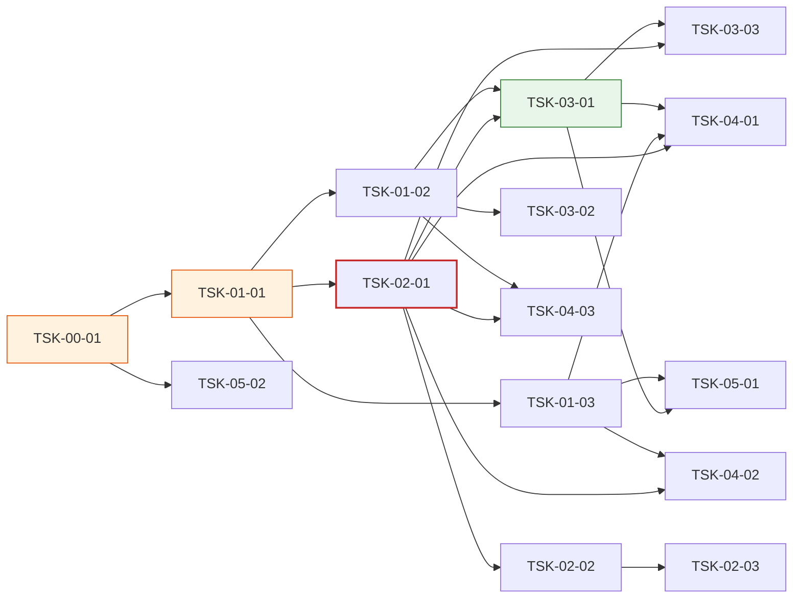

# WBS - dev-monitor v5

> version: 1.0
> description: dev-monitor 대시보드 v5 — UI 개선 6건(FR-01~FR-06) + monitor-server.py 6937줄 모놀리스 → `monitor_server` 패키지 증분 분리(FR-07) + 관련 프롬프트·문서 중복 제거(FR-08)
> depth: 3
> start-date: 2026-04-24
> target-date: 2026-05-22
> updated: 2026-04-24
> prd-ref: docs/monitor-v5/prd.md
> trd-ref: docs/monitor-v5/trd.md

---

## Dev Config

### Domains
| domain | description | unit-test | e2e-test | e2e-server | e2e-url |
|--------|-------------|-----------|----------|------------|---------|
| backend | Python scripts: `monitor-server.py` 엔트리 + `monitor_server/` 패키지(handlers, api, renderers/*). `http.server` + stdlib only. signal scanners, filter helpers. | `pytest -q scripts/` | - | - | - |
| frontend | SSR HTML + `scripts/monitor_server/static/style.css`, `static/app.js`, `skills/dev-monitor/vendor/graph-client.js`. SSR은 `renderers/*`가 생성. 클라이언트 JS는 `/static/*` 라우트로 서빙. CSS 변수 토큰 기반(`:root`). | `pytest -q scripts/` | `python3 scripts/test_monitor_e2e.py` | `python3 scripts/monitor-server.py --port 7321 --docs docs/monitor-v5` | `http://localhost:7321` |
| fullstack | backend + frontend 통합 (대시보드 라우트, 팝오버/슬라이드 패널, Phase 배지, pane 카드, /api/task-detail+SSR). | `pytest -q scripts/` | `python3 scripts/test_monitor_e2e.py` | `python3 scripts/monitor-server.py --port 7321 --docs docs/monitor-v5` | `http://localhost:7321` |
| infra | 패키지 스캐폴드, `/static/*` 라우팅 + 화이트리스트, 플러그인 캐시 동기화, 공용 CSS 변수 토큰, `@keyframes spin` 재사용. | - | - | - | - |

### Design Guidance
| domain | architecture |
|--------|-------------|
| backend | Python 3 stdlib only (no pip). `http.server.BaseHTTPRequestHandler` 서브클래스 라우팅(`/`, `/api/*`, `/static/*`). 모든 헬퍼 pure 함수. 테스트는 `scripts/test_monitor_*.py` — pytest + stdlib. `monitor-server.py`는 얇은 엔트리(< 500줄), 실제 로직은 `monitor_server/` 패키지. 패키지 이름은 언더스코어(`monitor_server`), 엔트리 파일명은 하이픈(`monitor-server.py`) — `sys.path.insert(0, Path(__file__).parent)` 후 `from monitor_server.handlers import Handler`. 각 파이썬 모듈 ≤ 800줄 (NF-03). 각 분할 단계(S1~S6)는 독립 PR — 동시 머지 회귀 방지. |
| frontend | SSR HTML은 `renderers/*` 섹션 렌더러가 문자열로 생성. CSS는 `:root` 변수 기반(`--phase-dd/im/ts/xx/failed/bypass/pending`, `--critical`, 기존 `--run/--done/--fail/--accent/--pending` 유지). 팝오버/슬라이드 패널은 **`data-section` 바깥 body 직계**에 배치해 5초 폴링 innerHTML 교체로부터 격리. 이벤트 바인딩은 document-level delegation 원칙. 라우팅과 메뉴 연결: 신규 페이지는 즉시 라우터에 등록하고 메뉴/사이드바의 진입점을 같은 Task에서 추가한다. 라우터·메뉴 배선을 분리된 후속 Task로 미루면 orphan page가 발생한다. 정적 에셋은 `/static/*` 화이트리스트(`style.css`, `app.js`)로만 서빙 + `Cache-Control: public, max-age=300` + path traversal 방어. |

### Quality Commands
| name | command |
|------|---------|
| lint | - |
| typecheck | `python3 -m py_compile scripts/monitor-server.py scripts/monitor_server/__init__.py scripts/monitor_server/handlers.py scripts/monitor_server/api.py` |
| coverage | - |

### Cleanup Processes
monitor-server, monitor-launcher

---

## WP-00: v4 베이스라인 & 사전 준비
- schedule: 2026-04-24 ~ 2026-04-24
- description: monitor-v4 전 릴리스의 테스트 green 상태와 pre-v5 태그를 확보해 FR-07 증분 분할의 롤백 기준점을 만든다.

### TSK-00-01: v4 테스트 green 확인 + `monitor-server-pre-v5` 태그
- category: infrastructure
- domain: infra
- model: sonnet
- status: [ ]
- priority: critical
- assignee: -
- schedule: 2026-04-24 ~ 2026-04-24
- tags: baseline, tag, rollback, pre-v5
- depends: -
- blocked-by: -
- entry-point: -
- note: PRD §11 전제조건 + TRD §4.2 S1 이전의 롤백 기준점. 모놀리스 버전을 태그로 보존해 각 S 단계가 독립 revert 가능하게 한다.

#### PRD 요구사항
- prd-ref: PRD §10 릴리스 조건 (v4 AC-20 regression 0), TRD §4.2 "롤백 경로", TRD §11 전제조건
- requirements:
  - `pytest -q scripts/` 전량 green 확인 (v4 기준선).
  - `scripts/test_monitor_e2e.py`도 실행하여 UI 회귀 없음 확인.
  - `git tag monitor-server-pre-v5` 으로 모놀리스 직전 커밋 태깅(향후 `git revert` 기준).
  - v4 릴리스 커밋 SHA, 태그명, 테스트 로그 요약을 `docs/monitor-v5/baseline.md`에 기록.
  - 플러그인 캐시(`~/.claude/plugins/marketplaces/dev-tools/`)도 v4와 동일 상태인지 확인.
- acceptance:
  - `pytest -q scripts/` exit 0.
  - `git tag --list monitor-server-pre-v5` 가 값을 반환.
  - `docs/monitor-v5/baseline.md` 파일 생성 + 위 4항목 기재.
- constraints:
  - 코드 변경 0 (Task 범위는 측정과 태깅만).
  - Python 3 stdlib only 원칙 유지.

#### 기술 스펙 (TRD)
- tech-spec:
  - `git tag monitor-server-pre-v5 {v4-release-sha}`
  - `pytest -q scripts/` + `python3 scripts/test_monitor_e2e.py`
- api-spec: -
- data-model: -
- ui-spec: -

---

## WP-01: 정적 에셋 분리 (FR-07 S1~S3)
- schedule: 2026-04-25 ~ 2026-04-30
- description: `monitor_server` 파이썬 패키지 스캐폴드 + `/static/*` 라우트 + 인라인 CSS/JS 를 `static/style.css`·`static/app.js`로 추출한다. UI 변경 착수 전 시각 자산의 편집 면적을 파일 단위로 쪼개 동시 머지 회귀를 차단한다.

### TSK-01-01: `monitor_server` 패키지 스캐폴드 + `/static/*` 화이트리스트 라우트
- category: infrastructure
- domain: backend
- model: sonnet
- status: [ ]
- priority: critical
- assignee: -
- schedule: 2026-04-25 ~ 2026-04-25
- tags: shared-contract, package-scaffold, http-route, static-assets
- depends: TSK-00-01
- blocked-by: -
- entry-point: -
- note: 계약 전용(contract-only) Task — 로직 이전 없음, 패키지 구조 + `/static/*` 라우트만. fan-in 3(TSK-01-02, TSK-01-03, TSK-02-01). 이후 모든 FR-07 단계와 UI 변경이 이 Task의 패키지 경로를 참조한다.

#### PRD 요구사항
- prd-ref: PRD §2 P2-7 FR-07, PRD §5 FR-07 AC-FR07-a, AC-FR07-e, TRD §1 "타깃(v5)", §4.1~§4.2 S1, §5.2
- requirements:
  - `scripts/monitor_server/` 디렉토리 생성 + `__init__.py`(빈 패키지 + 버전 문자열).
  - `scripts/monitor_server/handlers.py` 스켈레톤 — `BaseHTTPRequestHandler` 서브클래스 + `/` 기본 라우트(현재는 기존 `monitor-server.py`의 `do_GET` 재호출), `/static/<path>` 라우트.
  - `scripts/monitor_server/static/` 디렉토리 생성 (빈 상태로).
  - `/static/*` 구현: 화이트리스트 `_STATIC_WHITELIST = {"style.css", "app.js"}`, MIME `text/css; charset=utf-8` / `application/javascript; charset=utf-8`, `Cache-Control: public, max-age=300`, path traversal 차단(`name not in _STATIC_WHITELIST` → 404).
  - 알 수 없는 경로 / `..` 포함 경로는 404 또는 403.
  - `scripts/monitor-server.py` 상단에 `sys.path.insert(0, str(Path(__file__).parent))` 추가 + 주석으로 하이픈/언더스코어 매핑 설명(TRD R-H).
  - **로직 이전 금지** — CSS/JS 인라인 제거 및 렌더러 이전은 후속 Task 범위.
  - `scripts/test_monitor_static_assets.py` 신규 작성: `/static/style.css`(빈 파일이어도) 200 + 올바른 MIME + `Cache-Control` 헤더, `/static/evil.sh`/`/static/../../etc/passwd` 404.
- acceptance:
  - AC-FR07-a: `scripts/monitor_server/` 디렉토리 + 하위 파일 구조 검증(`__init__.py`, `handlers.py`, `static/`).
  - AC-FR07-e: path traversal 시도 차단(`test_monitor_static_assets.py::test_traversal_blocked` 통과).
  - `python3 -c "import monitor_server"` 성공 (sys.path 추가 후).
  - 기존 `pytest -q scripts/` 회귀 0 — 기존 기능 어떤 것도 건드리지 않음.
  - `monitor-server.py` 줄 수는 S1 단계에서 **증가 혹은 동일**(엔트리 로직 추가만).
- constraints:
  - Python 3 stdlib only.
  - `open(..., "w", encoding="utf-8", newline="\n")` 규칙 준수(CLAUDE.md).
  - `Path(__file__).parent / "static"` 기반 경로 해석 — `os.path.join` 문자열 조합 금지.
  - 패키지 이름 `monitor_server`(언더스코어) — 엔트리 파일 `monitor-server.py`(하이픈) 혼동 금지.
- test-criteria:
  - `test_monitor_static_assets.py::test_css_served_with_mime`
  - `test_monitor_static_assets.py::test_js_served_with_mime`
  - `test_monitor_static_assets.py::test_cache_control_header`
  - `test_monitor_static_assets.py::test_unknown_asset_404`
  - `test_monitor_static_assets.py::test_traversal_blocked`

#### 기술 스펙 (TRD)
- tech-spec:
  - TRD §1 타깃 레이아웃.
  - TRD §4.2 S1 (스캐폴드만, 로직 이전 없음).
  - TRD §5.2 `/static/<path>` 구현 블록.
- api-spec:
  - `GET /static/<whitelisted>` → 200 + MIME + `Cache-Control: public, max-age=300`.
  - `GET /static/<not-whitelisted or traversal>` → 404.
- data-model: -
- ui-spec: -

---

### TSK-01-02: 인라인 `<style>` → `static/style.css` 추출 + `<link>` 주입
- category: infrastructure
- domain: frontend
- model: sonnet
- status: [ ]
- priority: critical
- assignee: -
- schedule: 2026-04-28 ~ 2026-04-29
- tags: css-extraction, static-asset, visual-regression
- depends: TSK-01-01
- blocked-by: -
- entry-point: -
- note: 순수 이전 Task — 새 CSS 규칙·변수 추가 금지(phase/critical 토큰 추가는 TSK-03-01에서). fan-in 3(TSK-03-01, TSK-03-02, TSK-04-03 + 간접 다수). 시각 스냅샷 diff 0 이 유일한 허용 기준.

#### PRD 요구사항
- prd-ref: PRD §2 P2-7 FR-07 i, PRD §5 FR-07 AC-FR07-d, TRD §4.2 S2, TRD R-A(FOUC), R-D(캐시)
- requirements:
  - `scripts/monitor-server.py` 내 인라인 `<style>` 블록(TRD 기준 L1540~L3000 대역) 전량을 `scripts/monitor_server/static/style.css` 로 이동.
  - SSR HTML `<head>` 최상단(meta 다음)에 `<link rel="stylesheet" href="/static/style.css?v={pkg_version}">` 주입.
  - 인라인 `<style>` 블록 제거 — `grep -n "<style" scripts/monitor-server.py` 결과 0.
  - **규칙 변경·추가·삭제 금지** — 순수 cut & paste. 파일 길이 변화는 화이트스페이스만 허용.
  - 기존 v4 시각 E2E 스냅샷(`scripts/test_monitor_e2e.py`)이 diff 없이 통과해야 함.
  - 버전 쿼리 파라미터(`?v=`)는 `monitor_server.__version__`(TSK-01-01에서 정의) 또는 mtime 기반(개발 중 즉시 무효화).
- acceptance:
  - AC-FR07-d: `GET /static/style.css` → 200 + `text/css; charset=utf-8` + `Cache-Control: public, max-age=300`.
  - 인라인 `<style>` 블록이 `monitor-server.py` 에 남아있지 않음.
  - `test_monitor_render.py` SSR 스냅샷 회귀 0(HTML 본문 비교에서 `<style>` 블록 자리에 `<link>` 태그 치환만 발생).
  - FOUC(R-A) 재현 없음 — 로컬 localhost 부하 기준 첫 렌더 시 스타일 적용 완료.
- constraints:
  - TRD R-A: `<link>` 를 `<head>` 내 **최상단** 배치(meta 다음 즉시).
  - `Path` 기반 파일 쓰기(`pathlib.Path.write_text(..., encoding="utf-8", newline="\n")`).
  - 새 CSS 변수·규칙·셀렉터 추가 금지. 순수 이전만.
- test-criteria:
  - `test_monitor_render.py::test_no_inline_style_block`
  - `test_monitor_render.py::test_link_tag_injected_in_head`
  - `test_monitor_static_assets.py::test_css_content_non_empty`
  - `test_monitor_e2e.py` 시각 스냅샷 diff 0

#### 기술 스펙 (TRD)
- tech-spec:
  - TRD §4.2 S2. TRD §5.2 캐시 정책.
- api-spec:
  - `GET /static/style.css` 정적 에셋.
  - `GET /?...` HTML 에 `<link rel="stylesheet" href="/static/style.css?v=...">` 포함.
- data-model: -
- ui-spec:
  - 시각 스냅샷 무변경 (규칙 추가 금지 원칙).

---

### TSK-01-03: 인라인 `` 주입.
  - 인라인 `<script>` 블록 제거 — vendor graph-client.js 참조 `<script src="/vendor/graph-client.js">` 는 유지.
  - **동작 변경·추가·삭제 금지** — 순수 cut & paste.
  - 기존 E2E(hover 툴팁 v4, EXPAND 패널, 필터 바) 전량 회귀 0.
- acceptance:
  - AC-FR07-d: `GET /static/app.js` → 200 + `application/javascript; charset=utf-8` + `Cache-Control: public, max-age=300`.
  - 인라인 `<script>` 블록이 `monitor-server.py` 에 남아있지 않음(vendor 참조 제외).
  - v4 기존 e2e(`test_monitor_e2e.py`) hover 툴팁·EXPAND·필터 바 테스트 회귀 0.
- constraints:
  - IIFE 구조 보존 — 전역 누수 방지 래퍼 유지.
  - `defer` 속성 사용(DOM 파싱 후 실행).
  - 새 함수·바인딩 추가 금지.
- test-criteria:
  - `test_monitor_render.py::test_no_inline_script_block`
  - `test_monitor_render.py::test_script_tag_defer`
  - `test_monitor_static_assets.py::test_js_content_non_empty`
  - `test_monitor_e2e.py` 기존 hover/EXPAND/필터 시나리오 전량 통과

#### 기술 스펙 (TRD)
- tech-spec:
  - TRD §4.2 S3. `<script defer>` 삽입 위치는 `</body>` 직전.
- api-spec:
  - `GET /static/app.js` 정적 에셋.
- data-model: -
- ui-spec:
  - 기존 인터랙션 무변경(v4 동작).

---

## WP-02: Python 모듈 분리 (FR-07 S4~S6)
- schedule: 2026-05-01 ~ 2026-05-07
- description: `monitor-server.py` 모놀리스의 섹션 렌더러·API 라우트·HTTP 핸들러를 `monitor_server.renderers.*` / `api.py` / `handlers.py` 로 이전. 각 단계는 전체 테스트 green 확인 후 진행, 최종 `monitor-server.py` ≤ 500줄.

### TSK-02-01: `renderers/` 패키지 — 섹션 렌더러 8모듈 순차 이전
- category: infrastructure
- domain: backend
- model: opus
- status: [ ]
- priority: high
- assignee: -
- schedule: 2026-05-01 ~ 2026-05-05
- tags: module-split, renderer, ssr, incremental-commit
- depends: TSK-01-01
- blocked-by: -
- entry-point: -
- note: TRD §4.2 S4 — "1 파일 = 1 커밋" 원칙(wp → team → subagents → activity → depgraph → taskrow → filterbar → panel 순, 8 커밋). 상호 참조(`_render_task_row_v2`)로 인한 순서 의존성 있음. fan-in 6(TSK-02-02, TSK-03-01, TSK-03-03, TSK-04-01, TSK-04-02, TSK-04-03) — 이후 대부분의 UI Task가 이 패키지의 렌더러 파일을 편집한다.

#### PRD 요구사항
- prd-ref: PRD §2 P2-7 FR-07 iii, PRD §5 FR-07 AC-FR07-c, AC-FR07-f, AC-FR07-g, TRD §4.2 S4
- requirements:
  - `scripts/monitor_server/renderers/__init__.py` — `render_dashboard(model, lang, sps, sp)` 엔트리 + 섹션 조립.
  - 하위 모듈 8개 순차 생성 (각 1 커밋):
    1. `renderers/wp.py` — `_section_wp_cards`, `_render_task_row_v2` 이전. **본 Task 범위에서는 동작 변경 금지** (FR-01/FR-06 의 DOM 추가는 후속 Task).
    2. `renderers/team.py` — `_section_team_agents` + pane 카드 이전.
    3. `renderers/subagents.py` — `_section_subagents` 이전.
    4. `renderers/activity.py` — `_section_live_activity` 이전.
    5. `renderers/depgraph.py` — `_section_dep_graph` + `_build_graph_payload` 이전.
    6. `renderers/taskrow.py` — `_phase_label`, `_phase_data_attr`, `_trow_data_status` 공용 헬퍼 이전.
    7. `renderers/filterbar.py` — `_section_filter_bar` 이전.
    8. `renderers/panel.py` — task/merge 슬라이드 패널 body-직계 DOM 스캐폴드 이전.
  - `monitor-server.py` 의 해당 함수는 이전 후 `from monitor_server.renderers.X import func` 재사용 또는 shim 제거.
  - **각 하위 커밋 직후** `pytest -q scripts/` + `test_monitor_e2e.py` 전량 green 확인.
  - 각 모듈 파일 ≤ 800줄(NF-03 + AC-FR07-c).
  - `scripts/test_monitor_module_split.py` 신규: `import monitor_server.renderers.wp` 등 8개 모듈 import 가능 검증.
- acceptance:
  - AC-FR07-c: 각 `renderers/*.py` 파일 ≤ 800줄(정적 체크).
  - AC-FR07-f: v4 의 `/api/graph`, `/api/task-detail`, `/api/merge-status` 응답 스키마 무변경(기존 API 테스트 회귀 0).
  - AC-FR07-g: Git 히스토리에 해당 WP 브랜치 내 최소 8개 커밋(각 파일 1개씩) + WP-01 의 3 커밋 합계 **최소 11개 분할 커밋** 확인. squash merge 시 커밋 트레일러에 단계 라벨.
  - `test_monitor_module_split.py` 8개 import 테스트 통과.
  - `test_monitor_render.py` SSR 스냅샷 회귀 0.
- constraints:
  - **순수 이전** — 본 Task 범위에서는 FR-01~FR-06 UI 변경 0. UI 변경은 후속 WP-03/WP-04 에서.
  - 순서 의존성: `wp.py`·`depgraph.py` 가 `taskrow.py` 의 `_phase_data_attr`·`_phase_label` 을 사용 → `taskrow.py` 분리 커밋을 `wp.py`·`depgraph.py` 분리 직전에 배치하거나 선-shim 전략(원 위치 함수가 `renderers.taskrow` 를 import 하도록) 사용.
  - `monitor_server/__init__.py` 는 `monitor_server.renderers` 재수출(`from .renderers import render_dashboard`) 이외의 로직 금지.
  - 각 커밋 직후 전체 테스트 녹색 아니면 **다음 모듈 이전 금지** — 단일 Task 내부 게이트.
- test-criteria:
  - `test_monitor_module_split.py::test_import_wp`
  - `test_monitor_module_split.py::test_import_team`
  - `test_monitor_module_split.py::test_import_subagents`
  - `test_monitor_module_split.py::test_import_activity`
  - `test_monitor_module_split.py::test_import_depgraph`
  - `test_monitor_module_split.py::test_import_taskrow`
  - `test_monitor_module_split.py::test_import_filterbar`
  - `test_monitor_module_split.py::test_import_panel`
  - `test_monitor_module_split.py::test_each_module_under_800_lines`
  - `test_monitor_render.py` 전량

#### 기술 스펙 (TRD)
- tech-spec:
  - TRD §1 "타깃(v5)" 레이아웃.
  - TRD §4.2 S4 증분 분할 순서.
  - TRD §2 변경 파일 표의 renderers/* 행.
- api-spec:
  - 본 Task 에서 API 변경 0 (기존 계약 유지).
- data-model: -
- ui-spec:
  - SSR HTML 동일(본 Task는 파일 구조만 변경).

---

### TSK-02-02: `api.py` — `/api/*` 엔드포인트 이전
- category: infrastructure
- domain: backend
- model: sonnet
- status: [ ]
- priority: high
- assignee: -
- schedule: 2026-05-06 ~ 2026-05-06
- tags: module-split, api, contract-stable
- depends: TSK-02-01
- blocked-by: -
- entry-point: -
- note: TRD §4.2 S5. `/api/state`, `/api/graph`, `/api/task-detail`, `/api/merge-status` 스키마 무변경 — 본 Task 의 계약은 "파일 위치 변경 + 응답 동일".

#### PRD 요구사항
- prd-ref: PRD §2 P2-7 FR-07 iv, PRD §5 AC-FR07-c, AC-FR07-f, TRD §4.2 S5, TRD §5.1
- requirements:
  - `scripts/monitor_server/api.py` 신규 — `handle_state`, `handle_graph`, `handle_task_detail`, `handle_merge_status` 함수 정의.
  - 각 함수 시그니처: `def handle_X(handler, params: dict, model) -> None` — `BaseHTTPRequestHandler` 인스턴스 + 쿼리 파라미터 + 대시보드 모델을 받아 `self.send_response/header/body` 호출.
  - `monitor-server.py` 에서 `do_GET` 내부 분기 중 `/api/*` 경로를 `api.handle_*` 로 위임.
  - `api.py` ≤ 800줄.
  - `scripts/test_monitor_task_detail_api.py`, `test_monitor_graph_api.py`, `test_monitor_merge_badge.py` 전량 green.
- acceptance:
  - AC-FR07-c: `api.py` ≤ 800줄.
  - AC-FR07-f: `/api/state`, `/api/graph`, `/api/task-detail`, `/api/merge-status` 응답 JSON 스키마가 v4 와 byte 동일(필드 추가/제거/이름 변경 없음). **예외**: FR-06(TSK-04-01)에서 `/api/graph` 노드에 `phase` 필드가 추가될 예정이나, 본 Task 범위는 이전만이므로 v4 스키마 유지.
  - 기존 API 테스트 회귀 0.
- constraints:
  - 응답 JSON 필드 추가/제거 금지(본 Task 범위). FR-06 의 `phase` 필드 추가는 TSK-04-01 범위.
  - 캐싱 헤더(`no-cache` 등) 기존 정책 유지.
- test-criteria:
  - `test_monitor_task_detail_api.py` 전량
  - `test_monitor_graph_api.py` 전량
  - `test_monitor_merge_badge.py` 전량
  - `test_monitor_module_split.py::test_import_api`

#### 기술 스펙 (TRD)
- tech-spec:
  - TRD §4.2 S5.
  - TRD §5.1 엔드포인트 계약 표.
- api-spec:
  - `GET /api/state` → JSON (v4 무변경)
  - `GET /api/graph` → JSON (v4 무변경)
  - `GET /api/task-detail?task=&subproject=` → JSON (v4 무변경)
  - `GET /api/merge-status?subproject=&wp=` → JSON (v4 무변경)
- data-model: -
- ui-spec: -

---

### TSK-02-03: `handlers.py` — HTTP 라우팅 이전 + `monitor-server.py` ≤ 500줄
- category: infrastructure
- domain: backend
- model: sonnet
- status: [ ]
- priority: high
- assignee: -
- schedule: 2026-05-07 ~ 2026-05-07
- tags: module-split, http-routing, thin-entry
- depends: TSK-02-02
- blocked-by: -
- entry-point: -
- note: TRD §4.2 S6 — FR-07 완결. 엔트리 파일은 `HTTPServer((host, port), handlers.Handler)` 수준의 thin launcher 로 축소.

#### PRD 요구사항
- prd-ref: PRD §2 P2-7 FR-07 v, PRD §5 AC-FR07-b, AC-FR07-c, TRD §4.2 S6, TRD §1 타깃 레이아웃, NF-03
- requirements:
  - `scripts/monitor_server/handlers.py` — `BaseHTTPRequestHandler` 서브클래스(`Handler`) 에 `do_GET` 라우팅 통합: `/` → `renderers.render_dashboard`, `/api/*` → `api.handle_*`, `/static/*` → `_serve_static`, `/vendor/*` → 기존 vendor 서빙, 그 외 404.
  - `monitor-server.py` 엔트리 축소: `argparse`(`--port`, `--docs`) + `HTTPServer((host, port), handlers.Handler)` + `serve_forever()` 이외 로직 0.
  - `monitor-server.py` < 500 줄.
  - `monitor-launcher.py` 는 엔트리 파일명(`monitor-server.py`) 참조가 불변이므로 변경 없음 — 회귀 확인만.
- acceptance:
  - AC-FR07-b: `scripts/monitor-server.py` 실행 시 `monitor_server.handlers.Handler` 기반 서버 기동(실행 로그로 확인).
  - AC-FR07-c: `monitor-server.py` 줄 수 < 500, `handlers.py` ≤ 800.
  - NF-03: `monitor_server/` 하위 어떤 파일도 ≤ 800줄.
  - `monitor-launcher.py` 기존 subprocess 호출 인터페이스(`--port`, `--docs`) 회귀 0.
  - FR-07 S1~S6 전체 완료 — 기존 단위/E2E 테스트 전량 green(AC-FR07-f, v4 AC-20 regression 0).
- constraints:
  - 엔트리는 `if __name__ == "__main__"` 블록 외 추가 로직 금지.
  - `handlers.py` 에서 `/static/*` 서빙 로직 유지(TSK-01-01 의 화이트리스트 + path traversal 방어).
  - `open(..., encoding="utf-8", newline="\n")` 규칙 준수.
- test-criteria:
  - `test_monitor_module_split.py::test_monitor_server_entry_under_500_lines`
  - `test_monitor_module_split.py::test_handlers_under_800_lines`
  - `test_monitor_module_split.py::test_import_handlers`
  - `test_monitor_static_assets.py` 전량(회귀)
  - `test_monitor_e2e.py` 전량(회귀)

#### 기술 스펙 (TRD)
- tech-spec:
  - TRD §4.2 S6.
  - TRD §1 "타깃(v5)" 최종 레이아웃.
- api-spec:
  - `/`, `/api/*`, `/static/*`, `/vendor/*` 라우팅을 단일 `Handler.do_GET` 에서 dispatch.
- data-model: -
- ui-spec: -

---

## WP-03: 공유 시각 계약 + P0 UI (FR-03, FR-05)
- schedule: 2026-05-08 ~ 2026-05-12
- description: FR-02·FR-05·FR-06 이 공유하는 Phase/Critical CSS 변수 토큰과 `data-phase` 렌더링 규약을 선행 분리(TSK-03-01 계약 전용). 이어서 P0 차단 FR인 그리드 비율 반전(FR-03)과 크리티컬 패스 앰버 색 분리(FR-05)를 적용한다.

### TSK-03-01: Phase/Critical CSS 변수 토큰 + `data-phase` 렌더링 규약 (계약 전용)
- category: infrastructure
- domain: frontend
- model: sonnet
- status: [xx]
- priority: critical
- assignee: -
- schedule: 2026-05-08 ~ 2026-05-08
- tags: shared-contract, css-variables, data-phase, contract-only
- depends: TSK-01-02, TSK-02-01
- blocked-by: -
- entry-point: library
- note: 계약 전용(contract-only) Task — 토큰 선언 + 헬퍼 함수 1종만. 구현 규칙 덧붙이기·DOM 편집 없음. fan-in 3(TSK-03-03 FR-05, TSK-04-01 FR-06, TSK-05-01 FR-02). 본 Task 의 shape 가 확정되면 downstream 3 Task 가 병렬 진행 가능.

#### PRD 요구사항
- prd-ref: PRD §5 FR-05, FR-06, §6 접근성 (WCAG AA), TRD §7.5 `:root { --critical }`, TRD §7.6 `:root { --phase-* }`, TRD §2 renderers/taskrow.py
- requirements:
  - `scripts/monitor_server/static/style.css` 의 `:root` 블록에 CSS 변수 추가:
    - `--phase-dd: #6366f1` (indigo — Design)
    - `--phase-im: #0ea5e9` (sky — Build)
    - `--phase-ts: #a855f7` (violet — Test)
    - `--phase-xx: #10b981` (emerald — Done)
    - `--phase-failed: #ef4444` (red — Failed)
    - `--phase-bypass: #f59e0b` (amber — Bypass)
    - `--phase-pending: #6b7280` (gray — Pending)
    - `--critical: #f59e0b` (amber — Critical Path)
  - 위 변수들의 값이 WCAG AA contrast(≥ 4.5:1, 틴트 배경 vs 텍스트) 를 만족함을 주석으로 근거 표기.
  - `scripts/monitor_server/renderers/taskrow.py` 에 `_phase_data_attr(status_code) -> str` 공용 헬퍼 추가 — 입력 `[dd]`/`[im]`/`[ts]`/`[xx]`/`failed`/`bypass`/`pending` → 출력 `"dd"`/`"im"`/.../"pending"` 매핑. 기존 `_phase_label` 과 동일 위치.
  - **규칙 덧붙이기 금지** — 이 Task 는 `:root` 변수 + 헬퍼 함수만. `.badge[data-phase=...]`·`.dep-node[data-phase=...]`·`.dep-node.critical` 규칙은 후속 Task(TSK-03-03, TSK-04-01) 범위.
  - `scripts/test_monitor_phase_tokens.py` 신규 — `:root` 에 8개 변수 정의 존재 + `_phase_data_attr` 매핑 테이블 검증.
- acceptance:
  - `:root` 블록에 8개 CSS 변수(`--phase-dd/im/ts/xx/failed/bypass/pending`, `--critical`) 가 정의되어 있다.
  - `_phase_data_attr("[dd]") == "dd"` 등 7가지 상태 매핑이 단위 테스트로 검증된다.
  - 본 Task 커밋 시점에는 대시보드 시각 회귀 0 — 변수만 선언 + 사용처 없음이므로 렌더 결과 동일.
  - WCAG contrast 근거가 CSS 주석으로 기재된다.
- constraints:
  - 기존 CSS 변수(`--run`, `--done`, `--fail`, `--accent`, `--pending`, `--ink-*`, `--bg-*`) 값/이름 변경 금지 — 신규 `--phase-*` 는 기존 위에 쌓는 방식.
  - 헬퍼 함수는 pure function — 입력 dict/str 외 외부 상태 의존 금지.
  - 토큰 값은 본 Task에서 결정 후 **변경 금지** (downstream Task 들이 테스트로 고정).
- test-criteria:
  - `test_monitor_phase_tokens.py::test_root_variables_declared`
  - `test_monitor_phase_tokens.py::test_phase_data_attr_mapping`
  - `test_monitor_phase_tokens.py::test_wcag_contrast_comments`

#### 기술 스펙 (TRD)
- tech-spec:
  - TRD §7.5 `:root { --critical: #f59e0b }`.
  - TRD §7.6 `:root { --phase-* }` 블록.
  - TRD §2 renderers/taskrow.py 공용 헬퍼 이전 행.
- api-spec: -
- data-model: -
- ui-spec:
  - `:root` CSS 변수 8종 선언(사용처 없음).
  - 헬퍼 `_phase_data_attr` 만 정의(사용처 없음 — 계약 전용).

---

### TSK-03-02: FR-03 메인 그리드 `3fr:2fr` → `2fr:3fr` 반전 + `wp-stack` min-width 재조정
- category: development
- domain: frontend
- model: sonnet
- status: [dd]
- priority: critical
- assignee: -
- schedule: 2026-05-11 ~ 2026-05-11
- tags: FR-03, grid-layout, p0, visual
- depends: TSK-01-02
- blocked-by: -
- entry-point: 대시보드 루트 `/` (`main` 요소 2컬럼 그리드)
- note: P0 릴리스 차단 FR. CSS 파일 단일 편집 — 하나의 그리드 규칙 변경이 WP 카드 영역과 실시간 영역의 시각 비중을 바꾼다.

#### PRD 요구사항
- prd-ref: PRD §2 P0-1 FR-03, §5 FR-03 AC-FR03-a~d, §9 AC-1, AC-2, TRD §7.3
- requirements:
  - `scripts/monitor_server/static/style.css` 의 `.grid` 규칙 변경: `grid-template-columns: minmax(0, 2fr) minmax(0, 3fr)` (v4: `3fr 2fr`).
  - `.wp-stack` 의 `grid-template-columns: repeat(auto-fill, minmax(380px, 1fr))` (v4: 520px) 로 재조정 — 축소된 좌측 열에서도 카드 가로 스크롤 0 보장.
  - 기존 fold/필터 바/WP 머지 뱃지 레이아웃 무변경 — 폭만 축소.
  - `scripts/test_monitor_grid_ratio.py` 신규 — `style.css` 정규식 매치로 `.grid { ... 2fr ... 3fr ... }` 확인 + `.wp-stack minmax(380px, 1fr)` 확인.
  - `scripts/test_monitor_e2e.py` 에 `test_wp_card_no_horizontal_scroll` 시나리오 추가 — 1280px 뷰포트에서 WP 카드 내 `scrollWidth` ≤ `clientWidth`.
- acceptance:
  - AC-FR03-a / AC-1: computed `grid-template-columns` 가 `2fr:3fr` 비율 반영.
  - AC-FR03-b: 1280px 뷰포트 기준 WP 영역 폭이 메인 컨테이너 폭의 40% (±3%).
  - AC-FR03-c / AC-2: WP 카드 내부에 가로 스크롤바 없음(`test_wp_card_no_horizontal_scroll` 통과).
  - AC-FR03-d: 우측(팀 에이전트/서브에이전트/실시간 활동) 섹션이 확장된 폭을 활용해 더 넓게 렌더.
- constraints:
  - CSS 파일 외 수정 0 — Python 렌더러 변경 금지.
  - 모바일 반응형 범위 밖(PRD §3 비목표) — 1280px+ 데스크톱 기준.
- test-criteria:
  - `test_monitor_grid_ratio.py::test_main_grid_template_columns`
  - `test_monitor_grid_ratio.py::test_wp_stack_min_width`
  - `test_monitor_e2e.py::test_wp_card_no_horizontal_scroll`

#### 기술 스펙 (TRD)
- tech-spec:
  - TRD §7.3 `.grid { grid-template-columns: minmax(0, 2fr) minmax(0, 3fr) }` + `.wp-stack { minmax(380px, 1fr) }`.
- api-spec: -
- data-model: -
- ui-spec:
  - 메인 2컬럼 그리드: 좌 40% (WP 카드 스택), 우 60% (실시간 활동 + 팀 에이전트 + 서브에이전트).
  - WP 카드 스택: `min-width: 380px`, 좁은 열에서도 2열 유지 가능.

---

### TSK-03-03: FR-05 크리티컬 패스 앰버 색 분리 + 범례 갱신
- category: development
- domain: frontend
- model: sonnet
- status: [dd]
- priority: critical
- assignee: -
- schedule: 2026-05-12 ~ 2026-05-12
- tags: FR-05, dep-graph, critical-path, p0, visual
- depends: TSK-03-01, TSK-02-01
- blocked-by: -
- entry-point: 대시보드 루트 `/` > 의존성 그래프 섹션
- note: P0 릴리스 차단 FR. TSK-03-01 의 `--critical` 토큰을 적용 + 범례 DOM 갱신. failed 노드는 기존 `var(--fail)` 빨강 유지 — specificity 충돌 없음.

#### PRD 요구사항
- prd-ref: PRD §2 P0-2 FR-05, §5 FR-05 AC-FR05-a~d, §9 AC-3, AC-4, TRD §7.5
- requirements:
  - `scripts/monitor_server/static/style.css` 의 `.dep-node.critical` 규칙 변경:
    - `border-color: var(--critical)` (v4: `var(--fail)`)
    - `box-shadow: 0 0 0 2px color-mix(in srgb, var(--critical) 35%, transparent)` 추가.
  - `.dep-node.status-failed` 규칙 유지 — `border-left-color: var(--fail)`, `--_tint: color-mix(in srgb, var(--fail) 10%, transparent)`, `.dep-node-id { color: var(--fail) }`.
  - 동시 적용(`critical` + `status-failed`) 시 failed 색이 우선되도록 CSS specificity 명시(`.dep-node.status-failed.critical` 단독 규칙 또는 선언 순서 조정).
  - `scripts/monitor_server/renderers/depgraph.py` 의 `#dep-graph-legend` DOM 에 `<li class="legend-critical">` (앰버 swatch + "Critical Path" 라벨) 을 `<li class="legend-failed">` (빨강 swatch + "Failed" 라벨) 과 **별도 항목으로** 렌더.
  - `scripts/test_monitor_critical_color.py` 신규 — `.dep-node.critical` 가 `#f59e0b`(또는 `var(--critical)`), `.dep-node.status-failed` 가 `var(--fail)`, 범례 DOM 에 두 항목 별도 존재.
- acceptance:
  - AC-FR05-a / AC-3: `.dep-node.critical` computed `border-color` 가 `#f59e0b` 계열 RGB.
  - AC-FR05-b: `.dep-node.status-failed` computed 색이 `var(--fail)` 유지(v4 회귀 0).
  - AC-FR05-c: `.dep-node.status-failed.critical` 에서 failed 색이 우선(specificity 또는 선언 순서로 보장).
  - AC-FR05-d / AC-4: `#dep-graph-legend` 에 Critical Path / Failed 가 별도 `<li>` 로 존재.
- constraints:
  - 리터럴 `#f59e0b` 대신 `var(--critical)` 토큰 사용.
  - v4 의 failed 적색 경로 변경 금지(`.dep-node.status-failed`).
- test-criteria:
  - `test_monitor_critical_color.py::test_critical_uses_amber_token`
  - `test_monitor_critical_color.py::test_failed_keeps_red_token`
  - `test_monitor_critical_color.py::test_failed_wins_over_critical`
  - `test_monitor_critical_color.py::test_legend_has_critical_and_failed_items`

#### 기술 스펙 (TRD)
- tech-spec:
  - TRD §7.5 `.dep-node.critical { border-color: #f59e0b; ... }` (토큰화하여 `var(--critical)` 사용).
  - TRD §2 renderers/depgraph.py 변경 행.
- api-spec: -
- data-model: -
- ui-spec:
  - 크리티컬 패스 노드: 앰버 테두리 + 옅은 앰버 배경 틴트 + 2px 링 쉐도우.
  - failed 노드: 기존 빨강 유지.
  - 범례: Critical Path / Failed 별도 `<li>`.

---

## WP-04: P1 UI — Phase 배지 + 팝오버 + pane 카드 (FR-06, FR-01, FR-04)
- schedule: 2026-05-13 ~ 2026-05-19
- description: Phase 토큰 적용(FR-06), hover 툴팁 → ⓘ 클릭 팝오버 전환(FR-01), 팀 에이전트 pane 카드 높이 2배(FR-04). FR-06 이 Dep-Graph 노드 색까지 담당하여 WP 카드와 그래프 시각 일치를 완성한다.

### TSK-04-01: FR-06 Phase 배지 색상 + 내부 스피너 + Dep-Graph 노드 `data-phase` 적용
- category: development
- domain: fullstack
- model: sonnet
- status: [ ]
- priority: high
- assignee: -
- schedule: 2026-05-13 ~ 2026-05-14
- tags: FR-06, phase-badge, spinner, dep-graph, visual, p1
- depends: TSK-03-01, TSK-01-03, TSK-02-01
- blocked-by: -
- entry-point: 대시보드 루트 `/` > WP 카드 Task 행 배지 + 의존성 그래프 노드
- note: fullstack — renderers/wp.py(배지 DOM) + renderers/depgraph.py(노드 phase) + static/style.css(토큰 매핑) + static/app.js(기존 row-level `.spinner` 제거) + vendor/graph-client.js(노드 HTML 1줄 추가). 변경 면적 5파일.

#### PRD 요구사항
- prd-ref: PRD §2 P1-5 FR-06, §5 FR-06 AC-FR06-a~e, §9 AC-9, AC-10, AC-11, TRD §7.6
- requirements:
  - **CSS** (`static/style.css`):
    - `.badge` 기본 규칙(위치·padding·radius·투명 테두리·기본 배경) 정의.
    - `.badge[data-phase="dd|im|ts|xx|failed|bypass|pending"]` 7종 각각 `color-mix(in srgb, var(--phase-X) 15%, transparent)` 배경 + `var(--phase-X)` 테두리·텍스트 색.
    - `.badge .spinner-inline` — 8×8px 원형 border 스피너, 기본 `display:none`, `animation: spin 1s linear infinite` (기존 `@keyframes spin` 재사용 — 중복 선언 금지).
    - `.trow[data-running="true"] .badge .spinner-inline { display: inline-block }`.
    - v4 의 row-level `.trow[data-running="true"] .spinner` 규칙 제거(`display` 규칙만 제거, 키프레임·공용 스피너 CSS는 유지).
    - `.dep-node[data-phase="dd|im|ts|xx|failed|bypass"]` 에 `.dep-node-id { color: var(--phase-X) }` 적용 — 노드 글자색만 담당(`.status-*` 는 border-left-color 담당, CSS property scope 분리로 공존).
  - **Python 렌더러** (`renderers/wp.py`):
    - `_render_task_row_v2` 에서 배지 DOM 을 `
{phase_label}
` 로 갱신.
    - 기존 row 오른쪽 `.spinner` 요소 제거.
    - `phase_attr` 는 TSK-03-01 의 `_phase_data_attr(status)` 를 호출하여 구함.
  - **Python 렌더러** (`renderers/depgraph.py`):
    - `_build_graph_payload` 에서 각 노드 dict 에 `phase` 필드 추가 (`_phase_data_attr(status)` 재사용).
  - **Vendor JS** (`skills/dev-monitor/vendor/graph-client.js`):
    - 노드 HTML 템플릿에 `data-phase="${nd.phase}"` 속성 1줄 추가 — 기존 `status-${statusKey(nd)}` 클래스와 공존.
  - **API** (`api.py`):
    - `/api/graph` 응답 JSON 의 노드 객체에 `phase` 필드 추가 (v4 스키마 대비 필드 추가만 허용).
  - `scripts/test_monitor_phase_badge_colors.py` 신규 — 7종 `data-phase` 각각 CSS 규칙 존재 + `.badge .spinner-inline` 규칙 존재 + `.dep-node[data-phase]` 6종 규칙 존재.
  - `scripts/test_monitor_graph_api.py` 에 `test_graph_node_has_phase_field` 추가.
- acceptance:
  - AC-FR06-a / AC-9: 배지 DOM 에 `data-phase` 속성이 7가지 값으로 렌더된다.
  - AC-FR06-b: 각 phase 배지의 computed `background-color` + `color` 가 `--phase-X` 토큰과 일치.
  - AC-FR06-c / AC-10: `.running` Task 배지 내부에 `.spinner-inline` 요소가 있고 CSS animation 이 동작 — v4 외부 `.spinner` 제거 확인.
  - AC-FR06-d / AC-11: Dep-Graph 노드 색이 status → phase 토큰과 일치(`[dd]` indigo, `[im]` sky, `[ts]` violet, `[xx]` emerald, failed red, bypass amber).
  - AC-FR06-e: `var(--phase-bypass)` = `#f59e0b` 이 `:root` 전역 변수로 선언(TSK-03-01 에서 이미 완료된 상태여야 함).
  - NF-04 WCAG AA contrast 4.5:1 만족(TSK-03-01 에서 검증된 토큰 값 사용).
- constraints:
  - `.dep-node.status-failed` 빨강 경로(TSK-03-03) 훼손 금지 — property scope 분리(border-left-color vs dep-node-id color).
  - `/api/graph` 의 기존 필드 제거·이름 변경 금지(추가만).
  - `@keyframes spin` 은 기존 선언 재사용 — 중복 선언 금지(기존 위치: v3 TSK-00-01 에서 공용 키프레임으로 이미 존재).
  - `graph-client.js` 변경은 1줄 속성 추가만 — 기존 `statusKey()` 로직 수정 금지.
- test-criteria:
  - `test_monitor_phase_badge_colors.py::test_badge_rule_for_each_phase`
  - `test_monitor_phase_badge_colors.py::test_badge_spinner_inline_rule`
  - `test_monitor_phase_badge_colors.py::test_running_row_shows_inline_spinner`
  - `test_monitor_phase_badge_colors.py::test_dep_node_data_phase_rule`
  - `test_monitor_graph_api.py::test_graph_node_has_phase_field`

#### 기술 스펙 (TRD)
- tech-spec:
  - TRD §7.6 전체 CSS 블록.
  - TRD §7.6 Python 변경(`renderers/wp.py`, `renderers/depgraph.py`).
  - TRD §7.6 vendor graph-client.js 1줄 추가.
  - TRD R-F CSS property scope 분리 근거.
- api-spec:
  - `GET /api/graph` 응답 node 객체에 `phase: "dd"|"im"|"ts"|"xx"|"failed"|"bypass"|"pending"` 필드 추가.
- data-model:
  - Graph node JSON 스키마: `{id, label, status, phase, depends, ...}` — `phase` 추가.
- ui-spec:
  - Phase 배지: 7색 분기 + 내부 스피너.
  - Dep-Graph 노드 id 글자색 = phase 토큰.

---

### TSK-04-02: FR-01 Task 팝오버 — hover 제거 + ⓘ 클릭 + 위쪽 배치 + 폴백
- category: development
- domain: fullstack
- model: opus
- status: [ ]
- priority: high
- assignee: -
- schedule: 2026-05-15 ~ 2026-05-18
- tags: FR-01, popover, a11y, p1, interaction
- depends: TSK-01-03, TSK-02-01
- blocked-by: -
- entry-point: 대시보드 루트 `/` > WP 카드 Task 행 ⓘ 아이콘(시각: Task 이름 왼쪽 또는 배지 뒤, 위치는 FR-01 설계 참조)
- note: Design 복잡도 높음(opus) — 싱글톤 팝오버 상태머신 + 위치 폴백(위→아래) + 외부 클릭/ESC/재클릭 토글 + `aria-expanded` 동기화 + 접근성. fullstack — renderers/wp.py(.info-btn DOM) + static/style.css(.info-btn/.info-popover 규칙) + static/app.js(싱글톤 setupInfoPopover IIFE + 기존 setupTaskTooltip 제거).

#### PRD 요구사항
- prd-ref: PRD §2 P1-3 FR-01, §5 FR-01 AC-FR01-a~f, §9 AC-5, AC-6, AC-7, §6 접근성 (키보드 지원), TRD §7.1, R-B
- requirements:
  - **DOM** (`renderers/wp.py`): Task 행(`.trow`) 내부에 `<button class="info-btn" aria-label="상세" aria-expanded="false" aria-controls="trow-info-popover">ⓘ</button>` 추가. 기존 `data-state-summary` 속성은 팝오버 콘텐츠 재활용 목적으로 유지.
  - **싱글톤 DOM** (`renderers/panel.py` 또는 `renderers/__init__.py` body 직계): `

` — 1개만 존재.
  - **CSS** (`static/style.css`):
    - `.info-btn` — 작은 원형 버튼, 기본 포커스 링, hover 시 배경 틴트.
    - `.info-popover` — `position: absolute`, `box-shadow: 0 8px 24px rgba(0,0,0,0.18)`, 2단계 폰트 스케일(타이틀/본문), 꼬리 삼각형(before/after pseudo-element).
  - **JS** (`static/app.js`):
    - 기존 `setupTaskTooltip` IIFE 전량 삭제 + `#trow-tooltip` 관련 CSS 규칙 삭제.
    - `setupInfoPopover` IIFE 신설 — TRD §7.1 의 코드 블록 사양 그대로:
      - 싱글톤 상태 관리(openBtn 변수).
      - 클릭: `.info-btn` → 열기/토글, 팝오버 외부 클릭 → 닫기.
      - 키보드: `Escape` → 닫기 + `openBtn.focus()` (focus 복원).
      - 스크롤/리사이즈 → 닫기.
      - 포지션: `top = r.top + scrollY - ph - 8` 기본(위쪽), 상단 여유 부족 시 `top = r.bottom + scrollY + 8` (아래쪽 폴백), 좌우 `clamp(8, ..., innerWidth - pw - 8)`.
      - `aria-expanded` 동기화(`"true"` / `"false"`).
      - `renderInfoPopoverHtml(data)` — 기존 `renderTooltipHtml(data)` 재활용.
  - **E2E 마이그레이션**: v4 의 hover 기반 테스트(`scripts/test_monitor_e2e.py::test_task_tooltip_hover` 등)를 click 기반으로 마이그레이션. hover 단언 남기면 즉시 회귀.
  - `scripts/test_monitor_info_popover.py` 신규 — ⓘ 클릭 → 팝오버 표시, 위치(`top <= row.top + 4` 포함 꼬리 허용), 폴백(상단 여유 부족 케이스), ESC/외부 클릭 닫기, 재클릭 토글, `aria-expanded` 동기화.
- acceptance:
  - AC-FR01-a / AC-5: Task 행에 `.info-btn` 버튼 존재 + `aria-label` + `aria-expanded` 초기 `"false"`.
  - AC-FR01-b: mouseenter 만으로는 팝오버 열리지 않음(`#trow-info-popover[hidden]` 유지).
  - AC-FR01-c / AC-5: ⓘ 클릭 시 팝오버가 행 **상단**에 열리고, 팝오버 bottom ≤ row top + 4 허용 오차.
  - AC-FR01-d / AC-6: 상단 여유 부족 시 팝오버가 행 하단으로 폴백(`top > row.bottom`).
  - AC-FR01-e: ESC / 외부 클릭 / 같은 ⓘ 재클릭으로 닫힘 + ESC 시 `openBtn.focus()` 복원.
  - AC-FR01-f / AC-7: v4 `test_task_tooltip_hover` 가 click 기반으로 마이그레이션되어 통과 + hover-only 옛 테스트 파일 삭제.
  - NF-04: `<button>` 기본 포커스 + `Enter`/`Space` 열기 지원 + `aria-expanded` 동기화.
- constraints:
  - hover 트리거로 팝오버 여는 경로 0 — `mouseenter`/`mouseover` 바인딩 금지.
  - focus trap 금지(간단한 정보 표시용) — ESC 닫기만 제공.
  - 팝오버는 body 직계 — 5초 폴링 innerHTML 교체 시 살아남아야 함.
  - `renderTooltipHtml` 로직 재사용 — 콘텐츠 구조 변경 금지(내부 배지·state 요약 그대로).
- test-criteria:
  - `test_monitor_info_popover.py::test_info_button_present_with_aria`
  - `test_monitor_info_popover.py::test_hover_does_not_open`
  - `test_monitor_info_popover.py::test_click_opens_above_row`
  - `test_monitor_info_popover.py::test_flips_below_when_top_insufficient`
  - `test_monitor_info_popover.py::test_esc_closes_and_refocuses_button`
  - `test_monitor_info_popover.py::test_outside_click_closes`
  - `test_monitor_info_popover.py::test_re_click_toggles_close`
  - `test_monitor_info_popover.py::test_aria_expanded_sync`
  - `test_monitor_e2e.py::test_task_popover_click` (hover 버전에서 마이그레이션)

#### 기술 스펙 (TRD)
- tech-spec:
  - TRD §7.1 전체 — 제거 대상(`setupTaskTooltip`, `#trow-tooltip` 규칙) + 신규 DOM/CSS/JS.
  - TRD §7.1 `positionPopover`, `setupInfoPopover` 코드 블록.
  - TRD R-B 접근성 완화 근거.
- api-spec: -
- data-model: -
- ui-spec:
  - Task 행에 ⓘ 버튼(우측 배지 근처).
  - 팝오버: 행 상단 기본 + 하단 폴백 + 좌우 clamp + 꼬리 삼각형 + `box-shadow` 그림자 + 2단계 폰트.

---

### TSK-04-03: FR-04 팀 에이전트 pane 카드 높이 2배 + `last 6 lines` 라벨
- category: development
- domain: fullstack
- model: sonnet
- status: [ ]
- priority: high
- assignee: -
- schedule: 2026-05-18 ~ 2026-05-19
- tags: FR-04, pane-preview, visual, p1
- depends: TSK-01-02, TSK-02-01
- blocked-by: -
- entry-point: 대시보드 루트 `/` > 팀 에이전트 섹션 > pane 카드
- note: fullstack — CSS 조정(max-height, padding, ::before content) + Python 렌더러(`renderers/team.py`) 상수 `_PANE_PREVIEW_LINES = 6` (v4: 3). 라벨과 실제 수집 라인 수가 일치해야 함.

#### PRD 요구사항
- prd-ref: PRD §2 P1-4 FR-04, §5 FR-04 AC-FR04-a~d, §9 AC-8, TRD §7.4
- requirements:
  - **CSS** (`static/style.css`):
    - `.pane-head` padding `20px 14px 16px` (v4: `10px 14px 8px` — 상하 2배).
    - `.pane-preview` `max-height: 9em` (v4: `4.5em`) + `line-height: 1.5`.
    - `.pane-preview::before { content: "▸ last 6 lines" }` (v4: `"... last 3 lines"`). 한국어 렌더는 별도 스코프로 처리.
    - `.pane-preview { overflow-y: auto }` — 6줄 초과 시 개별 pane 내부 스크롤(R-G 완화).
  - **Python** (`renderers/team.py`):
    - 상수 `_PANE_PREVIEW_LINES = 6` 상향 (v4: 3).
    - pane 스크롤백 수집 호출(`tail`) 파라미터를 6으로 전달.
  - **단위 테스트** (`scripts/test_monitor_pane_size.py` 신규):
    - `.pane-preview max-height` ≥ `9em` 검증(`style.css` 정규식).
    - `::before content` 가 `last 6 lines` 또는 `최근 6줄` 포함.
    - `_PANE_PREVIEW_LINES == 6` (import 후 값 확인).
- acceptance:
  - AC-FR04-a / AC-8: `.pane-preview` computed `max-height` ≥ `9em`.
  - AC-FR04-b: 라벨 텍스트 `last 6 lines` (또는 한국어 `최근 6줄`).
  - AC-FR04-c: 서버가 pane tail 6줄 반환(단위 테스트로 `_PANE_PREVIEW_LINES == 6` 확인).
  - AC-FR04-d: `.pane-head` computed padding 총합이 v4 대비 증가(상·하 2배).
  - R-G 완화: `.pane-preview` 가 자체 스크롤 — 우측 열 전체 스크롤 부담 상쇄.
- constraints:
  - `.pane-preview::before` 텍스트를 i18n 적용 시 양쪽 언어 모두 "6"이 포함되도록.
  - `line-height` 변경은 9em 높이에서 6줄 표시 가정으로 설정(1.5em × 6줄 = 9em).
- test-criteria:
  - `test_monitor_pane_size.py::test_pane_preview_max_height`
  - `test_monitor_pane_size.py::test_pane_preview_label_6_lines`
  - `test_monitor_pane_size.py::test_pane_head_padding_increased`
  - `test_monitor_pane_size.py::test_pane_preview_lines_constant`

#### 기술 스펙 (TRD)
- tech-spec:
  - TRD §7.4 CSS 블록 + Python 상수 변경.
- api-spec: -
- data-model: -
- ui-spec:
  - pane 카드: 높은 상하 패딩 + 최대 9em 높이 + 개별 내부 스크롤 + "last 6 lines" 라벨.

---

## WP-05: P2 — EXPAND 진행 헤더 + 문서 정리 (FR-02, FR-08)
- schedule: 2026-05-19 ~ 2026-05-22
- description: EXPAND 슬라이드 패널 상단 sticky 진행 요약 헤더(FR-02) + dev-monitor SKILL.md 중복 제거(FR-08). 두 Task 는 상호 독립하며, FR-08 은 조사 선행 스코프 확정이 필수.

### TSK-05-01: FR-02 EXPAND 패널 sticky 진행 요약 헤더
- category: development
- domain: fullstack
- model: sonnet
- status: [ ]
- priority: medium
- assignee: -
- schedule: 2026-05-19 ~ 2026-05-20
- tags: FR-02, expand-panel, progress-header, sticky, p2
- depends: TSK-01-03, TSK-03-01
- blocked-by: -
- entry-point: 대시보드 루트 `/` > Task 행 ↗(EXPAND) 클릭 > 슬라이드 패널 상단 헤더
- note: fullstack — app.js(renderTaskProgressHeader + openTaskPanel 수정) + style.css(.progress-header sticky + 배지 phase 적용). `/api/task-detail` 스키마 무변경 — 기존 `state.last`, `state.phase_history`, `state.elapsed_seconds` 만 소비.

#### PRD 요구사항
- prd-ref: PRD §2 P2-6 FR-02, §5 FR-02 AC-FR02-a~e, §9 AC-12, AC-13, TRD §7.2
- requirements:
  - **JS** (`static/app.js`):
    - `renderTaskProgressHeader(state)` 함수 신설 — TRD §7.2 코드 블록 사양:
      - `statusCode` 배지: `
{statusCode}
` (phase 토큰은 TSK-03-01 의 매핑 재사용).
      - 메타: `last event`, `at`, `elapsed`, `phase steps` 4행 `<dl class="ph-meta">`.
      - `state.phase_history` 최근 **3건** 시간 역순 렌더 (`phase_history.length < 3` 이면 실제 개수).
    - `openTaskPanel()` 의 `body.innerHTML` 조립에서 `renderWbsSection(...)` **이전**에 `renderTaskProgressHeader(data.state)` 호출 삽입.
    - `.running` signal 존재 시 헤더 배지 내부에 `.spinner-inline` (TSK-04-01 의 CSS 규칙 재사용).
  - **CSS** (`static/style.css`):
    - `.progress-header { position: sticky; top: 0; z-index: 2; background: var(--bg-2); border-bottom: 1px solid var(--ink-1); padding: ... }` — 슬라이드 패널 스크롤 시 고정.
    - `.ph-badge` — 배지 기본 스타일(`.badge` 와 동일 토큰, `data-phase` 색 재사용).
    - `.ph-meta` — `<dl>` 레이아웃 (2-컬럼 그리드 `dt/dd`).
  - **테스트** (`scripts/test_monitor_progress_header.py` 신규):
    - `openTaskPanel(TSK-XX-XX)` 후 `#task-panel-body > .progress-header` DOM 존재.
    - 배지 `data-phase` 정확성 (status → phase 매핑).
    - `phase_history` 최근 3건 렌더.
    - 패널 스크롤 시 헤더 고정(`getComputedStyle(header).position === 'sticky'`).
  - **API 스키마 회귀 테스트**: `scripts/test_monitor_task_detail_api.py` 에 `test_api_task_detail_schema_unchanged` — v4 응답 필드 집합과 동일 확인.
- acceptance:
  - AC-FR02-a / AC-12: 슬라이드 패널에 `<header class="progress-header">` 존재.
  - AC-FR02-b: 헤더에 phase 배지(TSK-03-01 토큰) + `elapsed` 텍스트.
  - AC-FR02-c: 최근 3건 `phase_history` 렌더(시간 역순).
  - AC-FR02-d: `getComputedStyle(header).position === 'sticky'`.
  - AC-FR02-e / AC-13: `/api/task-detail` 스키마 무변경 — 기존 필드만 소비, 신규 필드 요청 없음.
- constraints:
  - `/api/task-detail` 응답 필드 추가/제거 금지.
  - 본문 4섹션(wbs/state/아티팩트/로그) 구조 유지.
  - `.progress-header` 는 `.task-panel-body` 스크롤 컨테이너 내부에 sticky — 바깥 컨테이너가 `overflow: auto` 여야 함(기존 구조 확인).
- test-criteria:
  - `test_monitor_progress_header.py::test_header_exists_at_panel_top`
  - `test_monitor_progress_header.py::test_header_badge_phase_attr`
  - `test_monitor_progress_header.py::test_phase_history_top_3_reverse_chrono`
  - `test_monitor_progress_header.py::test_header_sticky_position`
  - `test_monitor_task_detail_api.py::test_api_task_detail_schema_unchanged`

#### 기술 스펙 (TRD)
- tech-spec:
  - TRD §7.2 `renderTaskProgressHeader` 코드 블록.
  - TRD §7.2 `openTaskPanel` innerHTML 조립 순서.
  - TRD §5.1 `/api/task-detail` 무변경 계약.
- api-spec:
  - `GET /api/task-detail?task=&subproject=` — v4 스키마 그대로 소비.
- data-model:
  - `state.last: {event, at}`, `state.phase_history: [{event, from, to, at, elapsed_seconds}, ...]`, `state.elapsed_seconds: int` — 기존 필드만.
- ui-spec:
  - 슬라이드 패널 상단 sticky 헤더: phase 배지 + meta `<dl>` + 최근 3 phase.
  - 본문 4섹션(wbs/state/아티팩트/로그) 그대로.

---

### TSK-05-02: FR-08 `skills/dev-monitor/` 중복 문서 정리 (조사 선행)
- category: infrastructure
- domain: infra
- model: sonnet
- status: [ ]
- priority: low
- assignee: -
- schedule: 2026-05-21 ~ 2026-05-21
- tags: FR-08, docs, skill-md, scope-scan, p2
- depends: TSK-00-01
- blocked-by: -
- entry-point: -
- note: PRD §8 제약 "조사 후 범위 한정 선행" 준수. 자연어 트리거 키워드(description 필드)는 보존.

#### PRD 요구사항
- prd-ref: PRD §2 P2-8 FR-08, §5 FR-08 AC-FR08-a~d, §8 제약(스킬 트리거 보존, 범위 확정 선행), §9 AC-19, TRD §7.8, R-I
- requirements:
  - **선행 조사** (첫 커밋):
    - `grep -rn "monitor-launcher\|monitor-server\|dev-monitor" skills/dev-monitor/` 결과 열거.
    - `skills/dev-monitor/SKILL.md` 현재 줄 수 계측(`wc -l`).
    - 중복 후보 파일 목록 + 중복 문장 카운트를 `docs/monitor-v5/fr08-scope.md` 에 기록 → 이 파일이 본 Task 의 scope 확정 문서.
  - **정리 대상**:
    - `skills/dev-monitor/SKILL.md` — 구버전 이력 제거(또는 "참고: `docs/monitor-vN/prd.md`" 한 줄로 대체). 목표 ≤ 200줄.
    - `skills/dev-monitor/references/*.md`(존재 시) — SKILL.md 와 중복되는 트러블슈팅 문구 제거.
  - **정리 범위 밖**(변경 금지):
    - `scripts/monitor-server.py`, `scripts/monitor_server/**` 내부 docstring.
    - `docs/monitor-v1/` ~ `docs/monitor-v4/` 구버전 문서(역사적 가치로 보존).
    - 타 스킬 문서(dev-team, team-mode, 기타).
  - **프런트매터 보존**: `SKILL.md` 의 `description` 필드 자연어 트리거 키워드(모니터링/대시보드/monitor 등) 변경 금지.
  - `/dev-monitor` 자연어 + 슬래시 트리거 동작 회귀 0(기존 트리거 단위 테스트 실행).
- acceptance:
  - AC-FR08-a: FR-08 브랜치 초기 커밋에 `docs/monitor-v5/fr08-scope.md` 포함 — 조사한 파일 목록 + 중복 문장 카운트.
  - AC-FR08-b / AC-19: `skills/dev-monitor/SKILL.md` 줄 수가 v4 대비 유의미 감소(목표 ≤ 200줄).
  - AC-FR08-c: `/dev-monitor` 스킬 자연어 + 슬래시 트리거 동작 회귀 0.
  - AC-FR08-d: `docs/monitor-v1/` ~ `docs/monitor-v4/` 파일 삭제되지 않음(파일 수 보존 확인).
- constraints:
  - `description` 프런트매터 필드 본문 변경 금지(R-I).
  - 논리 변경 없는 **순수 삭제/링크화** diff 만 허용.
  - 조사 선행 커밋 없이는 본문 정리 금지 — 단일 Task 내부 게이트.
- test-criteria:
  - `scripts/test_dev_monitor_skill_md.py::test_description_keywords_intact`
  - `scripts/test_dev_monitor_skill_md.py::test_skill_md_under_200_lines`
  - `scripts/test_dev_monitor_skill_md.py::test_old_version_docs_preserved`
  - `scripts/test_dev_monitor_trigger.py` (기존) 전량 통과

#### 기술 스펙 (TRD)
- tech-spec:
  - TRD §7.8 스코프 한정 + 실행 절차.
  - TRD R-I description 보존 근거.
- api-spec: -
- data-model: -
- ui-spec: -

---

## 의존 그래프

### 그래프 (Mermaid)

범례:
- **앰버 (TSK-00-01, TSK-01-01)**: 구현 포함 선행 Task — 패키지 스캐폴드 + 베이스라인 태그.
- **녹색 (TSK-03-01)**: 계약 전용(contract-only) — CSS 토큰 + `_phase_data_attr` 헬퍼. 구현 로직 없이 shape 만 확정하여 downstream 병렬화.
- **적색 테두리 (TSK-02-01)**: 리뷰 후보 — fan-in 6. 근거: `renderers/` 패키지 분리 Task 이므로 거의 모든 UI Task 가 이 패키지의 렌더러를 편집함(단일 파일 이전이 아닌 패키지 이전 성격).

### 통계

> `scripts/wbs-parse.py --tasks-all | scripts/dep-analysis.py --graph-stats` 출력 기반.

| 항목 | 값 | 임계값 |
|------|-----|--------|
| 최장 체인 깊이 | 5 (critical path: TSK-00-01 → TSK-01-01 → TSK-02-01 → TSK-02-02 → TSK-02-03) | 3 초과 — 리뷰 필요 |
| 전체 Task 수 | 15 | — |
| Fan-in ≥ 3 Task 수 | 5 (TSK-02-01=6, TSK-01-01=3, TSK-01-02=3, TSK-01-03=3, TSK-03-01=3) | 계약 추출 후보 |
| Diamond 패턴 수 | 4 (apex 전원 TSK-01-01) | apex 계약 추출 후보 |
| Bottleneck Tasks | TSK-01-01, TSK-01-02, TSK-01-03, TSK-02-01, TSK-03-01 | — |

**Fan-in Top 5**:

| Task | Fan-in | 계약 추출 가능? |
|------|--------|----------------|
| TSK-02-01 (renderers/ 분리) | 6 | ❌ 유지 — 패키지 분리 Task 의 본질이 fan-in 증가. 내부 1 파일 = 1 커밋 원칙으로 이미 쪼개져 있어 Task 분할은 과도. |
| TSK-01-02 (CSS 추출) | 3 | ❌ 유지 — 단일 style.css 파일로 이전하는 작업이므로 fan-in 자연스러움. 후속 변경은 동일 파일의 다른 섹션을 편집. |
| TSK-01-03 (JS 추출) | 3 | ❌ 유지 — CSS 와 동일 이유. |
| TSK-03-01 (Phase/Critical 토큰 계약) | 3 | ✅ 이미 계약 전용으로 분리 완료 — 구현 Task(TSK-03-03 FR-05, TSK-04-01 FR-06, TSK-05-01 FR-02) 3건이 이 Task 를 `depends` 연결. |
| TSK-01-01 (패키지 스캐폴드) | 3 | ❌ 유지 — 스캐폴드 자체가 선행 인프라. |

**Diamond 패턴** (dep-analysis.py 직접 간선 기준, 4건 — apex 전원 TSK-01-01):

| Apex | 분기 | Merge |
|------|------|-------|
| TSK-01-01 | TSK-01-02, TSK-02-01 | TSK-03-01 (Phase/Critical 토큰 계약) |
| TSK-01-01 | TSK-01-02, TSK-02-01 | TSK-04-03 (FR-04 pane) |
| TSK-01-01 | TSK-01-03, TSK-02-01 | TSK-04-01 (FR-06 phase 배지) |
| TSK-01-01 | TSK-01-03, TSK-02-01 | TSK-04-02 (FR-01 팝오버) |

다이아몬드는 "스캐폴드 1개(TSK-01-01) → CSS/JS/Python 병렬 추출(TSK-01-02/01-03/02-01) → 각 UI·계약 Task 가 2경로를 병합"의 자연스러운 결과. apex 는 이미 최소 규모(디렉토리 + `/static/*` 라우트)로 쪼개어져 추가 분할 가치 없음.

### 리뷰 후보 (review_candidates)

dep-analysis.py 가 보고한 5개 후보(TSK-01-01, TSK-01-02, TSK-01-03, TSK-02-01, TSK-03-01) 전원 + 최장 체인 깊이 5 에 대한 판정:

| Task / 지표 | 신호 | 판정 | 근거 |
|------|------|------|------|
| TSK-02-01 (renderers/ 분리) | fan-in=6 | **유지** | 패키지 분리가 본 Task 의 본질. 8개 모듈(wp/team/subagents/activity/depgraph/taskrow/filterbar/panel)이 이미 파일 단위 커밋으로 쪼개져 있어 WBS Task 재분할 시 "1 Task 당 1 모듈" 로 Task 15개 → 22개로 폭증. 타 리팩토링 Task 와의 순서·테스트 게이트 조정 오버헤드가 내부 "1 파일 = 1 커밋" 가드(TRD §4.2 S4)보다 커진다. |
| TSK-03-01 (Phase/Critical 토큰 계약) | fan-in=3 | **유지 (이미 분리 적용)** | 이미 계약 전용(contract-only) Task 로 선행 배치되었다. FR-05(TSK-03-03) + FR-06(TSK-04-01) + FR-02(TSK-05-01) 3건이 이 Task 를 `depends` 연결해 병렬 진행 가능. 추가 세분(토큰 7종을 7개 Task 로) 은 과도. |
| TSK-01-02 (CSS 추출), TSK-01-03 (JS 추출) | fan-in=3 | **유지** | 각각 "`static/style.css`", "`static/app.js`" 단일 아티팩트로 순수 이전하는 작업. fan-in 은 "후속 FR 이 동일 파일의 서로 다른 섹션을 편집" 을 의미하지 "파일 내부 계약이 여러 feature 에 걸친다" 가 아님. 추가 분할 가치 없음. |
| TSK-01-01 (패키지 스캐폴드) | fan-in=3 | **유지** | 패키지 루트(디렉토리 + `/static/*` 라우트) — 전체 리팩토링의 공통 선행 인프라. 구조상 모든 후속 Task 가 이 Task 결과물을 참조할 수밖에 없다. |
| 최장 체인 깊이 5 (critical path: 00-01→01-01→02-01→02-02→02-03) | max_chain_depth=5 | **유지** | TRD §4.2 증분 분할 원칙("S1→S2→S3→S4→S5→S6 순차 + 각 단계 후 전체 테스트 green") 때문에 리팩토링 체인이 자연 길어짐. 단축 시도 대안: (a) TSK-00-01 베이스라인 제거 → 롤백 기준점 상실로 TRD R-C 동시 머지 회귀 위험 증가. (b) 계약 Task(TSK-03-01) 를 CSS 추출(TSK-01-02) 에 흡수 → diff 가 "순수 이전 + 새 규칙 추가" 를 한 커밋에 섞어 리뷰 부담 증가. (c) 그리드/크리티컬 UI 를 리팩토링 이전에 모놀리스에 적용 → 이후 분리 단계에서 재편집 발생. 세 대안 모두 리스크가 현 5단계보다 크므로 체인 유지 + 증분 게이트(TRD §4.2) 로 품질 방어. |

본 섹션 5개 후보 + 1개 지표 전원 "유지" 판정. 공유 계약 추출은 TSK-03-01 에서 이미 1회 적용 완료(0단계 4종 스캔 결과 중 "CSS 변수 토큰 + data-phase 렌더 규약" 이 2+ FR 공유 계약으로 식별되어 계약 전용 Task 로 분리). 추가 추출은 Task 수 폭증만 초래한다.
