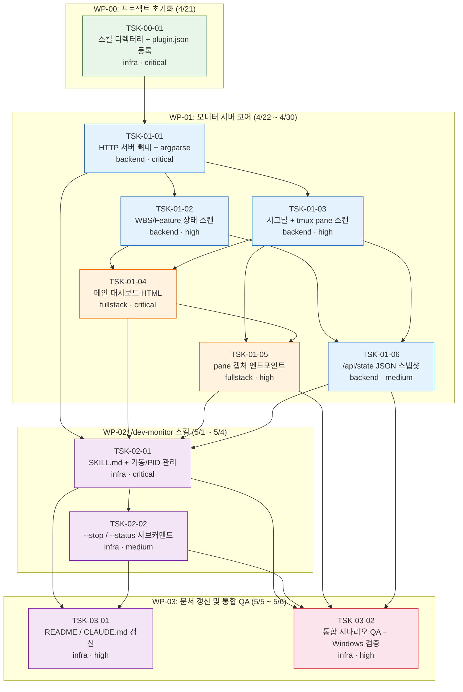

# WBS - dev-plugin 웹 모니터링 도구

> version: 1.0
> description: `/dev-monitor` 슬래시 커맨드로 로컬 HTTP 대시보드를 기동하여 dev-plugin 작업(WBS Task·Feature·팀 에이전트·서브에이전트)의 진행 상황을 브라우저에서 읽기 전용으로 통합 모니터링한다. Python stdlib 단일 파일 서버.
> depth: 3
> start-date: 2026-04-20
> target-date: 2026-05-06
> updated: 2026-04-20

---

## Dev Config

### Domains
| domain | description | unit-test | e2e-test | e2e-server | e2e-url |
|--------|-------------|-----------|----------|------------|---------|
| backend | Python HTTP 서버 로직 (스캔 함수·라우팅·subprocess) | `python3 -m unittest discover -s scripts -p "test_monitor*.py" -v` | - | - | - |
| fullstack | 서버 + HTML 대시보드 (인라인 CSS + meta refresh) | `python3 -m unittest discover -s scripts -p "test_monitor*.py" -v` | `python3 scripts/test_monitor_e2e.py` | `python3 scripts/monitor-server.py --port 7321 --docs docs` | `http://localhost:7321` |
| infra | 플러그인 메타(plugin.json)·스킬 디렉터리·문서 | - | - | - | - |

### Design Guidance
| domain | architecture |
|--------|-------------|
| backend | 단일 파일 `scripts/monitor-server.py` (목표 300±50 LOC). `http.server.ThreadingHTTPServer` + `BaseHTTPRequestHandler` 서브클래스. 스캔 함수(`scan_tasks`/`scan_features`/`scan_signals`/`list_tmux_panes`/`capture_pane`)는 매 요청마다 on-demand 실행 — 상태 캐시 없음. 모든 `subprocess.run`에 `timeout=3`, `shell=False`. `127.0.0.1` 바인딩 강제. Python 3.8+ stdlib 전용(`CLAUDE.md` 규약). `sys.executable` 사용, `python3` 하드코딩 금지. |
| fullstack | 대시보드는 단일 HTML 페이지(f-string 렌더링 + 인라인 CSS). `<meta http-equiv="refresh" content="3">` 로 전체 갱신, pane 상세 영역은 2초 fetch. 모든 사용자 유래 문자열 `html.escape()` 처리. 라우팅과 메뉴 연결: 신규 엔드포인트는 즉시 핸들러에 등록하고 대시보드의 진입 링크를 같은 Task에서 추가한다 — 진입 배선을 후속 Task로 미루면 orphan endpoint가 발생한다. |
| infra | `skills/dev-monitor/SKILL.md`는 `$ARGUMENTS` 파싱 후 `scripts/monitor-server.py`를 백그라운드 기동. PID 파일(`${TMPDIR}/dev-monitor-{port}.pid`) + `os.kill(pid, 0)` 좀비 감지. macOS/Linux는 `Popen(start_new_session=True)`, Windows psmux는 `DETACHED_PROCESS | CREATE_NEW_PROCESS_GROUP`. `.claude-plugin/plugin.json`의 스킬 목록에 `dev-monitor` 등록. |

### Quality Commands
| name | command |
|------|---------|
| lint | `python3 -m py_compile scripts/monitor-server.py` |
| typecheck | - |
| coverage | - |

### Cleanup Processes
monitor-server.py, python3

---

## WP-00: 프로젝트 초기화
- schedule: 2026-04-21 ~ 2026-04-21
- description: 스킬 디렉터리 뼈대와 플러그인 메타데이터 등록 — 후속 Task의 결과물 저장 위치를 확보한다.

### TSK-00-01: dev-monitor 스킬 디렉터리 생성 및 plugin.json 등록
- category: infrastructure
- domain: infra
- model: sonnet
- status: [xx]
- priority: critical
- assignee: -
- schedule: 2026-04-21 ~ 2026-04-21
- tags: setup, init, plugin-meta
- depends: -
- blocked-by: -
- entry-point: -
- note: -

#### PRD 요구사항
- prd-ref: PRD §6 파일 구조 변경안
- requirements:
  - `skills/dev-monitor/` 디렉터리 생성
  - `skills/dev-monitor/SKILL.md`는 placeholder로만 생성(본문은 TSK-02-01에서 작성)
  - `.claude-plugin/plugin.json`의 스킬 목록(또는 plugin 디렉터리 규약)에 `dev-monitor` 등록
  - 기존 스킬 파일 수정 0건 유지
- acceptance:
  - `ls skills/dev-monitor/SKILL.md` 성공
  - `plugin.json` 유효한 JSON이며 파싱 성공
  - 기존 스킬 10종 목록 변경 없음(추가만)
- constraints:
  - 플러그인 버전 `1.5.0` 으로 minor bump (PRD §6, TRD §12)

#### 기술 스펙 (TRD)
- tech-spec:
  - JSON 편집은 Python `json.load`/`json.dump`로 수행하거나 수동 삽입
  - 플러그인 네임스페이스 `dev:` 유지
- api-spec: -
- data-model: -
- ui-spec: -

---

## WP-01: 모니터 서버 코어
- schedule: 2026-04-22 ~ 2026-04-30
- description: `scripts/monitor-server.py` 단일 파일 작성. HTTP 라우팅·데이터 수집·HTML/JSON 렌더링을 구현하여 브라우저에서 바로 사용 가능한 상태로 만든다.

### TSK-01-01: HTTP 서버 뼈대 및 argparse 진입점
- category: development
- domain: backend
- model: sonnet
- status: [xx]
- priority: critical
- assignee: -
- schedule: 2026-04-22 ~ 2026-04-22
- tags: http-server, bootstrap
- depends: TSK-00-01
- blocked-by: -
- entry-point: -
- note: -

#### PRD 요구사항
- prd-ref: PRD §4.1, §5.1, §5.2
- requirements:
  - `scripts/monitor-server.py` 파일 생성
  - `argparse`로 `--port`(기본 7321), `--docs`(기본 `docs`), `--project-root`(기본 `$PWD`), `--max-pane-lines`(기본 500), `--refresh-seconds`(기본 3), `--no-tmux` 처리
  - `ThreadingHTTPServer` + `BaseHTTPRequestHandler` 서브클래스로 서버 기동
  - `127.0.0.1` 바인딩 강제(`0.0.0.0` 금지)
  - `GET` 외 메서드는 `405 Method Not Allowed`
  - `log_message` 재정의: stderr에 요청 라인 1건만 출력, stdout 비움
  - PRD/TRD에 명시된 엔드포인트 경로(`/`, `/api/state`, `/pane/{id}`, `/api/pane/{id}`) 라우팅 스켈레톤(핸들러는 `501`/stub 허용)
- acceptance:
  - `python3 scripts/monitor-server.py --port 7321`로 기동 → `curl http://localhost:7321/` 응답 코드 200 또는 501(stub)
  - 같은 포트로 `POST` 시 405 반환
  - `--no-tmux` 전달 시 인자 파싱 에러 없음
- constraints:
  - Python 3.8+ stdlib만 사용 (`http.server`, `json`, `subprocess`, `pathlib`, `urllib`, `argparse`)
  - pip 패키지 금지 (`CLAUDE.md` 규약)
  - `sys.executable` 사용, `python3` 하드코딩 금지 (Windows psmux 호환)

#### 기술 스펙 (TRD)
- tech-spec:
  - `http.server.ThreadingHTTPServer`
  - `BaseHTTPRequestHandler` subclass
  - Python 3.8+
- api-spec:
  - GET / → HTML (이 Task에서는 stub 허용)
  - GET /api/state → JSON
  - GET /pane/{id} → HTML
  - GET /api/pane/{id} → JSON
  - 그 외 405
- data-model: -
- ui-spec: -

### TSK-01-02: WBS/Feature 상태 스캔 (scan_tasks, scan_features)
- category: development
- domain: backend
- model: sonnet
- status: [xx]
- priority: high
- assignee: -
- schedule: 2026-04-23 ~ 2026-04-23
- tags: state-scan, wbs, feature
- depends: TSK-01-01
- blocked-by: -
- entry-point: -
- note: -

#### PRD 요구사항
- prd-ref: PRD §4.2, §5.3
- requirements:
  - `scan_tasks(docs_dir: Path)` 구현 — `{docs}/tasks/*/state.json` 순회
  - `scan_features(docs_dir: Path)` 구현 — `{docs}/features/*/state.json` 순회
  - 각 state.json 파싱 성공 → `WorkItem` 데이터 클래스 인스턴스 생성
  - 파싱 실패 → `raw_error` 필드에 원문 앞 500B 저장
  - `phase_history_tail`은 최근 10개만 슬라이스
  - `docs_dir/wbs.md`가 있으면 Task 제목·WP 매핑에 활용 (실패 시 title=None)
  - Feature title은 `spec.md` 첫 non-empty 줄
- acceptance:
  - 정상 state.json 1개 + 손상 state.json 1개 혼재 시 정상은 `WorkItem` 반환, 손상은 `raw_error` 채워짐
  - 빈 디렉터리(`tasks/` 없음) 시 `[]` 반환 — 예외 없음
  - 1MB 초과 state.json은 "file too large"로 읽기 거부
- constraints:
  - 모든 `open()`은 `mode="r"` (읽기 전용 보장)
  - TRD §7.2 Read-Only 보장 — `os.chmod 0o444` 상태에서도 동작

#### 기술 스펙 (TRD)
- tech-spec:
  - `pathlib.Path.glob`
  - `dataclasses.dataclass` (`WorkItem`)
  - `json.load`
- api-spec: -
- data-model:
  - WorkItem(id, kind, title, path, status, started_at, completed_at, elapsed_seconds, bypassed, bypassed_reason, last_event, last_event_at, phase_history_tail, wp_id, depends, raw_error)
  - `kind`: `"wbs"` | `"feat"`
- ui-spec: -

### TSK-01-03: 시그널 및 tmux pane 스캔 (scan_signals, list_tmux_panes, capture_pane)
- category: development
- domain: backend
- model: sonnet
- status: [xx]
- priority: high
- assignee: -
- schedule: 2026-04-24 ~ 2026-04-24
- tags: signal-scan, tmux, subprocess
- depends: TSK-01-01
- blocked-by: -
- entry-point: -
- note: -

#### PRD 요구사항
- prd-ref: PRD §4.2, §5.3, §3.2 S2
- requirements:
  - `scan_signals()` — `${TMPDIR}/claude-signals/` 재귀 스캔(`scope="shared"`) + `${TMPDIR}/agent-pool-signals-*` glob (`scope="agent-pool:{timestamp}"`)
  - 확장자로 `kind` 결정(`.running`/`.done`/`.failed`/`.bypassed`), 그 외 무시
  - `list_tmux_panes()` — `shutil.which("tmux")` 확인 → 없으면 `None` 반환
  - `tmux list-panes -a -F '#{window_name}\t#{window_id}\t#{pane_id}\t#{pane_index}\t#{pane_current_path}\t#{pane_current_command}\t#{pane_pid}\t#{pane_active}'` 실행 (`timeout=2`)
  - stderr에 `no server running` 포함 시 `[]` 반환
  - `capture_pane(pane_id)` — `tmux capture-pane -t {id} -p -S -500` (`timeout=3`)
  - ANSI escape sequence 제거: `re.sub(r'\x1b\[[0-9;]*[a-zA-Z]', '', output)`
  - `pane_id` 형식 검증: `^%\d+$` 정규식, 불일치 시 400 예정
- acceptance:
  - tmux 미설치 환경에서 `list_tmux_panes()` → `None`
  - tmux 설치됐으나 서버 없음 → `[]`
  - 존재하지 않는 pane id → subprocess 실패 메시지 반환(예외 X)
  - 시그널 디렉터리 자체 없음 → `[]` (예외 X)
- constraints:
  - 모든 `subprocess.run`에 `timeout=3` (리스트 호출은 2초)
  - `shell=False` 강제
  - Windows psmux에서도 `tmux` alias로 동작 — 별도 분기 없음

#### 기술 스펙 (TRD)
- tech-spec:
  - `subprocess.run`, `shutil.which`, `re.sub`
  - `${TMPDIR}` = `tempfile.gettempdir()` (macOS `$TMPDIR`, Linux `/tmp`, Windows `%TEMP%`)
- api-spec: -
- data-model:
  - SignalEntry(name, kind, task_id, mtime, scope)
  - PaneInfo(window_name, window_id, pane_id, pane_index, pane_current_path, pane_current_command, pane_pid, is_active)
- ui-spec: -

### TSK-01-04: 메인 대시보드 HTML 렌더링 (GET /)
- category: development
- domain: fullstack
- model: sonnet
- status: [xx]
- priority: critical
- assignee: -
- schedule: 2026-04-27 ~ 2026-04-28
- tags: html, dashboard, ui
- depends: TSK-01-02, TSK-01-03
- blocked-by: -
- entry-point: http://localhost:7321/ (루트 경로 `/`) — `/dev-monitor` 실행 후 안내된 URL로 진입
- note: -

#### PRD 요구사항
- prd-ref: PRD §4.3, §4.4, §4.5
- requirements:
  - `GET /` 핸들러 구현 → `text/html; charset=utf-8` 반환
  - `<meta http-equiv="refresh" content="{refresh-seconds}">` 자동 갱신 (기본 3초)
  - 인라인 CSS, 외부 프레임워크·폰트·CDN 의존성 0건
  - 섹션 6종 렌더링:
    1. 헤더(프로젝트명·기동 시각·스캔 대상 경로)
    2. WBS 섹션 (Task 트리 WP → Task, 상태 배지·경과 시간·재시도 카운트·bypass 아이콘)
    3. Feature 섹션 (동일 포맷)
    4. Team 에이전트 섹션 (tmux window 목록, pane 리스트, "show output" 링크 = `/pane/{id}`)
    5. Subagent 섹션 (agent-pool 슬롯별 상태 + "외부 캡처 불가" 안내)
    6. phase_history 최근 10건
  - 상태 배지: `[dd]` 🔵 DESIGN blue / `[im]` 🟣 BUILD purple / `[ts]` 🟢 TEST green / `[xx]` ✅ DONE gray / `.running` 🟠 RUNNING orange(pulse) / `.failed` 🔴 FAILED red / `bypassed` 🟡 BYPASSED yellow
  - tmux 미설치 시 Team 섹션에 "tmux not available" 안내, 나머지 섹션은 정상
  - JSON 파싱 실패 Task는 해당 행에만 ⚠️ 표시 + raw 내용 링크
  - 모든 사용자 유래 문자열 `html.escape()` 처리 (XSS 방어)
- acceptance:
  - 빈 프로젝트(`docs/tasks/` 비어있음)에서도 "no tasks/features" 안내가 정상 렌더 — 예외 없음
  - state.json 1개 손상 시 해당 Task만 ⚠️, 나머지 정상
  - tmux 없음 환경에서 WBS/Feature 섹션은 그대로 표시
  - 페이지 소스에 외부 도메인(`http(s)://`) 요청 0건 (localhost 제외)
- constraints:
  - 진입점(`entry-point`) 필수 — 라우팅과 메뉴 연결을 같은 Task에서 완료 (orphan endpoint 방지)
  - 모든 HTML 출력 전 `html.escape()` 적용

#### 기술 스펙 (TRD)
- tech-spec:
  - Python f-string + 인라인 CSS (Jinja2 등 템플릿 엔진 금지)
  - `html.escape` 전역 적용
- api-spec:
  - GET / → 200 text/html; charset=utf-8
- data-model:
  - 렌더링 입력: `{generated_at, project_root, docs_dir, wbs_tasks, features, shared_signals, agent_pool_signals, tmux_panes}` (TRD §4.1)
- ui-spec:
  - 섹션 6종 (위 requirements 참조)
  - 상태 배지·색상 매핑 (위 requirements 참조)
  - `<pre class="pane-capture">` 스타일 영역은 TSK-01-05에서 추가 예정

### TSK-01-05: pane 캡처 엔드포인트 (/pane/{id}, /api/pane/{id})
- category: development
- domain: fullstack
- model: sonnet
- status: [xx]
- priority: high
- assignee: -
- schedule: 2026-04-29 ~ 2026-04-29
- tags: pane, tmux, capture, endpoint
- depends: TSK-01-03, TSK-01-04
- blocked-by: -
- entry-point: http://localhost:7321/pane/{id} — 대시보드 Team 섹션의 "show output" 링크에서 진입
- note: -

#### PRD 요구사항
- prd-ref: PRD §4.3, §5.3
- requirements:
  - `GET /pane/{pane_id}` → `text/html; charset=utf-8` 반환
  - `GET /api/pane/{pane_id}` → `application/json` 반환
  - URL에서 `pane_id` 추출 후 `^%\d+$` 정규식 검증 → 불일치 시 `400 {"error":"invalid pane id","code":400}`
  - `capture_pane()` 호출 후 ANSI escape 제거
  - HTML 응답 포맷: `<pre class="pane-capture" data-pane="{id}">{escaped lines}</pre>
captured at {ts}
`
  - JSON 응답 포맷: `{pane_id, captured_at, lines, line_count, truncated_from}`
  - subprocess 실패 시 "capture failed: {stderr}" 표시, 대시보드 전체는 계속 동작
  - pane 상세 영역은 2초 fetch로 부분 갱신 (대시보드측 JS — 단, 의존성 0 vanilla JS만 사용)
- acceptance:
  - `curl http://localhost:7321/pane/%99`(존재하지 않는 pane) → 200 with "capture failed" 메시지
  - `curl http://localhost:7321/pane/abc` → 400
  - `/api/pane/%1` 응답에 `line_count` 필드 존재
  - HTML 응답에서 `<script src="http...">` 등 외부 리소스 로딩 0건
- constraints:
  - Command injection 방어: list 형 subprocess 호출, `shell=False`
  - `html.escape()` 적용
  - `timeout=3`

#### 기술 스펙 (TRD)
- tech-spec:
  - `subprocess.run`, `re` (ANSI strip 및 pane_id 검증)
  - Vanilla JS(stdlib 외부 의존 금지) — `fetch('/api/pane/...')` + setInterval
- api-spec:
  - GET /pane/{id} → 200 HTML | 400 HTML
  - GET /api/pane/{id} → 200 JSON | 400 JSON
- data-model:
  - `{pane_id, captured_at, lines:list[str], line_count:int, truncated_from:int}`
- ui-spec:
  - `<pre class="pane-capture">` 영역 — 대시보드 안에 inline 렌더 또는 독립 페이지

### TSK-01-06: /api/state JSON 스냅샷 엔드포인트
- category: development
- domain: backend
- model: sonnet
- status: [xx]
- priority: medium
- assignee: -
- schedule: 2026-04-30 ~ 2026-04-30
- tags: api, json, snapshot
- depends: TSK-01-02, TSK-01-03
- blocked-by: -
- entry-point: -
- note: -

#### PRD 요구사항
- prd-ref: PRD §4.3
- requirements:
  - `GET /api/state` → `application/json; charset=utf-8`
  - 응답 구조: TRD §4.1의 렌더링 데이터와 동일 (`generated_at`, `project_root`, `docs_dir`, `wbs_tasks`, `features`, `shared_signals`, `agent_pool_signals`, `tmux_panes`)
  - `phase_history_tail`은 최근 10개(기본, PRD §8 T4 결정에 따라 조정 가능)
  - `dataclass` → `json.dumps` 직렬화 (asdict)
  - 에러 발생 시 `{"error": "msg", "code": <http>}`
- acceptance:
  - `curl http://localhost:7321/api/state | python3 -m json.tool` 성공
  - `tmux_panes`는 tmux 미설치 시 `null`
  - 응답 시간 1초 이내 (100 Task 규모 이하)
- constraints:
  - JSON 응답만, HTML 섞지 않음
  - `dataclasses.asdict` 사용

#### 기술 스펙 (TRD)
- tech-spec:
  - `json.dumps(..., default=str)` — datetime 직렬화
  - `dataclasses.asdict`
- api-spec:
  - GET /api/state → 200 application/json
- data-model:
  - TRD §5.1 WorkItem / §5.2 SignalEntry / §5.3 PaneInfo
- ui-spec: -

### TSK-01-07: Feature 섹션 스캔·렌더 (DEFECT-1 후속)
- category: development
- domain: fullstack
- model: sonnet
- status: [xx]
- priority: high
- assignee: -
- schedule: 2026-05-04 ~ 2026-05-04
- tags: server, feature, scan, renderer
- depends: TSK-01-02, TSK-01-04
- blocked-by: -
- entry-point: scripts/monitor-server.py
- note: TSK-03-02 QA에서 발견된 DEFECT-1. `docs/features/*/state.json`을 스캔하여 대시보드 Feature 섹션에 렌더. 현재 `_section_features`는 빈 리스트만 처리. Feature 모드(`/feat`) 사용자에게 진행 상황 노출.

#### 구현 스펙
- `scan_features(docs_dir)` → List[FeatureInfo] — `docs/features/*/state.json` 읽어 반환
- `_section_features(features, running_ids, failed_ids)` — 테이블/카드 렌더
- `_build_state_snapshot`의 `features` 필드 채우기
- api/state JSON에 `features` 배열 포함

#### 수락 기준
1. `docs/features/sample/state.json`이 존재하면 대시보드 Feature 섹션에 행이 렌더된다.
2. Feature 없으면 "no features" 안내 렌더.
3. `/api/state` 응답 `features` 필드에 동일 데이터 포함.

#### 테스트
- unit: `scan_features` 함수 직접 호출 (fixture docs dir)
- E2E: 임시 features 디렉토리 생성 후 대시보드 HTTP GET 검증

### TSK-01-08: 손상 state.json 경고 배지 (DEFECT-2 후속)
- category: development
- domain: backend
- model: sonnet
- status: [xx]
- priority: medium
- assignee: -
- schedule: 2026-05-04 ~ 2026-05-04
- tags: server, error-handling, ui
- depends: TSK-01-02, TSK-01-04
- blocked-by: -
- entry-point: scripts/monitor-server.py
- note: TSK-03-02 QA에서 발견된 DEFECT-2. `scan_tasks`가 손상된 state.json을 silent skip하여 사용자가 문제를 인식할 수 없음. 에러 Task에 경고 배지 또는 로그 렌더링 필요.

#### 구현 스펙
- `scan_tasks`에 `error: Optional[str]` 필드 추가 — JSON 파싱 실패 시 에러 메시지 기록
- 대시보드 WBS 섹션 렌더 시 `error != None`인 Task에 ⚠ 배지 + 툴팁
- `/api/state`의 `wbs_tasks` 엔트리에도 `error` 필드 포함

#### 수락 기준
1. state.json이 문법 오류면 해당 Task 행에 경고 배지 표시
2. 정상 Task와 시각적으로 구분
3. `/api/state`에서 `error` 필드로 노출

### TSK-01-09: HTML 렌더 경로 dataclass 보존 (DEFECT-3 후속)
- category: development
- domain: backend
- model: sonnet
- status: [xx]
- priority: high
- assignee: -
- schedule: 2026-04-21 ~ 2026-04-21
- tags: server, renderer, regression
- depends: TSK-01-04, TSK-01-06
- blocked-by: -
- entry-point: scripts/monitor-server.py
- note: TSK-03-02 QA 재검증에서 발견된 DEFECT-3. `_build_state_snapshot`의 `_asdict_or_none` 결과를 `render_dashboard`가 그대로 받아 `_render_task_row`의 `getattr(item, ...)`이 전부 None → task-row id/title/status span 공란. `_build_render_state` 헬퍼를 분리하고 `_route_root`만 raw dataclass 경로로 전환.

#### 구현 스펙
- `_build_render_state(project_root, docs_dir, scan_*...)` 신규: raw dataclass 리스트 유지 (8-key dict 반환, `_build_state_snapshot`과 동일 키)
- `_build_state_snapshot`은 `_build_render_state` 결과를 `_asdict_or_none`으로 감싸는 얇은 래퍼로 리팩토링 (외부 계약 불변)
- `_route_root` (`GET /`) 만 `_build_render_state` 직접 호출로 전환, `_handle_api_state` (`GET /api/state`) 는 `_build_state_snapshot` 그대로 사용

#### 수락 기준
1. `GET /` 응답의 task-row id/title/status span에 실제 값이 렌더된다 (공란 아님).
2. `/api/state` JSON 계약 불변 (8개 최상위 키, `wbs_tasks` 원소는 dict로 16개 필드 보존).
3. 기존 monitor 자동화 테스트 240건 전부 통과.

#### 테스트
- unit: `test_monitor_render.py` / `test_monitor_api_state.py` 등 monitor 계열 240건 회귀 없이 통과
- E2E: 실제 서버 기동 후 curl로 HTML task-row 및 `/api/state` JSON 검증 (본 Task 수행 세션에서 수동 검증됨)

---

## WP-02: /dev-monitor 스킬
- schedule: 2026-05-01 ~ 2026-05-04
- description: monitor-server.py를 백그라운드 기동/종료/상태 확인하는 슬래시 커맨드 스킬 작성. PID 파일 기반으로 멱등성·좀비 감지를 보장한다.

### TSK-02-01: SKILL.md 작성 및 기동 + PID 관리
- category: infrastructure
- domain: infra
- model: sonnet
- status: [xx]
- priority: critical
- assignee: -
- schedule: 2026-05-01 ~ 2026-05-01
- tags: skill, launcher, pid
- depends: TSK-01-01, TSK-01-04, TSK-01-05, TSK-01-06
- blocked-by: -
- entry-point: -
- note: -

#### PRD 요구사항
- prd-ref: PRD §4.1, TRD §3
- requirements:
  - `skills/dev-monitor/SKILL.md` 본문 작성 — YAML frontmatter `name: dev-monitor` + description(자연어 트리거 키워드 포함: "모니터링", "대시보드", "monitor", "dashboard")
  - `$ARGUMENTS` 파싱: `--port`(기본 7321), `--docs`(기본 `docs`)
  - PID 파일 경로: `${TMPDIR}/dev-monitor-{port}.pid`
  - 기동 플로우:
    1. PID 파일 존재 + `os.kill(pid, 0)` 생존 → URL 재출력 후 종료 (idempotent)
    2. socket bind 테스트 → 실패 시 사용자 안내
    3. `subprocess.Popen(..., start_new_session=True)`(macOS/Linux) 또는 `DETACHED_PROCESS|CREATE_NEW_PROCESS_GROUP`(Windows psmux)로 detach
    4. PID 파일 기록
    5. `http://localhost:{port}` URL 출력
  - 로그: `${TMPDIR}/dev-monitor-{port}.log` append
  - `sys.executable` 사용 (python3 하드코딩 금지)
- acceptance:
  - 최초 기동 → URL 출력 + 브라우저에서 200 응답
  - 동일 포트 재기동 → 기존 PID 재사용 안내, 새 프로세스 생성 0
  - PID 파일만 있고 프로세스 죽은 상태(좀비) → 재기동 성공, PID 파일 갱신
  - 포트 충돌 → 안내 메시지 + `--port` 옵션 힌트
- constraints:
  - LLM 토큰 소비 0 (기동 1회 호출 외)
  - 1초 이내 기동 응답
  - 네 플랫폼(macOS/Linux/WSL2/Windows psmux) 동일 동작

#### 기술 스펙 (TRD)
- tech-spec:
  - `subprocess.Popen` detach (플랫폼별 flag)
  - `socket.socket().bind(('127.0.0.1', port))` 사전 테스트
  - `os.kill(pid, 0)` 생존 체크
- api-spec: -
- data-model: -
- ui-spec: -

### TSK-02-02: --stop / --status 서브커맨드
- category: infrastructure
- domain: infra
- model: sonnet
- status: [xx]
- priority: medium
- assignee: -
- schedule: 2026-05-04 ~ 2026-05-04
- tags: skill, cli, lifecycle
- depends: TSK-02-01
- blocked-by: -
- entry-point: -
- note: PRD §8 T3 — 제공 여부는 TSK-02-01 시작 전 확정 필요. 기본 방침은 "제공".

#### PRD 요구사항
- prd-ref: PRD §4.1, TRD §3.2, §9.2
- requirements:
  - `/dev-monitor --stop [--port PORT]` — PID 파일 읽어 `SIGTERM` 송신, PID 파일 삭제
  - `/dev-monitor --status [--port PORT]` — PID 파일 존재 및 생존 체크 결과 + URL 출력
  - 서버 측: `SIGTERM` 수신 → `serve_forever` 중단 + finally 블록에서 PID 파일 삭제
  - `--stop` 시 프로세스 이미 죽은 경우 PID 파일만 삭제
- acceptance:
  - `--stop` 후 `--status` → "not running"
  - `--status`만 실행 → 기동 여부·URL 출력, 기동 없으면 "not running"
  - 좀비 PID(프로세스 없음) `--stop` → PID 파일 삭제 + 정상 종료 메시지
- constraints:
  - Windows psmux에서는 `SIGTERM` 대신 `taskkill /PID` 사용 가능 — `_platform.py`와 정합성 유지

#### 기술 스펙 (TRD)
- tech-spec:
  - `os.kill(pid, signal.SIGTERM)` / Windows는 `subprocess.run(["taskkill","/PID",str(pid),"/F"])`
  - `signal.signal(signal.SIGTERM, handler)` on server
- api-spec: -
- data-model: -
- ui-spec: -

---

## WP-03: 문서 갱신 및 통합 QA
- schedule: 2026-05-05 ~ 2026-05-06
- description: 사용자 문서(README·CLAUDE.md) 갱신과 PRD §7 P4에서 정의한 수동 QA 시나리오 전체 실행.

### TSK-03-01: README / CLAUDE.md 갱신
- category: infrastructure
- domain: infra
- model: sonnet
- status: [xx]
- priority: high
- assignee: -
- schedule: 2026-05-05 ~ 2026-05-05
- tags: docs, readme, claude-md
- depends: TSK-02-01, TSK-02-02
- blocked-by: -
- entry-point: -
- note: -

#### PRD 요구사항
- prd-ref: PRD §6
- requirements:
  - `README.md`의 스킬 테이블에 `/dev-monitor` 한 줄 추가 (인자, 기본 포트, 설명)
  - `CLAUDE.md`의 "Helper Scripts" 테이블에 `scripts/monitor-server.py` 항목 추가 (Purpose, Used by)
  - 플러그인 버전 `1.5.0` 표기 확인
  - 스킬 파일 규약 섹션에 `dev-monitor` 포함 여부 점검
- acceptance:
  - README 스킬 테이블이 11개 행 (기존 10 + 신규 1)
  - CLAUDE.md Helper Scripts 테이블에 `monitor-server.py` 행 존재
  - Markdown 렌더링 깨짐 없음
- constraints:
  - 기존 항목 변경 최소화

#### 기술 스펙 (TRD)
- tech-spec: -
- api-spec: -
- data-model: -
- ui-spec: -

### TSK-03-02: 통합 시나리오 QA + Windows(psmux) 검증
- category: infrastructure
- domain: infra
- model: sonnet
- status: [xx]
- priority: high
- assignee: -
- schedule: 2026-05-05 ~ 2026-05-06
- tags: qa, manual-test, cross-platform
- depends: TSK-02-01, TSK-02-02, TSK-01-05, TSK-01-06
- blocked-by: -
- entry-point: -
- note: PRD §8 T1/T2 결정(refresh 간격, pane 라인 수)은 본 Task 실행 중 수정하여 기본값 확정한다.

#### PRD 요구사항
- prd-ref: PRD §7 P4, TRD §10.2, §10.3
- requirements:
  - QA 시나리오 5종 실행 및 결과 기록:
    1. 빈 프로젝트 기동 → `/` "no tasks/features" 정상 안내
    2. `/dev-team` 실행 중 `/dev-monitor` → WBS·tmux·시그널 섹션 모두 표시
    3. `/feat {name}` 실행 중 → Feature 섹션 표시
    4. state.json 고의 손상 → 해당 Task만 ⚠️
    5. 포트 충돌 재기동 → idempotent 재사용 안내
  - 플랫폼 매트릭스 검증: macOS, Linux, WSL2, Windows native(psmux)
  - Windows psmux에서 `detect_mux()` 인식 + `capture-pane` 동작 확인
  - 결과를 `docs/monitor/qa-report.md`에 기록
- acceptance:
  - 5개 시나리오 모두 Pass
  - 네 플랫폼 중 최소 macOS + Linux Pass (나머지는 환경 제약 시 "미검증" 명시 허용)
  - 발견된 결함은 별도 WBS Task 또는 이슈로 분리
- constraints:
  - QA 중 `state.json`·`wbs.md`·시그널 파일을 수정하지 않도록 감시 (Read-Only 보장 검증)
  - `ps`로 `monitor-server.py` 프로세스 리소스 점유 확인 (장시간 실행 시 FD 누수 여부)

#### 기술 스펙 (TRD)
- tech-spec:
  - curl, 브라우저 수동 확인
  - `lsof -p {pid}` 로 FD 모니터 (Linux/macOS)
- api-spec: -
- data-model: -
- ui-spec: -

### TSK-03-03: test_qa_fixtures 하네스 회귀 수정 (DEFECT-4 후속)
- category: development
- domain: backend
- model: sonnet
- status: [ts]
- priority: high
- assignee: -
- schedule: 2026-04-21 ~ 2026-04-21
- tags: test, harness, regression
- depends: TSK-01-09
- blocked-by: -
- entry-point: scripts/test_qa_fixtures.py
- note: TSK-03-02 QA 재검증에서 발견된 DEFECT-4. 현재 25 tests 중 11 errors. 원인 1) `_import_server()`가 모듈을 `sys.modules`에 등록하지 않아 `@dataclass SignalEntry` 평가 시 `sys.modules.get(cls.__module__)`이 None → `AttributeError: 'NoneType' object has no attribute '__dict__'`. 원인 2) `monitor-server.py`의 `parse_args` 함수가 `build_arg_parser`로 리네임되었으나 하네스가 구명칭을 참조.

#### PRD 요구사항
- prd-ref: TRD §10.3 (하네스 유지보수)
- requirements:
  - `_import_server()` 수정: `importlib.util.module_from_spec` 이후 `sys.modules[name] = module`로 등록한 뒤 `spec.loader.exec_module(mod)` 실행
  - `parse_args` 호출부를 `build_arg_parser().parse_args([...])`로 전환하거나, `monitor-server.py`에 `parse_args` alias 추가
  - 25 tests 전부 pass — 회귀 없이 monitor 전체 240+25 통과
- acceptance:
  - `python3 scripts/test_qa_fixtures.py` → OK (errors=0, failures=0)
  - `python3 -m unittest discover -s scripts -p "test_monitor*.py" -v` → 기존 240건 회귀 없음
- constraints:
  - monitor-server.py 공개 API 변경 최소화 (alias 수준)
  - 하네스 의존성(stdlib only) 유지

#### 기술 스펙 (TRD)
- tech-spec:
  - `importlib.util` 정석 로딩 패턴 적용
  - `unittest` 표준 러너, 추가 의존성 없음
- api-spec: -
- data-model: -
- ui-spec: -

### TSK-03-04: 플랫폼 매트릭스 검증 (Linux/WSL2/Windows psmux)
- category: infrastructure
- domain: infra
- model: sonnet
- status: [ ]
- priority: medium
- assignee: -
- schedule: 2026-05-07 ~ 2026-05-08
- tags: qa, cross-platform, manual-test
- depends: TSK-03-02, TSK-03-03
- blocked-by: -
- entry-point: -
- note: TSK-03-02는 macOS만 Pass 완료. 나머지 3개 플랫폼(Linux, WSL2, Windows psmux) 검증을 분리 실행.

#### PRD 요구사항
- prd-ref: PRD §7 P4, TRD §10.2
- requirements:
  - Linux(Ubuntu 22.04+)에서 QA 5시나리오 + `detect_mux()` + `capture-pane` 확인
  - WSL2에서 QA 5시나리오 + `/tmp` 시그널 경로 정상 동작 확인
  - Windows native + psmux 조합에서 `detect_mux()` 인식 + `capture-pane` 동작 확인
  - 결과를 `docs/monitor/qa-report.md`의 "플랫폼 매트릭스" 섹션에 추가 기록
- acceptance:
  - 최소 Linux Pass (필수)
  - WSL2, Windows psmux는 환경 제약 시 "미검증" 명시 허용 (PRD §7 P4 정책 일치)
  - 발견된 플랫폼별 결함은 별도 WBS Task로 분리
- constraints:
  - QA Read-Only 제약 유지 (state.json·wbs.md·시그널 파일 수정 금지)

#### 기술 스펙 (TRD)
- tech-spec:
  - Linux/WSL2: native tmux
  - Windows: psmux (tmux alias)
  - `curl`, `lsof`(Linux/WSL2), `Get-Process`(Windows PowerShell)
- api-spec: -
- data-model: -
- ui-spec: -

---

## 태스크 의존도 그래프

> 크리티컬 패스: 00-01 → 01-01 → 01-02 → 01-04 → 01-05 → 02-01 → 02-02 → 03-01
>
> 병렬 구간: 01-02 ‖ 01-03 · 01-04 ‖ 01-06 · 03-01 ‖ 03-02

**범례**: 초록=초기화, 파랑=backend, 주황=fullstack, 보라=infra, 빨강=QA
